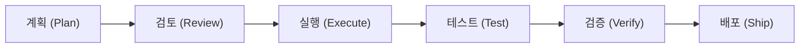
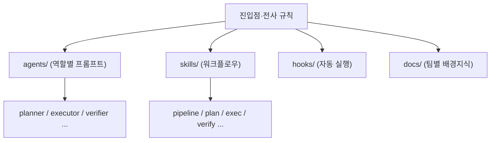
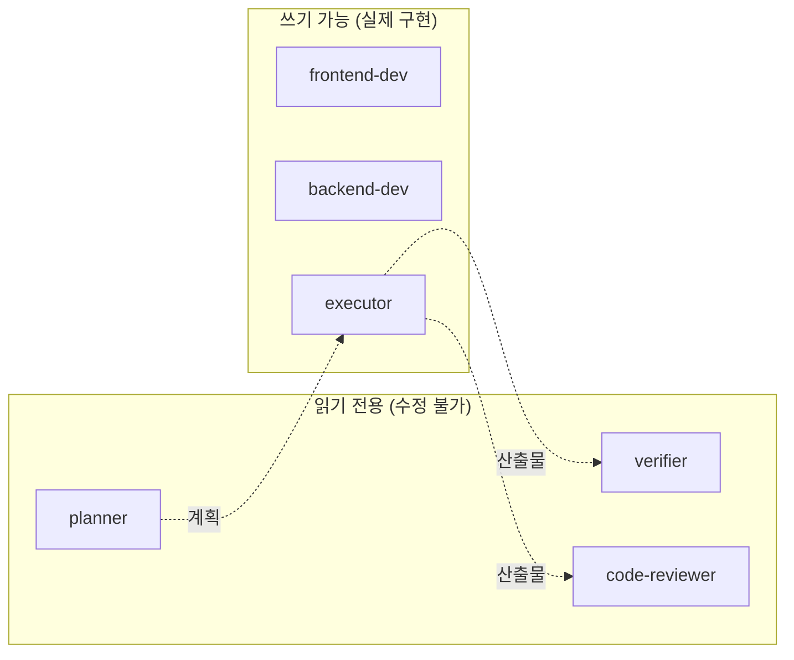

사내에서 여러 직군이 [Claude Code](https://docs.claude.com/en/docs/claude-code)(터미널이나 Claude Desktop App을 사용하는 AI 코딩 도구)를 여러 PoC들을 만들기 위해 쓰기 시작했다. 그런데 그냥 쓰면 결과가 들쭉날쭉이었다. 모델이 아무리 똑똑해도 계획 없이 곧장 파일을 고치고, 검증을 건너뛰고, "**<u>다 됐다</u>**"라고 확신하는 일이 잦았다. 마침 그 무렵에는 모델과 Claude Code CLI도 불안정해서, 복잡한 문제 앞에서 추론을 성급히 생략하거나 토큰을 비정상적으로 소모하는 문제까지 있었다.

그래서 **하네스**(harness; AI가 사고 치지 않도록 감싸주는 규칙과 안전장치의 묶음)가 필요하다고 생각했다. 모델 자체는 아니지만, *AI를 안전하게 사용하는 운전 보조 장치*에 가깝다. 운전 실력이 늘면 어떤 보조는 필요 없어지지만, 안전벨트나 브레이크에 대한 점검은 실력과 무관하게 계속 필요하다.

이걸 맨땅에서 설계하긴 어려웠다. 그에 대한 지식이 많지 않았고, Claude가 사용하는 플러그인 환경에 대해서도 익숙치 않았기 때문이다. 그리고 이미 **공개된 하네스**가 여럿 있었다. 그래서 처음은 코드부터 짜기 전에 **남이 만들고, 사용자들이 많이 사용하는 하네스 5개를 뜯어보는 것**으로 시작했다.

## 살펴본 5개의 하네스 플러그인

| 항목    | gstack        | everything-claude-code | oh-my-claudecode    | superpowers          |
| ----- | ------------- | ---------------------- | ------------------- | -------------------- |
| 저자    | Garry Tan     | Affaan M               | Yeachan Heo         | Jesse Vincent (obra) |
| 에이전트  | \~33 역할 skill | **47개**                | 19개                 | 1개(+14 skill)        |
| 스킬    | \~33          | **181개**               | 37개                 | 14개                  |
| 커맨드   | `/qa`·`/ship` | **79개 slash**          | 매직 키워드              | slash+skill          |
| 멀티 AI | Claude+Codex  | Claude 중심              | Claude+Codex+Gemini | Claude 중심            |
| 주요 기능 | 헤드리스 브라우저 QA  | 생산 환경 플러그인             | 멀티 에이전트 오케스트레이션     | 문서를 TDD로             |

다섯 번째로 본 `hermes-agent`는 컨테이너 단위로 환경을 격리하고 **스스로 스킬을 만들어 내는 자율 에이전트**라, 우리가 지금 당장 쓸 규모는 아니었다. 나머지 넷이 실질적인 참고 대상이었다.

각각 성격이 또렷했다.

- \*\*everything-claude-code(ECC)\*\*는 규모로 압도 당했다(?). 47개의 에이전트, 181개의 스킬, 79개의 커맨드. 언어별로 디렉토리를 완전히 갈라 두고 `./install.sh typescript`처럼 *필요한 것만* 골라 주입한다. 쓰지 않는 언어 규칙이 프롬프트에 끼지 않으니 토큰이 새지 않는다.

- **superpowers**는 정반대로 작은 규모이다. 스킬이 14개뿐인데, "스킬 문서도 코드처럼 TDD로 만든다"는 철학이 가장 단단하다. 오픈소스 PR 거부율이 94%에 달할 만큼 품질 기준이 높았다.

- \*\*oh-my-claudecode(OMC)\*\*는 라우터가 작업을 쪼개 권한이 분리된 서브 에이전트들에게 **강제로 위임**한다. UI는 Gemini, 백엔드 검증은 Codex로 넘겨 서로 다른 모델끼리 교차 검증까지 시킨다.

- **gstack**은 실제 QA를 자동화한다. Playwright 기반 헤드리스 브라우저(화면 없이 도는 브라우저)를 상주시켜 명령 하나에 100밀리초로 화면을 검사한다.

## 넷이 똑같이 하던 것

성격은 달라도, 넷을 겹쳐 놓으니 공통 골격이 보였다. 전부 **마크다운 파일을 AI의 행동을 규정하는 코드로** 쓴다. `agents/`에 역할별 프롬프트를, `skills/`에 워크플로우를, `hooks/`에 자동으로 실행하는 장치를 둔다.

그리고 작업 흐름이 약속이라도 한 듯 같았다.



이름만 달랐다. OMC는 `team-plan → team-prd → team-exec → team-verify → team-fix`, ECC는 `planner → tdd-guide → executor → code-reviewer → verifier`, gstack은 `/plan-ceo-review → /plan-eng-review → /qa → /ship`. 결국 *계획부터 세우고, 끝났다고 말하기 전에 증거를 확보한다*는 한 문장으로 동작한다고 말할 수 있었다.

## 가져온 것과 버린 것

다 가져올 수는 없었다. 우리는 비개발 직군까지 쓰는 사내 개발 도구가 목표였고, 첫 버전은 러프하게 "그냥 쓰는 것보다 품질 하한선을 올려 준다" 정도면 충분했다. 그래서 추려냈다.

### **가져온 것**

1. 코딩 시작 전 *의도를 명확히 하는* 단계를 강제하는 구조. 넷 모두의 공통점이자 가장 중요한 골격이다.
2. 작업한 AI와 검토하는 AI를 **분리**하는 구조. 자기가 쓴 글을 자기가 교정하면 오류를 못 잡는 것과 같다.
3. 삭제·덮어쓰기·배포처럼 돌이키기 어려운 행동 전에 **사람에게 묻는** 게이트 단계.
4. 팀마다 다른 맥락 파일을 줘서 각 팀 방식을 학습시키는 구조.
5. 이번 세션에서 배운 것이 다음 세션에 남는 **기록**.

### **버린 것**

- 에이전트 열 개가 동시에 도는 **대규모 병렬 오케스트레이션**. 복잡성 대비 이득이 없고 비용도 크다.

- 사람의 확인 절차가 없는 **자동 배포**. 금융 서비스엔 맞지 않는다.

- ECC의 **181개의 스킬을 통째로** 복사하는 것. 많을수록 AI가 뭘 써야 할지 헷갈리고 토큰만 는다. 적은 단위로 시작하는 게 맞았다.

## 그래서 만든 V0 하네스

추려낸 결론은 그대로 코드가 됐다. 첫 스캐폴드(scaffold; 뼈대만 세운 초기 구조)는 이런 모양이었다.



가장 먼저 한 건 **권한 분리**였다. ECC에서 본 패턴 그대로, 검토자 에이전트에게는 읽기 도구만 줬다.

```yaml agents/code-reviewer.md
name: code-reviewer
description: 구현이 완료된 코드를 계획서 및 코딩 표준과 대조하여 리뷰. Read-only
tools: ["Read", "Grep", "Glob"]  # [!code highlight]
```

`Edit`이나 `Write`가 아예 없다. 그래서 리뷰어는 리뷰를 하다가 원본 코드를 몰래 고치는 일이 **구조적으로** 불가능하다. 텍스트로 "고치지 마세요"라고 부탁하는 게 아니라, 도구 목록에서 빼 버려 못 하게 만든 것이다.



다음은 **합리화를 막았다**. superpowers에서 본 "Red Flags" 패턴을 가져와, 검토 에이전트가 빠뜨리기 쉬운 부분을 프롬프트에 못박았다.

```text agents/code-reviewer.md
<Red_Flags>
  - BLOCK 판정 후 수정 없이 APPROVE로 번복하는 것
  - "괜찮아 보입니다"처럼 근거 없는 찬사
  - 코드를 직접 수정하려는 시도
</Red_Flags>
```

결국 *"확신하지 말고 증거를 대라"* 는 태도를 글로 강제한 것이다.

마지막은 파이프라인이다. 모든 작업은 한 줄짜리 흐름을 따르게 했다.

```text skills/pipeline/SKILL.md
Stage 1: Plan  →  Stage 2: Exec  →  Stage 3: Verify  →  [Stage 4: Fix]
```

Plan이 끝나면 사용자에게 요약을 보여 주고 **승인을 받아야** Exec 단계로 넘어간다. Verify가 통과하면 끝, 실패하면 Fix로 빠져 최대 세 번까지 자가 수정한다. 네 개의 하네스를 뜯어보며 찾은 "계획부터, 증거 확보 후 완료"가 이 네 글자에 들어 있다.

## 돌아보면

거창하게 시작하지 않은 게 다행이었다. 멀티 에이전트 오케스트레이션 같은 화려한 기능부터 욕심냈다면 첫 버전을 못 띄웠을 것이다. *비개발자가 그냥 쓰는 것보다 하한선을 올린다* 는 소박한 목표 하나로 좁힌 덕에, 권한 분리·파이프라인·합리화 차단이라는 골격만 단단히 깔고 시작할 수 있었다.

다음 편은 이 골격을 실제로 굴리면서 처음 부딪힌 문제다. 모델이 *제 손으로* 계획 단계를 건너뛰려 들었고, 그걸 어떻게 시스템으로 막았는지를 다룬다. 🌱
