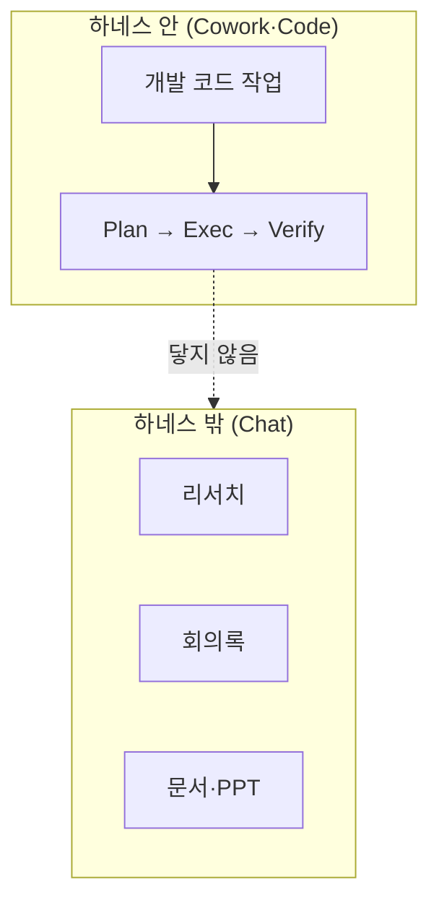
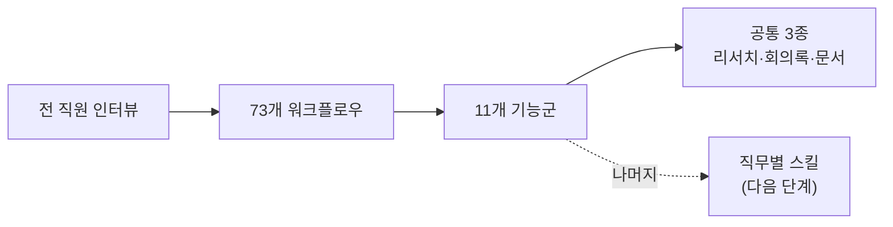
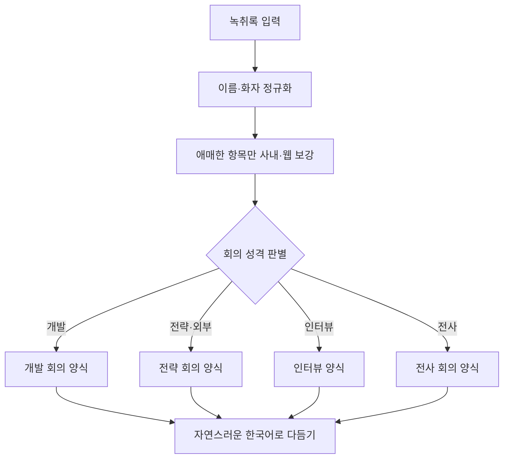
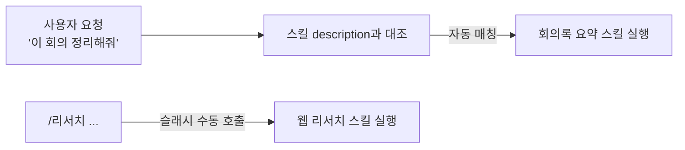

하네스를 만들어 전사에 배포하고 얼마간 굴려 보니, 정작 그걸 매일 켜는 사람은 데스크톱 앱 기준으로 구성원의 절반쯤이었다. 나머지 절반은 하네스를 한 번도 안 켜고도 일이 됐다. 기획서를 쓰고, 회의록을 정리하고, 발표 자료를 만들었다. 그 일들은 내가 만든 파이프라인 *바깥*에 있었다.

여기서 **하네스**(harness; AI가 사고 치지 않게 감싸는 규칙 묶음)는 모델 자체가 아니라, 계획을 세우고 검증을 거치게 강제하는 안전장치다. [[harness-9-orchestration|비개발 업무까지 받치는 방법을 다시 벤치마킹하며]], 이미 가진 훅 아키텍처 위에 에이전트 몇을 얹으면 되겠다고 적었다. 그런데 막상 *무엇을* 얹을지는 코드가 아니라 사람에게 물어야 알 수 있었다. 그래서 이번엔 코드를 짜기 전에, 하네스를 안 쓰는 사람들부터 만나 봤다.

## 하네스가 절반만 덮고 있었다

내가 만든 하네스에는 스킬이 9개 있었다. 이름을 늘어놓으면 이렇다.

```text skills/
plan/         exec/         verify/
deploy/       tdd/          review/
pipeline/     memory-load/  memory-save/
```

하나하나 뜯어보면 결이 똑같다. `plan`은 요구사항을 태스크로 쪼개고, `exec`는 코드를 짜고, `verify`는 `lint`·`build`를 돌리고, `review`는 읽기 전용으로 코드를 검토하고, `tdd`는 테스트부터 쓰게 한다. [[harness-1-benchmarking|처음 골격을 세울 때]] 잡았던 `Plan → Exec → Verify → Fix` 한 줄을, 단계별로 스킬로 나눠 놓은 것이다. **9개 전부가 개발 파이프라인의 부품**이었다. 회의록이나 발표 자료를 위한 스킬은 하나도 없었다.

문제는 그것만이 아니었다. 이 하네스는 **Node 기반 스크립트 플러그인**(plugin; 스킬·에이전트·훅을 담은 패키지)이라, Claude를 로컬 프로젝트 폴더에서 깊게 파고드는 Cowork·Code 환경에서만 돈다. 비개발 직군이 실제로 일하는 곳은 대부분 **챗**(Chat; 프로젝트·지침과 커넥터로 대화하며 쓰는 환경)이었는데, 챗에서 스킬로 하네스를 부르는 방식은 아예 넣지 못한 상태였다.

```json .claude-plugin/plugin.json
{
  "hooks": {
    "UserPromptSubmit": "node scripts/pipeline-injector.mjs"  // [!code highlight]
  },
  "skills": ["pipeline", "plan", "exec", "verify", "review", "deploy", "..."]
}
```

강조한 줄이 발목이었다. 모든 요청을 가로채 파이프라인으로 라우팅하는 그 스크립트는 Node로 도는데, 챗에는 Node 스크립트를 걸 자리가 없다. 골격이 좋고 나쁘고를 떠나, *실행될 자리 자체*가 절반의 사람들에겐 없었던 셈이다.



환경 차이도 컸다. Cowork·Code는 하나의 프로젝트를 깊게 파고들거나 로컬 파일을 만지는 데 강하지만, 세션을 새로 열 때마다 맥락이 리셋되는 느낌이 크다. 반대로 챗은 프로젝트·지침과 커넥터로 대화를 이어가기 좋아서, 일반 업무는 자연스럽게 챗으로 기울어 있었다. 회의 후속 처리 같은 일이 특히 그랬다. 사람들이 이미 챗에 가 있는데, 하네스만 반대편 환경에 서 있었던 것이다.

솔직히 이건 [[harness-1-benchmarking|첫 버전]]부터 *감수한 한계*였다. 개발 환경 전용으로 좁게 시작한 덕에 첫 버전을 띄울 수 있었으니, 후회하는 결정은 아니다. 다만 "그냥 쓰는 것보다 하한선을 올려 준다"는 목표를 회사 전체로 넓히려면, 이 절반을 더는 미룰 수 없었다.

## 6월 말, 이틀 동안 전 직원을 만났다

무엇을 만들지 정하기 전에, 무엇이 없는지부터 알아야 했다. 6월 말 이틀에 걸쳐 전 직원을 인터뷰했다. 그냥 "AI 잘 쓰세요?"라고 물으면 답이 다 비슷하게 돌아온다는 걸 알아서, 먼저 *척도*를 두 축으로 설계했다.

- **사용 깊이(D1~D5)**: D1은 단순 리서치나 요약, D5는 스킬을 엮어 서비스를 구현하는 수준.
- **장벽 깊이(B1~B5)**: B1은 "그런 게 있는지 몰랐다" 수준의 인지 부족, B5는 보안·규정 때문에 손을 못 대는 구조적 장벽.

이 두 축으로 나눠 놓으니, 뭉뚱그려 보이던 사람들이 또렷하게 갈렸다. 개인을 특정하지 않고 유형만 적으면 이렇다.

**장벽이 얕은 유형(B1~B2).** 도구는 이미 손 닿는 곳에 있는데 안 써 봐서 못 쓰는 경우다. 이 유형은 코칭 한 번, 시연 한 번이면 풀린다. 새 기능을 만들 문제가 아니라 *알려 줄* 문제였다.

**이미 자기 파이프라인을 굴리는 최상위 운용자(D5).** 인터뷰 중 한 명은 카톡·Gmail·Slack·캘린더·Notion을 전부 연결한 개인 스킬을 이미 돌리고 있었다. 미회신 메시지와 사람별 업무 진행 상황을 매일 아침 이메일로 자동 정리해 받는 식이었다. 이 사람의 말은 "이런 걸 만들어 달라"는 *요청*이 아니라, 이미 쓰고 있는 사람의 **제품 피드백**에 가까웠다. 눈높이가 달라서, 받아 적는 태도도 달라야 했다.

**도구는 아는데 기준이 없는 유형.** 리서치를 시켜 본 적은 있는데, 나온 결과에서 뭘 믿어야 할지 모르겠다는 사람들이었다. AI가 그럴듯하게 써 준 문장에 출처가 없거나, 보도자료 하나를 여러 매체가 받아쓴 걸 여러 근거로 착각하는 식이다. *도구*가 아니라 *판단 기준*이 없는 문제였다.

**접할 기회 자체가 없던 유형.** 하네스가 개발 전용이라 자기 업무엔 와닿지 않는다고 답한 사람들이다. 틀린 말이 아니었다. 앞서 본 대로, 이들에겐 하네스가 돌 자리조차 없었다.

인터뷰에서 하네스 자체를 겨눈 지적도 나왔다. 잘 쓰는 사람일수록 **단순한 작업에까지 계획을 강제하는 마찰**을 불편해했다. "한 줄 고치는데도 매번 계획서를 보여 준다"는 것이다. 세션이나 모델이 바뀌면 맥락이 통째로 사라져 매번 다시 설명해야 한다는 **맥락 소실** 문제도 반복해서 나왔다.

여러 사람은 하네스가 *과하게 처리*한다고도 느꼈다. 파일 이름 하나만 물었을 뿐인데 계획을 세우고 검토자를 부르고 검증까지 돌리는 식이었다. 안전을 위해 깐 절차가, 가벼운 질문 앞에서는 오히려 답을 굼뜨게 만들었다. 하네스가 "잘 쓰는 사람을 느리게 하는 장치"로 느껴지는 순간이 있다는 건, 만든 사람으로선 뼈아픈 피드백이었다. 이 지적은 뒤에서 복잡도별로 계획을 차등하는 개선으로 이어졌다.

## 73개의 일이 11개로, 다시 3개로

인터뷰에서 나온 실제 업무를 다 받아 적으니 워크플로우가 **73개**였다. 그대로는 손댈 수 없어서, 겹치는 것끼리 묶었다. 표현만 다를 뿐 같은 일인 것들을 합치자 **11개의 기능군**으로 수렴했다. 그중에서도 직군을 가리지 않고 가장 자주 나온 상위 셋이 또렷했다. 웹 리서치, 회의록 요약, 문서·발표 자료 제작.



여기서 전략을 한 번 뒤집었다. 처음엔 D5 운용자의 요청을 받아 *잘 쓰는 사람의 상한*을 더 올리는 쪽으로 기울었다. 하지만 인터뷰를 겹쳐 놓고 보니, 지금 급한 건 상한이 아니라 하한이었다. **잘 쓰는 사람의 천장을 높이기보다, 전 직원의 바닥을 올린다.** 상한을 뚫는 일은 D5가 스스로도 하고 있었지만, 바닥은 아무도 대신 올려 주지 않았다.

그래서 이 셋을 **스킬**(skill; Claude가 반복 작업을 수행하는 설명서 한 장)로 만들기로 했다. 스킬은 챗에서도 돌고, Node 스크립트가 필요 없다. 하네스가 못 닿던 절반에게 정확히 필요한 형태였다.

## 웹 리서치 스킬

리서치는 맨땅에서 시작하지 않았다. `research-mode`라는 오픈소스 스킬을 받아 며칠 돌려 봤는데, 뼈대가 좋았다. 별도 키가 필요 없고, **모든 사실에 출처를 붙이며, 근거가 없으면 "모른다"고 답한다**는 원칙이 특히 그랬다. AI 리서치에서 가장 위험한 건 그럴듯한 창작인데, 이 뼈대는 그걸 구조로 막고 있었다.

그런데 실제 회사·기술 주제로 수십 번 돌려 보니 한계도 분명했다. 나온 약점을 그때그때 고치며 네 가지를 더했다.

첫째는 **교차검증**(cross-check; 같은 수치를 독립된 출처 둘로 겹쳐 확인)이다. 결론에 쓰는 핵심 수치는 반드시 서로 다른 출처 두 곳을 확보하게 했다.

```md skills/web-research/SKILL.md
결론이나 산출물에 수치를 쓸 때는 독립된 출처 두 곳을 확보한다.

- 같은 발표를 옮긴 기사 여러 개는 독립 출처가 아니다.
- 한 곳뿐이면 그 수치 옆에 "미검증(단일 출처)"이라고 붙인다.
- 진짜 독립은 발표 주체가 다른 자료다. (회사 발표 vs 전자공시)
```

강조하고 싶은 건 가운데 줄이다. 링크가 세 개 붙어 있어도 원본이 하나면 근거는 하나다. 회사 발표를 여러 매체가 받아쓴 걸 세 개의 증거로 세면, 확인한 척만 하고 실제로는 아무것도 확인하지 못한 게 된다.

둘째는 보도자료 배포처를 신뢰 매체로 착각하지 않는 규칙이다. GlobeNewswire 같은 배포 창구는 뉴스를 *뿌려 주는* 곳이지, 취재해서 *전하는* 곳이 아니다. 배포처 링크를 만나면 그 뒤의 원본을 한 번 더 찾게 했다. 셋째는 국내 기업이면 전자공시 같은 국내 1차 소스를 먼저 보게 한 것이고, 넷째는 **열리지 않는 링크를 그냥 버리지 않고**, 같은 사실을 담은 다른 자료로 대신 확인한 뒤에야 거르게 한 것이다.

마지막으로, 결과를 쉬운 한국어로 내게 했다. 이건 리서치의 정확성만큼이나 중요했다. 비개발자가 바로 읽혀야 쓸모가 있기 때문이다.

```text skills/web-research/SKILL.md
- 문장을 서술어로 끝낸다. 명사·체언으로 끝내지 않는다.
  나쁜 예: "성장세 지속." / 좋은 예: "성장세가 이어집니다."
- 어려운 말을 쉬운 말로 바꾼다. (지배적 운영 모델 → 가장 널리 쓰는 방식)
- 과장어를 뺀다. (해자, 구조적, 정면, 임박, 혁신적)
- 자기 규칙·방법을 소리 내 설명하지 않는다. 결과만 낸다.
```

명사로 끝나는 개조식 보고서는 딱 봐도 AI가 쓴 티가 난다. 문장을 서술어로 맺게 하고, 조사 과정을 구구절절 설명하지 않고 결과만 내게 하니, 읽는 사람이 "이거 AI가 썼네"라고 느끼는 순간이 눈에 띄게 줄었다.

산출물 맨 끝에는 **다음에 이어서 보면 좋은 것**을 붙이게 했다. 답을 내고 끝내는 게 아니라, 검색창에 그대로 넣을 다음 검색어와 그걸 보면 무엇을 알 수 있는지를 한 줄씩 남긴다. 리서치는 대개 한 번으로 안 끝나는데, 도구는 늘 한 번의 답만 주고 멈춘다. *다음 한 걸음*을 같이 쥐여 주는 게, 기준이 없다던 그 유형에게 특히 필요했다.

한 가지 더, 리서치 스킬은 **사내 데이터를 조회하지 않게** 선을 그었다. 웹·외부만 본다. 회사 데이터는 최신성이나 권한 판단이 따로 필요하기도 했지만, 비용 문제가 컸다. 사내 검색은 Snowflake 웨어하우스가 *켜져 있는 시간*으로 과금되는데, 30초 뒤 자동으로 잠들었다가 요청마다 다시 깨어나느라 붙는 최소 시간이 계속 쌓인다. 실측해 보니 순수 연산은 78초인데 청구는 약 53분으로 부풀어 있었다. 웹 리서치마다 사내 데이터를 무조건 두드리면 이 깨어나는 시간이 낭비로 쌓인다. 그래서 사내 조회는 별도 스킬이 맡게 하고, 리서치 중 필요하면 그쪽으로 넘기게 했다.

## 회의록 요약 스킬

인터뷰에서 가장 자주 나온 통증이 회의였다. 미팅이 많다 보니 회의록·Notion 등록·이메일 팔로업·자료 제작 같은 후속 처리가 쌓였다. 이 스킬은 클로바노트 녹취록을 던지고 "회의록 요약해줘"라고 입력하면 발동한다.

첫 관문은 **이름 교정**이다. 녹취록은 화자가 "참석자 1, 참석자 2"로만 찍히거나, 사내·외부 이름이 음차로 깨져 있기 일쑤다. 그래서 사내 정식 명단을 먼저 읽고, 발음·철자가 가까운 이름을 정식 표기로 스냅하게 했다.

```text skills/meeting-summary/SKILL.md
발음·철자가 가까우면 정식 이름으로 스냅한다. (예: "민준 → 민재")
화자 라벨(참석자 N)은 문맥·자기소개·호칭 단서로 실제 인물에 연결한다.
근거가 약하면 단정하지 말고 라벨을 유지한 채 후보로만 둔다.
```

핵심은 마지막 줄이다. 애매하면 지어내지 않는다. 명단에 매칭이 안 되거나 음차로 깨진 업체·용어는, 사내 회의록 DB와 사내 메신저 커넥터를 먼저 뒤지고, 거기서도 안 나오면 웹 서치로 보강하게 했다. 그래도 못 찾으면 "확인 필요"로 남긴다.

다음은 **계열 분기**다. 회의는 성격이 제각각이라 한 양식으로 찍어내면 어색해진다. 기존·최근 회의록 양식을 학습해, 개발 회의인지 전략 회의인지 인터뷰인지 전사 회의인지를 판별하고 그에 맞는 템플릿으로 요약하게 했다.



여기까진 배포 전에 짠 흐름이었다. 그런데 배포하고 나서 현장 피드백이 진짜 개선을 만들었다. 회의록을 자주 쓰는 한 동료가 이렇게 지적했다.

> 노션에 자동 등록하면, 완료 알림이 뜨기 전에 미리 보는 사람이 많아요. 그런데 그 뒤에 내용이 바뀌면 누가 뭘 봤는지 추적이 안 돼요.

맞는 말이었다. 자동 등록은 편하지만, *등록 후에 고치는* 구조라 버전이 엉킨다. 그래서 등록 전에 사람이 검토하는 게이트를 하나 넣었다. 요약 초안을 먼저 채팅에 보여 주고, 사람만 답할 수 있는 항목을 함께 물은 뒤, 승인을 받아야 등록한다.

```text skills/meeting-summary/SKILL.md
1단계 입력 수집
2단계 화자·이름 정규화
3단계 사내 근거 보강 (애매한 항목 한정)
4단계 회의 계열 자동 판별
5단계 요약 본문 작성 (계열별 양식)
6단계 자연스러운 한국어로 다듬기
7단계 초안 검토 게이트   # 등록 전, 사람이 검토
8단계 검토 반영 후 등록
```

7단계가 피드백으로 새로 생긴 관문이다. "등록 후 노션에서 고친다"가 아니라 "등록 전에 여기서 먼저 고친다"로 순서를 바꾼 것이다. 돌이키기 어려운 일 앞에서 사람에게 묻는다는 [[harness-1-benchmarking|하네스의 원래 기준]]이, 개발이 아닌 회의록에서도 똑같이 통했다.

## 문서·PPT 스킬

세 번째는 문서와 발표 자료다. 회사에는 색·폰트·로고·레이아웃을 규정한 디자인 시스템이 있었지만, 그건 사람이 눈으로 보고 맞추는 규칙이었다. 이걸 스킬이 따를 수 있게 *글로* 옮기는 게 일이었다.

```text skills/docs-ppt/SKILL.md
- 보고서·일반 문서 = 회사 표준 네이비 단색
- 발표 덱·다이어그램·목업 = 확장 팔레트
- 강조색은 핵심 한두 곳에만. 다이어그램 1개당 의미색 최대 3색.
- 제품 화면이 필요하면 남의 캡처를 붙이지 않고 SVG로 직접 그린다.
```

팔레트·타이포·로고 규칙을 이렇게 언어로 못 박아 두니, AI가 매번 색을 새로 고르지 않고 회사 톤을 지켰다. 제품 화면 목업도 아무 스크린샷이나 붙이는 대신, 회사 토큰에 맞춰 SVG로 직접 그리게 했다.

그런데 이 스킬에서 제일 애먹은 건 디자인이 아니라 **깨지지 않게 빌드하는 것**이었다. 발표 파일을 만들 때, 그림자 설정 하나를 여러 도형에 재사용하면 파일이 조용히 망가진다. 그림자 값이 도형마다 새로 변환되는데, 같은 객체를 돌려 쓰면 두 번째부터 값이 폭발한다.

```js skills/docs-ppt/references/build.js
// 그림자 상수를 여러 도형에 재사용하면 두 번째부터 값이 폭발해
// PowerPoint가 "복구가 필요합니다" 경고를 낸다. 매번 새 객체를 넘긴다.
const sh = () => ({ type: "outer", color: BRAND_NAVY, opacity: 0.1, blur: 7, offset: 3 }); // [!code highlight]
```

강조한 줄이 핵심이다. 상수 하나를 공유하는 대신 *함수*로 두어, 도형마다 새 그림자 객체를 만들어 넘긴다. 고약한 건, 미리보기 도구는 이 폭발한 값을 알아서 눌러 보여 줘서 멀쩡해 보인다는 점이다. 정작 받는 사람의 PowerPoint에서만 경고가 뜬다. 그래서 빌드 뒤에 압축을 풀어 폭발한 그림자 값이 0건인지 검사하는 절차까지 붙였다.

시연에서 이 스킬의 한계는 솔직하게 인정했다. 사진을 능동적으로 배치하는 고난도 디자인은 아직 못 한다. 다만 한 임원이 이렇게 정리해 줬고, 나도 공감했다.

> 사진을 예쁘게 까는 건 아직이지만, 콘텐츠 중심 문서를 바로 만들어 배포하는 용도로는 충분해요.

바닥을 올리는 게 목표였으니, 이 정도면 그 목표에는 닿았다.

## 배포, 그리고 "지침과 스킬이 뭐가 달라요?"

세 스킬을 조직 스킬로 전사에 공유했다. 설치는 데스크톱 앱에서 사용자 지정 → 스킬 → 공유된 스킬 순으로 들어가면 된다. 앱 버전이 낮으면 화면이 달라 업데이트가 필요할 수 있다는 안내도 함께 붙였다.

다만 조직 스킬이라고 모두에게 저절로 꽂히진 않았다. 조직 계정에 속하지 않은 사람에겐 자동 공유가 안 돼서, 그 계정엔 스킬을 손으로 따로 전달해야 했다. 전사 배포라는 말이 무색하게, 마지막 한 칸은 결국 사람이 채웠다.

스킬이 도는 방식은 단순하다. 사용자가 뭔가 요청하면, Claude가 각 스킬 설명(`description`)과 요청이 맞는지 견줘 보고, 맞으면 그 스킬을 불러 실행한다. 슬래시(`/`)로 직접 부를 수도 있다.



시연 뒤 나온 질문 하나가 오래 남았다. 한 동료가 "프로젝트 지침이랑 스킬이 뭐가 다르냐"고 물었다. 답은 이렇다. **지침은 한 프로젝트 안에서만 적용된다.** 그래서 사람마다, 프로젝트마다 회의록 포맷이 갈린다. 반면 **스킬은 전사 공통으로 발동한다.** 누가 어느 프로젝트에서 부르든 같은 회의록 스킬이 같은 결과를 낸다. 하한을 *전 직원의* 하한으로 올리려면, 개인 지침이 아니라 공통 스킬이어야 하는 이유가 여기 있었다.

## 하네스를 버린 게 아니다

오해하기 쉬운데, 이건 하네스를 접고 스킬로 갈아탄 이야기가 아니다. 개발 코드 작업에는 여전히 계획과 검증을 강제하는 하네스가 맞다. 스킬은 그 옆에 낸 **더 가벼운 진입점**이다. 챗에서 한 줄로 부를 수 있고, 계획서를 요구하지 않는다.

동시에 하네스 자체의 마찰도 손보고 있다. 인터뷰에서 나온 "단순 작업까지 계획을 강제한다"는 불편은, 요청을 복잡도로 나눠 계획을 차등하는 쪽으로 고쳤다.

```text skills/pipeline/SKILL.md
[요청 유형 분류]
 A: 바로 응답                     (단순 질문·조회, 계획 없이)
 B: Exec → Verify                (작은 수정)
 C: Plan → Exec → Verify → Fix   (복잡 작업만 촘촘히 계획)
```

모든 요청을 C로 몰지 않고, 단순한 건 A로 바로 답하고 복잡한 것만 계획을 촘촘히 세우게 했다. 잘 쓰는 사람이 느끼던 번거로움은 이 차등으로 눌렀다.

인터뷰에서 나온 또 하나의 통증, **맥락 소실**도 같이 다뤘다. 세션이나 모델이 바뀌면 매번 처음부터 다시 설명해야 한다던 그 불편이다. 이건 계획서와 메모리를 세션에 묶어 두지 않고, *다른 세션이나 다른 모델에서도 안전하게 이어 쓸 수 있는* 형태로 남기는 쪽으로 손보고 있다. 한 번 세운 계획과 한 번 쌓은 기록이 세션이 닫혀도 살아남으면, 매번 다시 설명하는 낭비가 준다. [[harness-4-memory|메모리를 처음 만들 때]] 세운 "한 번 배운 건 다음에 남는다"는 방향을, 세션과 모델의 경계 너머로 넓히는 일이기도 하다.

결국 하네스는 개발의 깊은 물길로, 스킬은 전 직원의 얕은 진입로로, 역할을 나눠 가진 그림이 됐다.

## 남은 것

이번 3종은 시작이다. 다음은 직군별로 뎁스를 더한 스킬(기획·디자인·운영 맞춤)과, 부서별 개발 프로젝트를 받치는 하네스 지원을 함께 밀어 볼 생각이다.

한 가지 배운 게 있다. 나는 늘 무엇을 더 만들지부터 고민했는데, 정작 이번에 제일 크게 바뀐 건 새 코드가 아니라 *질문의 방향*이었다. "무엇을 만들까"가 아니라 "누가 못 쓰고 있나"를 물으니, 만들 것이 저절로 좁혀졌다. 안 쓰는 사람을 만나 본 게, 결국 가장 쓸모 있는 스펙 문서였던 것 같다 🍀
