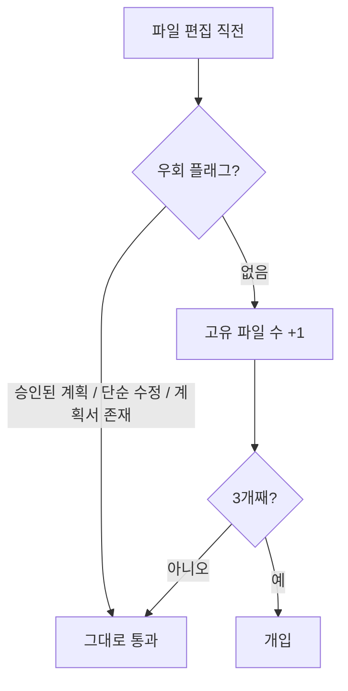

[[harness-1-benchmarking|지난 편]]에서 "복잡한 작업은 계획부터 세운다"는 파이프라인을 AI가 탈 수 있도록 만들었다. 그런데 막상 굴려 보니 AI가 그 규칙을 *제 손으로* 건너뛰는 경우를 발견하게 되었다.

증상은 늘 비슷했다. 사용자가 기능을 요청하면, AI는 계획 스킬을 부르는 대신 곧장 파일을 고치기 시작했다. 그러다 두세 개째 파일을 고치면서 채팅에 이런 식으로 적었다. "수정 파일: A, B, C / 승인해 주시면 진행하겠습니다." 겉보기엔 계획 같지만, 이건 정식 계획 절차를 **흉내만 낸 우회**였다. planner 에이전트도, 계획서 저장도, 자가 점검도 없이 AI가 즉석에서 지어낸 가짜 계획이다.

모델에게 "**그러지 마**"라고 적어 두는 것만으론 부족했다. 똑똑한 모델일수록 "이번엔 **작은 수정**이니까"라며 스스로를 설득했다. 그래서 **말이 아니라 장치로** 막기로 했다.

## 세는 부분부터

아이디어는 단순하다. *한 번의 사용자 턴 안에서 계획 없이 고친 고유 파일 수*를 센다. 세 번째 파일을 고치려는 순간이 곧 "이건 단순 수정이 아니다"라는 신호다.

이걸 [`PreToolUse`](https://docs.claude.com/en/docs/claude-code/hooks) [훅](https://docs.claude.com/en/docs/claude-code/hooks)(파일을 고치는 도구가 실행되기 *직전*에 끼어드는 장치)으로 잡았다. `Edit`·`Write`·`MultiEdit`·`NotebookEdit` 호출 직전마다 카운터를 올린다.

```js scripts/edit-counter.mjs
// Edit / Write / MultiEdit / NotebookEdit 직전에 이 턴의 고유 파일 수를 센다
const FILE_EDIT_TOOLS = new Set(["Edit", "Write", "MultiEdit", "NotebookEdit"]);
const length = recordFile(sessionId, fp);  // [!code highlight]
```

물론 **진짜 단순 수정까지 막으면 안 된다.** 그래서 세기 *전에* 우회 플래그를 먼저 확인한다. 하나라도 켜져 있으면 카운터를 건드리지 않고 즉시 통과시킨다.

```js scripts/preedit-guard.mjs
// 승인된 계획이 있거나, 사용자가 단순 수정이라 못박았으면 즉시 통과
if (hasApprovedPlanFlag() || hasBypassFlag(sessionId) || hasPlanForSession(sessionId)) {
  process.exit(0);
}
const length = recordFile(sessionId, fp);
```

세 가지는 각각 역할이 다르다. `hasApprovedPlanFlag`는 계획(plan) 스킬이 정식으로 사용자 승인을 받았을 때 켜지는 1순위 신호다. `hasBypassFlag`는 사용자가 "그냥 해줘"라든지 "단순 수정"처럼 명시적으로 우회를 요청했을 때다. `hasPlanForSession`은 계획서 파일이 실제로 저장돼 있는지 보는 마지막 안전망이다.



## 처음엔 벽을 세웠다

처음 버전(v1.1.14)은 세 번째 파일에서 아예 막아 세웠다. 훅이 `decision: "block"`을 돌려주면 그 편집은 거부가 되고, AI는 **강제**로 계획(plan) 스킬로 끌려간다.

```js scripts/preedit-guard.mjs
// v1.1.14 기준, 3개째 파일이면 강제 차단
if (length < 3) process.exit(0);

const blockOutput = {
  decision: "block",                       // [!code highlight]
  reason,                                  // "곧장 /plan 스킬을 시행하세요" 등
  hookSpecificOutput: {
    hookEventName: "PreToolUse",
    permissionDecision: "deny",
  },
};
process.stdout.write(JSON.stringify(blockOutput));
```

`reason`에는 단순한 거부가 아니라 *다음에 무엇을 하라*는 지시를 담았다. 사용자에게 사과나 메타 설명을 늘어놓지 말고, 첫 도구 호출로 곧장 계획 스킬을 부르고, 사용자에게 보일 첫 줄은 계획 스킬이 출력하는 안내 한 줄이어야 한다는 것까지 담게 되었다. 차단당한 티가 안 나게, 매끄럽게 *이어 가는* 흐름으로 보이게 한 셈이다.

그리고 채팅에 가짜 계획을 적는 우회는 편집 훅이 아니라 **프롬프트 단계**에서 막았다. "수정 파일:", "Phase 1/2/3", "승인해 주시면" 같은 즉석의 계획 패턴을 자연어로 금지하는 규칙을 매 턴마다 주입했다.

## 그런데 다시 벽을 낮췄다

벽은 잘 막긴 했지만, 너무 잘 막았다. 비개발자에게는 멀쩡히 흘러가던 작업이 **갑자기 거부당하는 경험**이 거칠게 느껴질 수도 있겠다 싶었다. 그래서 정식 릴리즈(v1.2.0)를 준비하며 이 부분을 다시 손보게 되었다.

결론은 **강제 차단을 버리고, 세도록 두되 막지는 않는** 쪽이었다. 카운터는 그대로 두되 세 번째부터는 표준 에러 채널에 힌트 한 줄만 흘려두고 통과시킨다. 계획을 경유할지 말지는 AI의 판단에 맡긴다.

```js scripts/preedit-guard.mjs
// v1.2.0 부터 block 폐기. 카운터는 유지하되 힌트만 남기고 통과
if (length >= 3) {
  process.stderr.write(/* 한 줄 힌트 */);  // [!code highlight]
}
process.exit(0);  // 차단하지 않음
```

우회 플래그를 다루는 함수들은 그대로 뒀다. 계획 저장·프롬프트 주입 같은 다른 장치가 여전히 "이번 턴에 몇 개나 고쳤나"를 참조하기 때문이다. 막는 행동만 걷어 내고, *인프라는 남긴* 것이다.

## 돌아보면

이 과정의 교훈은 "**강제와 신뢰 사이의 균형**"이었다. 모델이 덜 똑똑할 땐 벽이 필요했지만, 모델이 충분히 똑똑해지자 벽은 방해만 됐다. 그래서 *막는 것*에서 *알려 주는 것*으로 결론을 내렸다. 안전장치를 한 번 세웠다가 누그러뜨리는 이 패턴은, 이 하네스을 운영하며 **더 많이 반복**된다.

다음 편은 외부 도구를 처음 붙인 이야기다. 코드를 더 잘 읽게 해 주는 **[Serena](https://github.com/oraios/serena)** **MCP**를 도입하면서, "첫 세션부터 연결돼 있어야 한다"는 까다로운 요구와 씨름하는 이야기다. 😎
