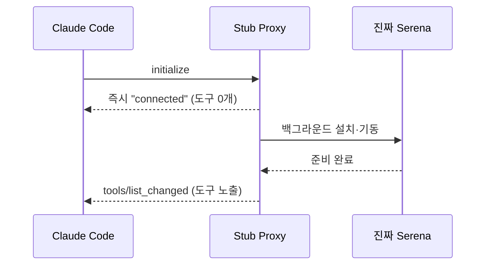

[[harness-2-self-bypass|지난 편]]까지가 규칙과 안전장치였다면, 이번엔 처음으로 *외부 도구*를 붙인 이야기다.

AI가 큰 코드베이스를 다룰 때, 파일을 통째로 읽어 들이면 토큰이 금세 바닥난다. [Serena](https://github.com/oraios/serena)는 코드를 심볼(symbol, 함수·클래스 같은 의미 단위) 단위로 훑게 해 주는 [MCP](https://modelcontextprotocol.io/) 서버(AI에 도구를 끼워 주는 표준 통로)다. 함수 하나만 콕 집어 읽으니 훨씬 싸다. 이걸 하네스에 붙이기로 했다.

문제는 설치와 연결이었다. Serena는 파이썬 도구라 별도 런타임이 필요하고, MCP 서버가 처음 뜨는 데 시간이 걸린다. 그런데 Claude Code는 MCP 서버가 제때 응답하지 않으면 연결을 포기한다. 비개발자 입장에서는 첫 세션에 `serena: failed`가 떠 있고, 직접 재연결 버튼을 눌러야 하는 경험이 된다. 이건 받아들이기 어려웠다.

## 일단 "연결됐다"고 답하는 프록시

그래서 떠올린 게 **Stub Proxy**(겉만 흉내 내는 중간 대리자)였다. 발상은 단순하다. Claude Code가 서버를 띄우는 순간, 진짜 Serena가 준비되기 전이라도 *일단* "연결됐다"고 즉시 답한다. 그러고 나서 뒤로 진짜 Serena를 설치·기동하고, 준비가 끝나면 "도구 목록이 바뀌었다"고 알려 도구를 슬그머니 노출한다.



핵심은 `initialize` 요청에 *지체 없이* 응답하는 부분이다. 진짜 서버를 기다리지 않고 프록시가 먼저 손을 든다.

```js scripts/run-serena.mjs
// initialize엔 즉시 응답해 "connected"를 확보하고, 진짜 Serena는 백그라운드로 띄운다
if (method === "initialize") {
  respondResult(id, {
    protocolVersion,
    capabilities: { tools: { listChanged: true } },  // [!code highlight]
    serverInfo: { name: PROXY_NAME, version: PROXY_VERSION },
  });
  setImmediate(prepareInBackground);
  return;
}
```

`listChanged: true`가 약속의 핵심이다. "지금은 도구가 없지만 나중에 바뀔 거야"라고 선언해 두는 것이다. 통신 채널도 조심스럽게 갈랐다. 표준 입력은 Claude Code의 요청, 표준 출력은 프록시의 응답(여기에 잡음이 섞이면 통신이 깨진다), 표준 에러는 설치 로그 전용. 한 채널이라도 오염되면 JSON 통신이 무너지기 때문이다.

설치도 사용자 환경을 건드리지 않게 격리했다. 파이썬 패키지 실행기 [uv](https://github.com/astral-sh/uv)를 플러그인 전용 폴더에만 받아서, 시스템 전역에는 흔적을 안 남겼다.

## 결국 걷어냈다

여기까지는 영리했다. 그런데 Claude **Desktop**에서 막혔다. Desktop은 "도구 목록이 바뀌었다"는 알림을 구조적으로 지원하지 않았다. 그러니 프록시가 아무리 "이제 도구가 생겼어"라고 외쳐도 Desktop은 듣지 못했고, 도구가 0개로 고정됐다. 첫 세션 연결을 살리려던 장치가, 다른 환경에서는 오히려 도구를 영영 안 보이게 만든 것이다.

그래서 프록시를 폐기하고 가장 단순한 방식으로 돌아갔다. 패키지 실행기로 Serena를 *그냥 바로* 띄워 표준 입출력에 직결한다.

```js scripts/run-serena.mjs
// 프록시 폐기(2026-04-24). uvx로 Serena를 직접 실행해 stdio 그대로 연결한다
const child = spawn(uvxPath, [
  "--from", "git+https://github.com/oraios/serena",
  "serena", "start-mcp-server",
  "--context", "claude-code",
  "--enable-web-dashboard", "false",  // [!code highlight]
  "--enable-gui-log-window", "false",
  "--project", projectRoot,
], { stdio: "inherit", windowsHide: true });
```

대시보드와 GUI 로그 창은 꺼 뒀다. 안 그러면 세션을 시작할 때마다 브라우저 창이 멋대로 열린다. 첫 세션에 도구가 잠깐 안 보이는 건 감수하기로 했다. 한 번 설치되면 다음부터는 캐시된 실행기를 즉시 재사용하니, 실제로 체감되는 지연은 최초 1회뿐이었다.

## 돌아보면

Stub Proxy는 똑똑한 해법이었지만, *내 환경에서만* 똑똑했다. 한 곳(CLI)의 문제를 풀려고 만든 장치가 다른 곳(Desktop)에서 더 큰 문제를 만들었다. 결국 "영리한 우회"보다 "단순하고 어디서나 도는 것"이 이겼다. 이 교훈은 시리즈 마지막, Serena 자체를 들어내는 회차에서 한 번 더 확인하게 된다.

다음 편은 하네스의 기억이다. AI가 무엇을 기억하고, 그 기억을 다음 세션에 어떻게 꺼내 쓰는지를 다룬다. 🌱
