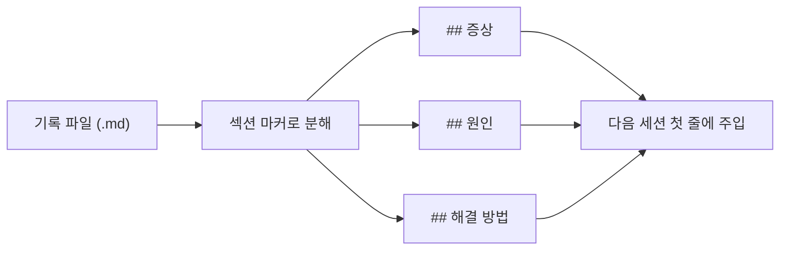

[[harness-3-serena-proxy|지난 편]]에서 도구를 붙였다면, 이번엔 하네스의 **기억**이다.

세션이 끝나면 **AI의 맥락은 사라진다.** 같은 실수를 다음 세션에서 또 한다. 그래서 작업하며 마주친 에러 패턴, 알게 된 사실, 세웠던 계획을 마크다운 파일로 남기고, 다음 세션이 시작될 때 다시 불러오기로 했다. 흔한 오해와 달리 이 저장은 거의 **자동**이다. 세션 시작/종료 시점마다 알아서 기록되고, 사람이 "기억해 줘"라고 시키는 건 보조일 뿐이다.

문제는 *불러오는* 쪽이었다.

## 통째로 읽으면 안 됐다

처음엔 단순했다. 저장된 메모리 파일의 앞부분을 잘라서 넣었다. 그런데 첫 8줄, 240자만 끊어 넣으니 정작 중요한 "원인"과 "해결 방법"이 잘려 나갔다. 기록은 남는데 다음 세션이 그걸 못 쓰는 상황이었다.

그래서 *앞부분을 자르는* 대신 *섹션을 골라 뽑는* 쪽으로 바꿨다. 기록의 종류마다 어떤 제목(마커)의 내용을 얼마나 가져올지를 표로 정의했다.

```js scripts/memory-loader.mjs
const SUBDIR_CONFIG = {
  "error-patterns": {
    markers: ["## 증상", "## 원인", "## 해결 방법"],  // [!code highlight]
    sectionCap: 250,
    maxCount: 5,
    title: "최근 에러 패턴"
  },
  "learnings": {
    markers: ["## 내용", "## 적용 상황"],
    sectionCap: 350,
    maxCount: 5,
    title: "학습 인사이트"
  },
  // plans: 목표·영향 범위·Task 단위로 더 길게
};
```

에러 패턴이면 증상/원인/해결 세 토막을 각 250자까지, 다섯 건만 불러왔다. 학습 내용이면 내용과 적용 상황 두 조각을 각 350자까지 불러왔다. 결국 *알맹이만 골라 다음 세션에 제공해 준다*. 앞부분을 자르던 것에서, 의미 있는 단면을 추려 내는 것으로 바뀐 것이다.



여기엔 사소하지만 성가신 함정도 있었다. 마커를 정규식으로 찾다 보니, 기록 본문 안에 인용된 `## 요약` 같은 글자(코드 블록 안의 예시)까지 진짜 제목으로 오인했다. **여러 줄을 한 번에 보는 정규식**으로 이걸 걸러 냈다.

## 세션 시작 때 불러오기

뽑아낸 메모리는 세션이 시작될 때 [`SessionStart`](https://docs.claude.com/en/docs/claude-code/hooks) [훅](https://docs.claude.com/en/docs/claude-code/hooks)으로 주입한다. 사용자가 보는 첫 줄에 "이전 작업 기록 3건을 불러왔어요" 같은 안내가 뜨는 게 그 결과라고 할 수 있다.

얼마나 넣을지는 두 가지로 정한다. 위의 `maxCount`(**종류별 건수**)와 설정 파일의 전체 상한이다.

```js scripts/memory-loader.mjs
// 전체 주입량 상한은 설정에서 읽는다(기본은 50)
let maxEntries = 50;
try {
  const s = JSON.parse(readFileSync(settingsPath, "utf-8"));
  if (s?.memory?.max_entries) maxEntries = s.memory.max_entries;
} catch {}
```

기억이 많아질수록 무작정 다 넣으면 그게 또 토큰을 소모한다. 그래서 "최근/중요 순으로 이만큼만"이라는 상한을 둔 것이다.

## 저장 쪽도 수정

불러오기를 고치고 나니 저장 쪽의 결함도 보였다. AI가 기록 저장을 깜빡하는 빈도를 줄이려고, **작업이 끝나는 시점**([`PostToolUse`](https://docs.claude.com/en/docs/claude-code/hooks))에 저장을 강하게 권하는 장치를 뒀다.

여러 세션이 동시에 돌 때 같은 마커 파일을 건드리다 깨지는 경합(race condition)도 막아야 했다. 임시 파일에 먼저 쓰고 마지막에 *이름만 바꿔치기*하는 **원자적 교체**(atomic rename)로 풀었다. 쓰다 만 절반짜리 파일이 읽히는 일이 없어진다.

## 결론

메모리에서 어려운 건 "저장"이 아니라 "무엇을, 얼마나 꺼내느냐"였다. 다 기억하면 비싸고, 적게 기억하면 쓸모없다. 마커라는 단순한 규칙 하나로 그 문제를 잡게 되었다. 기록의 *형식*을 약속해 두면, AI가 그 형식을 단면으로 활용할 수 있다는 게 이 과정의 작은 발견이었다.

다음 편은 시선을 바꾸게 된다. 지금까지는 안에서 돌아가는 부분이었다면, 다음은 *비개발자에게 어떻게 보이느냐*다. 친화적인 안내 문구와 첫 줄에 나오는 가시화로 정식 버전을 다듬는다. 🍀
