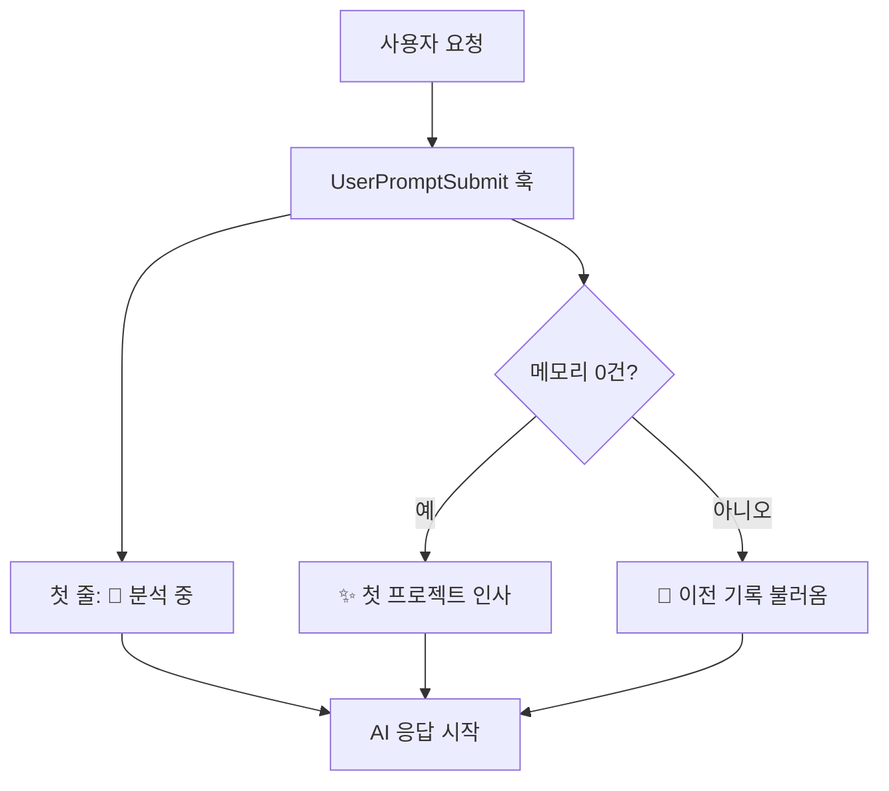

[[harness-4-memory|지난 편]]까지가 안에서 도는 부분을 건드렸다면, 이번엔 *바깥 문구에서 어떻게 보이느냐*를 다루는 글이다.

이 하네스는 개발자만 쓰도록 만든 게 아니다. 기획자나 디자이너, 운영팀에서도 사용하게끔 하려고 했다. 그런데 그동안 개발을 할 때 화면에 뜨던 말은 죄다 개발 용어였다. "lint가 통과되었습니다." 등 비개발자에게는 외계어가 될 수 있었다. 정식 버전(v1)을 준비하며, 이걸 **모두가 알아들을 수 있는 말로 바꾸는 작업**이 필요했다.

## 그 전엔 무엇이 문제였나

하네스는 *기능*은 다 갖췄다고 할 수는 있었지만, 고유의 *말투*가 없었다. 계획 → 작업 → 검증을 다 거치면서도, 그 사실이 사용자 화면에는 거의 드러나지 않았다. AI가 답을 내놓으면 그게 안전한 답변인지, 그냥 즉흥으로 뱉은 답변인지 구분할 단서가 없었다. 검증 결과도 `verify.sh`의 원본 출력 형식(PASS/FAIL & exit code)을 거의 그대로 보여줬고, 진행 안내에는 `planner`·`/harness:plan` 같은 **내부 도구의 이름**(에이전트/슬래시 커맨드; AI를 동작하게 하는 내부 도구 호출)이 그대로 노출됐다.

개발자에게는 그게 오히려 정보이긴 했지만, 비개발자에게는 신뢰를 깎는 노이즈였다. 그래서 v1의 과제는 새 기능이 아니라 *번역*이었다. 같은 일을 하되, 모두가 읽을 수 있는 형태로 제공하는 것이었다.

## 작동하고 있다는 걸 보여 주기

가장 먼저 한 건 **하네스의 가시화**다. 사용자가 무언가를 요청하면, AI가 답하는 맨 첫 줄에 "하네스가 지금 일하고 있다"는 신호를 강제로 띄운다. 매 사용자 턴마다 **항상** 띄우도록 설정해두었다.

이건 사용자 입력이 모델에 닿기 직전에 끼어드는 [`UserPromptSubmit`](https://docs.claude.com/en/docs/claude-code/hooks) [훅](https://docs.claude.com/en/docs/claude-code/hooks)이 맡는다. 훅이 매 턴마다 프롬프트를 짜서 `additionalContext`(모델에게만 덧대는 숨은 지시문)로 밀어 넣는데, 그 마지막에 가시화할 수 있도록 한 문장을 못 박아 둔다.

```js scripts/pipeline-injector.mjs
// 매 사용자 턴마다 첫 응답 첫 줄에 하네스 가시화 헤더를 강제 출력.
// 회피 시그널(--simple 등)이 있어도 항상 출력.
baseLines.push(
  "사용자 가시화 규칙 - 사용자에게 보내는 첫 응답의 맨 첫 줄에 다음 한 줄을 그대로 출력하세요. 의역·추가 설명·prefix 금지.",
  "> 🚀 하네스가 요청을 분석하고 있어요."  // [!code highlight]
);
```

별것 아닌 것 같지만, 비개발자에게는 *중요한 부분*이었다. AI가 그냥 답변하는 건지, 우리 하네스를 거쳐 답하는 건지 구분이 안 되면 신뢰가 안 생긴다. 이 한 문장이 "**지금 하네스가 켜져 있다**"를 매번 증명한다.

처음 쓰는 사람에게는 다른 문구를 띄웠다. 세션을 처음 시작할 때 도는 `SessionStart` 훅이 프로젝트의 메모리 폴더를 열어 보고, 기록이 0건이면, **즉 이 하네스로 처음 작업하는 프로젝트면** 빈 화면 대신 *앞으로 기억이 쌓인다*는 문구를 먼저 보여준다.

```js scripts/memory-loader.mjs
// 메모리 폴더가 없거나 기록 0건이면, 첫 응답 첫 줄에 띄울 콜드 스타트 인사를 내보낸다
const emptyHeadline = "✨ 하네스로는 처음 하는 프로젝트네요! 이번 세션부터 메모리가 차곡차곡 쌓일 거예요.";
const emptyOutput = { hookSpecificOutput: { hookEventName: "SessionStart",
  additionalContext: [emptyHeadline, "", `…맨 첫 줄에 그대로 출력하세요.`, `> ${emptyHeadline}`].join("\n") } };
process.stdout.write(JSON.stringify(emptyOutput));  // [!code highlight]
```

콜드 스타트(cold start; 아무 기록도 없는 첫 실행)에서도 화면이 비지 않게, 그리고 기록이 있으면 그건 그것대로 "**이전 기록을 불러왔다**"고 알린다.



## 모두가 알아들을 수 있는 말로

검증 결과를 보고하는 말도 바꿨다. 내부적으로는 lint·build·test를 그대로 돌리되, 사용자에게 보이는 응답에서는 그 단어를 *절대 노출하지 않기로* 했다. 검증 스킬 문서에 아예 단어 매핑 표를 명시해 뒀다.

| 내부에서 쓰는 말                | 사용자에게 보이는 말        |
| ------------------------ | ------------------ |
| build 통과                 | 프로그램이 정상적으로 만들어졌어요 |
| PASS / FAIL              | 통과 / 문제 발견         |
| lint·build·type check 통과 | 코드 점검이 모두 통과했어요    |
| sentinel을 작성합니다          | 기록을 남기고 있어요        |

"디스크"/"파일에 저장" 같은 표현조차 "**메모리에 기록**"으로 바꿨다. 기록을 남길 때 화면에 뜨는 말은 딱 한 줄이다. "**💾 작업 내용을 기록으로 남겼어요.**"

더 중요한 건 *무엇을 숨기느냐*였다. 에이전트 이름이나 슬래시 커맨드, 내부에서 분류하는 라벨은 아예 사용자 응답에 노출하지 않기로 정책을 세우고, 그걸 매 턴 주입되는 안내문 맨 위에 명시했다.

```js scripts/pipeline-injector.mjs
// 주요 사항만 한 줄로 압축. 내부 라벨(A/B)·슬래시커맨드·에이전트명은 사용자 가시 영역에 노출 금지.
const baseLines = [
  "[하네스] 새 요청이면 분류 후 진행: 질문/열람=즉답, 1~2파일 단순수정=즉시작업+점검, 그 외=계획→승인→작업→점검.",
  "내부 라벨·슬래시커맨드·에이전트명을 사용자 응답에 노출 금지. 진행 중 흐름이면 이어가세요.",  // [!code highlight]
];
```

결국 이 한 줄이 하는 일은 단순하다. *사용자는 무엇을 했는지만 알면 되지, 어떤 내부 도구가 그 일을 했는지는 알 필요가 없다.* 부품명이 새어 나오면 그건 정보보다는 군더더기라고 생각했다.

[[harness-2-self-bypass|2편]]에서 다룬 자기우회 차단 방식도 이 과정에 맞물려 누그러졌다. 강제로 막아 세우면 비개발자에게는 거친 경험이라고 생각되어, 막지는 않는 쪽으로 내린 게 바로 이 정식 버전이었다.

## 교훈

이 과정에서 배운 건 "하네스는 보여야 신뢰받는다"였다. 아무리 좋은 검증/메모리 기록 과정을 설치해놔도, 사용자가 그게 도는지 모르면 없는 것과 같다. 첫 줄 한 줄, 인사 한 줄이 기능 목록보다 신뢰에 더 크게 기여했다. 정식 버전의 코어는 새 기능이 아니라 *말투*였던 셈이다.

다음 편은 조금 더 무대를 넓힌다. 지금까지 [Claude Code](https://docs.claude.com/en/docs/claude-code) 위에서만 돌던 하네스를, [Codex](https://github.com/openai/codex)라는 다른 LLM에서도 돌도록 확장한다. 🌱
