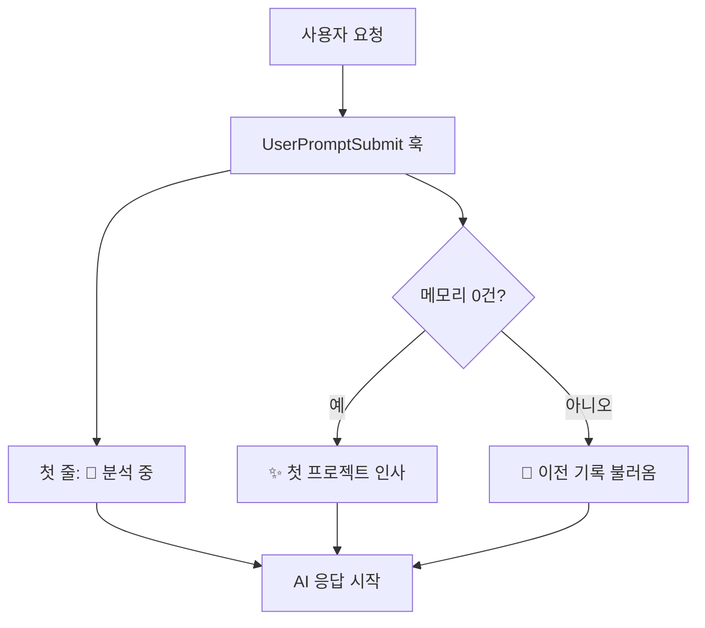

[[harness-4-memory|지난 편]]까지가 안에서 도는 장치였다면, 이번엔 *바깥에서 어떻게 보이느냐*다.

이 하네스는 개발자만 쓰는 게 아니다. 기획·운영·디자인 직군도 쓴다. 그런데 그동안 화면에 뜨던 말은 죄다 개발자 말이었다. "lint 통과", "sentinel TTL", "PASS/FAIL". 비개발자에게는 외계어였다. 정식 버전(v1.2.0)을 준비하며, 이걸 알아들을 수 있는 말로 갈아엎었다.

## 작동하고 있다는 걸 보여 주기

가장 먼저 한 건 **첫 줄 가시화**다. 사용자가 무언가를 요청하면, AI가 답하는 맨 첫 줄에 "하네스가 지금 일하고 있다"는 신호를 강제로 띄운다. 매 사용자 턴마다, 회피 신호가 있어도 항상.

```js scripts/pipeline-injector.mjs
// 매 턴 첫 응답의 맨 첫 줄에 하네스 가시화 헤더를 강제 출력
baseLines.push(
  "사용자 가시화 규칙: 사용자에게 보내는 첫 응답의 맨 첫 줄에 다음 한 줄을 그대로 출력하세요.",
  "> 🚀 276 하네스가 요청을 분석하고 있어요."  // [!code highlight]
);
```

별것 아닌 것 같지만, 비개발자에게는 *중요한 안심*이다. AI가 그냥 답하는 건지, 안전장치를 거쳐 답하는 건지 구분이 안 되면 신뢰가 안 생긴다. 이 한 줄이 "지금 하네스가 켜져 있다"를 매번 증명한다. (그래서 이 글을 쓰는 동안에도 화면 위쪽에 같은 줄이 계속 떴다.)

처음 쓰는 사람에게는 다른 인사를 띄웠다. 메모리가 0건이면, 즉 이 도구로 처음 작업하는 프로젝트면 이렇게.

```text
✨ 276 하네스로는 처음 하는 프로젝트네요! 이번 세션부터 메모리가 차곡차곡 쌓일 거예요.
```

빈 화면 대신 "앞으로 기억이 쌓인다"는 기대를 먼저 심는 콜드 스타트(cold start, 아무 기록도 없는 첫 실행) 안내다.



## 말을 사람 말로

검증 결과를 보고하는 말도 바꿨다. "빌드·린트·테스트 통과" 같은 표현은 비개발자용 친화 표현으로 매핑했다. 에이전트 이름·슬래시 커맨드·내부 라벨은 아예 사용자 응답에 노출하지 않기로 정책을 세웠다. 사용자는 *무엇을 했는지*만 알면 되지, 어떤 내부 부품이 그 일을 했는지는 알 필요가 없다.

[[harness-2-self-bypass|지난 편]]에서 다룬 자기우회 차단도 이 회차에 맞물려 누그러졌다. 강제로 막아 세우면 비개발자에게는 거친 경험이라, 세되 막지 않는 쪽으로 내린 게 바로 이 정식 버전이었다.

설명서도 다시 썼다. 어디서 쓰나, 지금 어디까지 됐나, 설치·확인·업데이트, 실제 사용법, 자동으로 되는 것, 우회 방법, 스킬, 자주 묻는 질문, 향후 계획까지 11개 섹션으로 정리했다. 개발자 README가 아니라 *사용 설명서*에 가깝게.

## 돌아보면

이 회차에서 배운 건 "안전장치는 보여야 신뢰받는다"였다. 아무리 좋은 검증·기록 장치를 깔아도, 사용자가 그게 도는지 모르면 없는 것과 같다. 첫 줄 한 줄, 인사 한 줄이 기능 목록보다 신뢰에 더 크게 기여했다. 정식 버전의 핵심은 새 기능이 아니라 *말투*였던 셈이다.

다음 편은 무대를 넓힌다. 지금까지 [Claude Code](https://docs.claude.com/en/docs/claude-code) 위에서만 돌던 하네스를, [Codex](https://github.com/openai/codex)라는 다른 런타임에서도 돌게 옮긴다. 한 하네스, 두 런타임. 🌱
