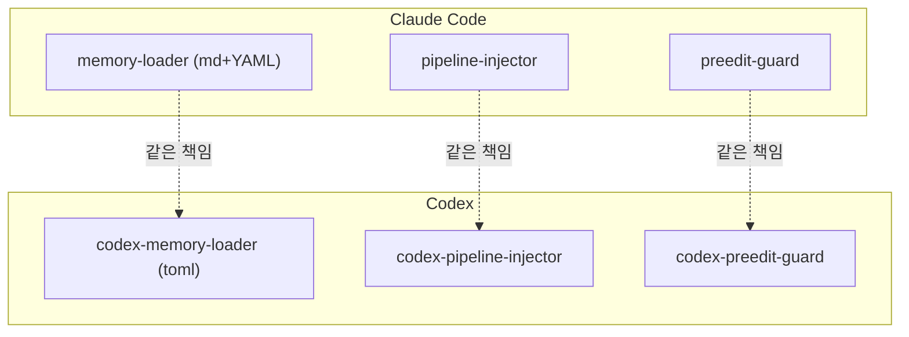

여기까지 만든 하네스는 [Claude Code](https://docs.claude.com/en/docs/claude-code) 위에서만 돌았다. 그런데 사내에서 [Codex](https://github.com/openai/codex)(OpenAI의 코딩 에이전트)도 쓰기 시작했다. 둘은 **런타임**(runtime; AI가 실제로 도는 실행 환경)이 다르다. 하네스를 Codex에서도 쓰려면, 같은 흐름을 그쪽 방식으로 다시 구현해야 했다. v1.3.0의 과제였다.

## 그전엔 무엇에 묶여 있었나

기존 하네스는 Claude Code의 부품에 단단히 묶여 있었다. 역할별 에이전트는 `agents/*.md`(YAML 머리말이 붙은 마크다운)로 정의했고, 워크플로우는 `/harness:plan` 같은 **슬래시 커맨드**로 불렀다. 세션 시작·사용자 입력·편집 직전마다 도는 훅도 Claude Code의 훅 규격(`hooks.json`)에 맞춰져 있었다. 흐름 자체는 런타임과 무관했지만, 그 흐름을 *부르는 방법*이 전부 Claude Code 전용이었다.

Codex에는 그 부품이 없거나 모양이 달랐다. 에이전트는 마크다운이 아니라 **TOML**(키=값 형식의 설정 파일)로 적고, 슬래시 커맨드라는 개념 자체가 없다. 그래서 "복사 붙여넣기"로는 안 됐다.

## 표면은 유지, 속은 포팅

원칙은 분명했다. *흐름은 그대로, 구현만 갈아 끼운다.* Claude용 파일 표면은 손대지 않고, Codex용 파일을 `codex/` 아래로 따로 뒀다. 같은 파이프라인(계획 → 실행 → 검증 → 수정)과 같은 메모리·계획 보조 스크립트를 Codex 쪽에도 깔되, Codex의 방식에 맞게 바꿨다.

훅 구조를 보면 양쪽이 거울처럼 닮았다. 세션 시작에 메모리를 불러오고, 사용자 입력마다 파이프라인을 주입하고, 파일 편집 직전에 범위를 점검한다. Codex 훅은 플러그인 루트를 환경 변수로 받아 같은 이름의 `codex-` 스크립트를 띄운다.

```json codex/hooks/hooks.json
{
  "hooks": {
    "SessionStart":     [ /* codex-memory-loader.mjs   */ ],  // 기억 불러오기
    "UserPromptSubmit": [ /* codex-pipeline-injector.mjs */ ], // 파이프라인 주입 [!code highlight]
    "PreToolUse":       [ /* codex-preedit-guard.mjs    */ ], // 편집 범위 점검 (matcher: apply_patch|Edit|Write)
    "Stop":             [ /* codex-completion-saver.mjs  */ ]
  }
}
```

슬래시 커맨드가 없으니, 워크플로우를 부르는 일은 전부 훅과 컨텍스트 주입으로 옮겼다. `/plan`을 손으로 치는 대신, `UserPromptSubmit` 훅이 매 턴 파이프라인 안내를 주입해 같은 흐름이 자동으로 돌게 한 것이다.

에이전트도 다시 났다. 같은 책임을 지되, Claude의 YAML 마크다운이 아니라 Codex의 TOML로. 모델·추론 강도·샌드박스 권한을 그 형식에 맞춰 적는다.

```toml codex/agents/implementer.toml
name = "implementer"
description = "프론트엔드·백엔드·DB·범용 작업을 한 에이전트가 도메인에 맞춰 처리"
model = "gpt-5.5"
sandbox_mode = "workspace-write"        # [!code highlight]
model_reasoning_effort = "medium"
developer_instructions = """
승인됐거나 명확히 범위가 잡힌 작업만 한다. 변경은 작게, 한 커밋 단위로.
편집한 모든 줄은 맡은 작업과 직접 매핑돼야 한다. 곁다리 리팩터링·임포트 정렬·죽은 코드 삭제 금지.
검증은 가장 좁은 의미 있는 체크로. DONE / DONE_WITH_CONCERNS / NEEDS_CONTEXT / BLOCKED 중 하나로 보고.
"""
```

에이전트마다 *모델·권한·추론 강도*도 따로 줬다. 구현하는 에이전트는 쓰기 권한과 중간 추론을, 검증하는 에이전트는 읽기 전용에 가벼운 추론을 준다. [[harness-1-benchmarking|1편]]에서 검토자에게 읽기 도구만 줬던 권한 분리가, 여기서는 샌드박스 모드라는 더 강한 형태로 박혔다.

```toml codex/agents/verifier.toml
name = "verifier"
model = "gpt-5.4"
sandbox_mode = "read-only"            # 파일을 못 고친다 [!code highlight]
model_reasoning_effort = "low"        # 검증은 무거운 추론이 필요 없다
```

이 모든 codex 부속을 하나의 플러그인 매니페스트가 묶는다. 스킬·훅·도구 경로를 한 파일이 가리키고, 버전을 Claude 쪽과 한 숫자로 맞춰(v1.4.0으로 통일) 두 런타임이 따로 놀지 않게 했다.

```json codex/.codex-plugin/plugin.json
{
  "name": "harness-dev",
  "skills": "./skills/",
  "hooks": "./hooks/hooks.json",     // [!code highlight]
  "mcpServers": "./mcp.json"
}
```

[[harness-2-self-bypass|2편]]의 편집 범위 점검도, [[harness-4-memory|4편]]의 메모리 로더도, [[harness-5-nondev-ux|5편]]의 첫 줄 가시화도 전부 `codex-` 접두가 붙은 쌍둥이로 다시 났다. 그리고 워크플로우 스킬(`harness-plan`·`harness-exec`·`harness-verify` ...)도 `codex/skills/` 아래 같은 이름으로 옮겨 심었다. 같은 책임, 다른 런타임.



## 저장 위치를 한 곳에서

두 런타임을 동시에 받치려니 *저장 위치*가 문제였다. 메모리와 카운터를 어디에 둘지가 런타임마다 흩어지면 코드가 갈라진다. 그래서 경로를 한 군데서 결정하는 작은 추상화 층을 뒀다. 플러그인 데이터 폴더를 기본으로 삼되, 환경 변수로 덮어쓸 수 있게.

```js codex/scripts/lib/harness-paths.mjs
export function dataRoot() {
  const configured = process.env.PLUGIN_DATA || process.env.CODEX_HARNESS_DATA;
  const root = configured?.length ? configured : join(homedir(), ".codex-harness-dev");  // [!code highlight]
  mkdirSync(root, { recursive: true });
  return root;
}
// memory/, counter/ 같은 하위 경로는 전부 이 dataRoot() 한 곳에서 파생된다
export function memoryDir(cwd = process.cwd()) {
  return subdir(join(dataRoot(), "projects", toSlug(cwd)), "memory");
}
```

이 "저장 위치를 코드 한 곳에서 관리한다"는 정리는 사소해 보여도 중요했다. 뒤에 메모리를 팀이 공유하게 옮길 때([[harness-7-snowflake|7편]]), 이 한 곳만 바꾸면 됐기 때문이다. 당장 필요해서가 아니라, *다음 확장의 디딤돌*로 미리 깔아 둔 셈이다.

## 돌아보면

런타임 이식은 "복사 붙여넣기"가 아니었다. 슬래시 커맨드처럼 한쪽에만 있는 기능에 흐름이 묶여 있으면, 그 의존부터 끊어야 했다. 그 과정에서 하네스의 *본질*이 더 또렷해졌다. 슬래시 커맨드는 껍데기였고, 진짜 알맹이는 "계획 → 실행 → 검증"이라는 흐름과 그걸 강제하는 훅들이었다. 껍데기를 떼어 보니 알맹이가 드러난 회차였다.

다음 편은 기억의 무대를 넓힌다. 지금까지 기록은 *내 PC에만* 쌓였다. 이걸 팀이 같이 쓰게 사내 공용 저장소로 올리는 파이프라인을 만든다. 그 과정에서 민감정보를 가리는 문제와 정면으로 부딪힌다. 😎
