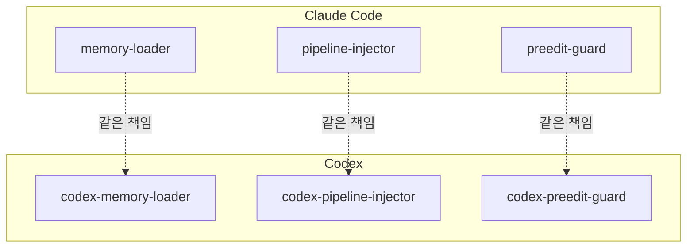

여기까지 만든 하네스는 [Claude Code](https://docs.claude.com/en/docs/claude-code) 위에서만 돌았다. 그런데 사내에서 [Codex](https://github.com/openai/codex)(OpenAI의 코딩 에이전트)도 쓰기 시작했다. 둘은 런타임(runtime, AI가 실제로 도는 실행 환경)이 다르다. 하네스를 Codex에서도 쓰려면, 같은 흐름을 그쪽 방식으로 다시 구현해야 했다. v1.3.0의 과제였다.

## 표면은 유지, 속은 포팅

원칙은 분명했다. *흐름은 그대로, 구현만 갈아 끼운다.* Claude용 파일 표면은 손대지 않고, Codex용 파일을 `codex/` 아래로 따로 뒀다. 같은 파이프라인(계획 → 실행 → 검증 → 수정)과 같은 메모리·계획 보조 스크립트를 Codex 쪽에도 깔되, Codex의 방식에 맞게 바꿨다.

가장 큰 차이는 **슬래시 커맨드 의존**이었다. Claude Code에서는 `/plan` 같은 슬래시 커맨드로 스킬을 부른다. Codex에는 그런 게 없다. 그래서 슬래시 의존을 걷어내고, Codex의 훅과 컨텍스트 주입만으로 같은 흐름이 돌게 했다.

훅 구조를 보면 양쪽이 거울처럼 닮았다. 세션 시작에 메모리를 불러오고, 사용자 입력마다 파이프라인을 주입하고, 파일 편집 직전에 범위를 점검한다.

```json codex/hooks/hooks.json
{
  "hooks": {
    "SessionStart":    [ /* codex-memory-loader.mjs */ ],     // 기억 불러오기
    "UserPromptSubmit":[ /* codex-pipeline-injector.mjs */ ], // 파이프라인 주입 [!code highlight]
    "PreToolUse":      [ /* codex-preedit-guard.mjs */ ],     // 편집 범위 점검
    "PostToolUse":     [ /* ... */ ]
  }
}
```

[[harness-2-self-bypass|2편]]의 편집 범위 점검도, [[harness-4-memory|4편]]의 메모리 로더도, [[harness-5-nondev-ux|5편]]의 첫 줄 가시화도 전부 `codex-` 접두가 붙은 쌍둥이로 다시 났다. 같은 책임, 다른 런타임.



## 저장 위치를 한 곳에서

두 런타임을 동시에 받치려니 *저장 위치*가 문제였다. 메모리와 플래그를 어디에 둘지가 런타임마다 다르면 코드가 갈라진다. 그래서 저장 경로를 한 군데서 결정하는 작은 추상화 층을 뒀다. 플러그인 데이터 폴더를 기본으로 삼되, 환경 변수로 덮어쓸 수 있게.

이 "저장 위치를 코드 한 곳에서 관리한다"는 정리는 사소해 보여도 중요했다. 뒤에 메모리를 팀이 공유하게 옮길 때([[harness-7-snowflake|7편]]), 이 한 곳만 바꾸면 됐기 때문이다. 당장 필요해서가 아니라, *다음 확장의 디딤돌*로 미리 깔아 둔 셈이다.

## 돌아보면

런타임 이식은 "복사 붙여넣기"가 아니었다. 슬래시 커맨드처럼 한쪽에만 있는 기능에 흐름이 묶여 있으면, 그 의존부터 끊어야 했다. 그 과정에서 하네스의 *본질*이 더 또렷해졌다. 슬래시 커맨드는 껍데기였고, 진짜 알맹이는 "계획 → 실행 → 검증"이라는 흐름과 그걸 강제하는 훅들이었다. 껍데기를 떼어 보니 알맹이가 드러난 회차였다.

다음 편은 기억의 무대를 넓힌다. 지금까지 기록은 *내 PC에만* 쌓였다. 이걸 팀이 같이 쓰게 사내 공용 저장소로 올리는 파이프라인을 만든다. 그 과정에서 민감정보를 가리는 문제와 정면으로 부딪힌다. 😎
