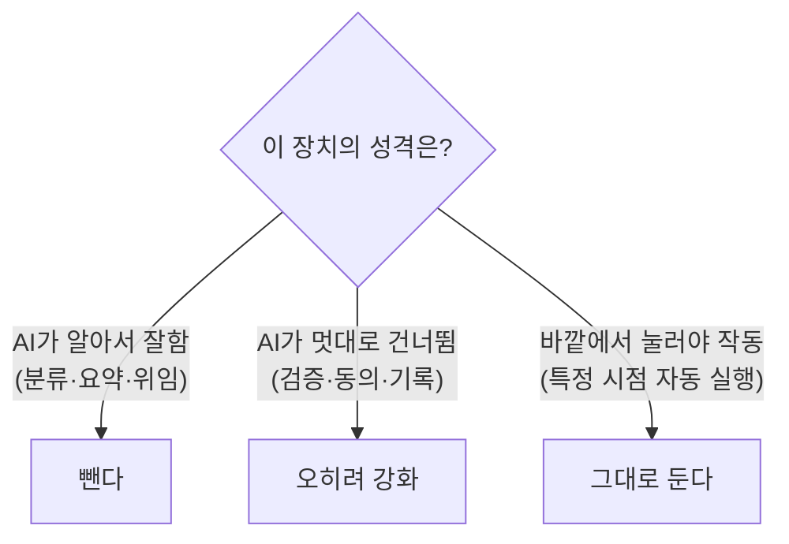

[[harness-1-benchmarking|1편]]부터 [[harness-7-snowflake|7편]]까지는 *쌓는* 이야기였다. 파이프라인을 깔고, 도구를 붙이고, 기억을 공유하게 했다. 그런데 그사이 모델이 부쩍 똑똑해졌다. 그러자 질문이 뒤집혔다. *이제 뭘 빼도 되나?*

기준을 다시 잡았다. "더 똑똑한 AI가 이 일을 할 수 있나?"가 아니라 **"AI가 이 일을 제 멋대로 건너뛸 수 있나?"** 로 봐야 했다.



빼도 되는 건 AI 능력에 흡수되는 잔소리였다. 몇 가지가 구체적으로 사라졌다.

- 작업을 A/B/C로 깐깐하게 나누던 **분류표**. 모델이 알아서 분류를 잘하니, "단순 수정이면 바로, 복잡하면 계획부터"라는 *권유형* 한 줄로 줄였다.
- 사실상 같은 일을 하던 **프론트·백엔드·DB 일꾼 넷**. "편집한 모든 줄은 맡은 작업과 직접 매핑돼야 한다"는 수술적 변경 원칙만 공통으로 흡수시키고, `implementer` 하나로 합쳤다.
- 한참 전에 꺼 둔 **배포 기능**. `deploy-*` 에이전트와 배포 스크립트는 호출해도 즉시 종료하게 가드만 남겨 둔, 사실상 죽은 무게였다.

그 결과 진입점 문서(`CLAUDE.md`)도 152줄에서 84줄로 줄었다. 반대로 검증·동의 게이트·권한 분리·기록은 똑똑해질수록 *더* 중요했다. 확신할수록 객관적 검증이 필요하니까.

이 사상을 두 번의 더 큰 제거로 옮겼다.

## 하나: 직접 만든 통로를 걷다

[[harness-7-snowflake|7편]]에서 만든 동기화 통로를 들어냈다. 데이터 조회·기록 저장을 *공식 커넥터*가 맡기로 하면서, 직접 만들어 운영하던 통로가 통째로 중복이 됐기 때문이다. 그 통로에만 매달려 있던 보조 모듈들도 함께 지웠다. 청킹·마스킹·증분 마커처럼 7편에서 공들였던 코드들이다.

```text 삭제된 파일 (커밋 메시지에서)
- run-harness-rag.mjs, set-harness-rag-secret.mjs
- memory-sync{,-trigger,-exclude}.mjs
- lib/memory-{sync-marker, chunker, scrubber}.mjs
→ .mcp.json: harness-rag 서버 제거 / SessionStart 핸들러 4→3
```

아까운 코드였지만, *중복은 부채*다. 같은 일을 두 곳이 하면 둘 다 관리해야 하고, 둘이 어긋나면 버그가 된다. 세션 시작 핸들러도 넷에서 셋으로 줄었다.

## 둘: 도구를 들어내고 네이티브로 돌아가다

더 큰 결정은 [[harness-3-serena-proxy|3편]]의 코드 분석 도구(Serena)를 통째로 빼는 것이었다. 모델이 충분히 똑똑해지면서, 기본 도구(파일 읽기·검색)만으로도 코드 탐색이 잘 됐다. 외부 도구 하나가 주는 이득보다, 세션마다 외부 프로세스를 띄우는 부담이 더 커진 것이다.

```json .mcp.json
// 제거 후, 빈 통로만 남긴다
{
  "mcpServers": {}   // [!code highlight]
}
```

Serena를 쓸 땐 토큰을 아끼려고 탐색에 계단식 정책까지 뒀었다. 먼저 심볼(symbol; 함수·클래스 같은 코드 단위)을 정확히 찾고, 안 되면 부분 일치로, 그래도 안 되면 파일 개요를 보고, 마지막에야 통째로 읽는 식이다. 그런데 모델이 똑똑해지자 그냥 `rg`(ripgrep; 빠른 텍스트 검색)와 파일 읽기만으로도 코드를 잘 짚었다. 계단을 떠받치던 외부 도구가 사라져도 탐색력이 안 꺾인 것이다. 그래서 읽기 도구만 갖던 검토자·계획 에이전트의 기본 검색을 보강하고, 외부 프로세스 기동을 세션 시작에서 들어냈다.

## 남이 깐 짐까지 치우기

여기서 한 가지가 더 걸렸다. 코드를 지운다고 *이미 각 PC에 깔린* 격리 런타임과 캐시(1기가가 넘었다)까지 사라지진 않는다. 그래서 PC마다 *딱 한 번* 도는 청소부 스크립트를 세션 시작에 붙였다.

```js scripts/serena-cleanup.mjs
if (existsSync(doneFlag)) return;          // 이 PC에서 이미 돌았으면 즉시 끝 [!code highlight]
// uv 캐시 중 serena로 "식별된" 것만 회수. 내용으로 확인하지, 경로만 보고 지우지 않는다
const SERENA_URL_RE = /oraios[\/\\]serena/i;
// ... 회수 끝나면
writeFileSync(doneFlag, new Date().toISOString());  // 완료 표시
process.exit(0);                                     // 어떤 경우에도 정상 종료
```

불변식이 까다로웠다. *출력을 내지 않고*(사용자 화면을 어지럽히지 않게 로그는 파일에만), *어떤 예외도 던지지 않고*(청소가 실패해도 세션을 막지 않게 항상 `exit 0`), 완료 표시로 *한 번만* 돈다. 그리고 다른 동료가 다른 용도로 쓰는 같은 런타임 자산은 절대 건드리지 않는다. 그래서 경로만 보고 지우지 않고, 파일 *내용*에서 `oraios/serena` 흔적을 확인한 것만 회수했다. 내가 깐 것만, 조용히, 한 번. 이 청소부 자체도 임시라, 다음 릴리스에서 함께 지울 예정이다.

## 돌아보면

하네스는 자동차의 운전 보조 장치다. 운전 실력(모델 성능)이 늘면 어떤 보조는 떼어도 된다. 하지만 안전벨트와 브레이크 점검은 실력과 무관하게 계속 필요하다. 이 시리즈는 결국 그 분별의 기록이었다. *알아서 하는 일은 AI에 맡기고, 멋대로 건너뛸 수 있는 일은 더 단단히 잡는다.*

[[harness-3-serena-proxy|3편]]에서 영리한 우회(Stub Proxy)를 단순함이 이겼던 것처럼, 여기서도 직접 만든 것을 표준과 네이티브가 이겼다. 만드는 것만큼 *지우는 것* 도 엔지니어링이라는 걸, 이 회차에서 가장 또렷이 배웠다.

여기까지가 한 하네스를 쌓고 덜어낸 여덟 번의 기록이다. 그런데 덜어내고 나니 새 욕심이 생겼다. 지금까지는 *개발*만 받쳤지만, 기획·영업·디자인 같은 다른 영역도 받치려면 에이전트를 여럿 두고 일을 나눠야 한다. 그 멀티 에이전트를 다시 *벤치마킹*하는 데서 다음 이야기가 시작된다. 😎
