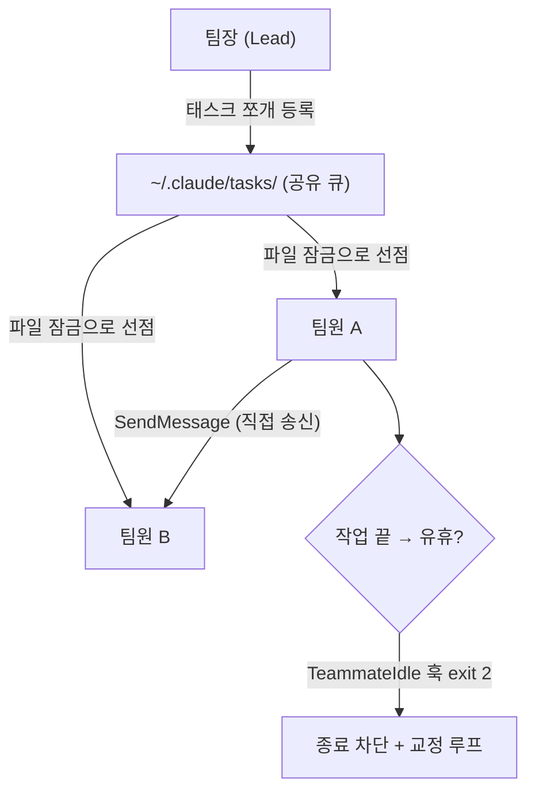
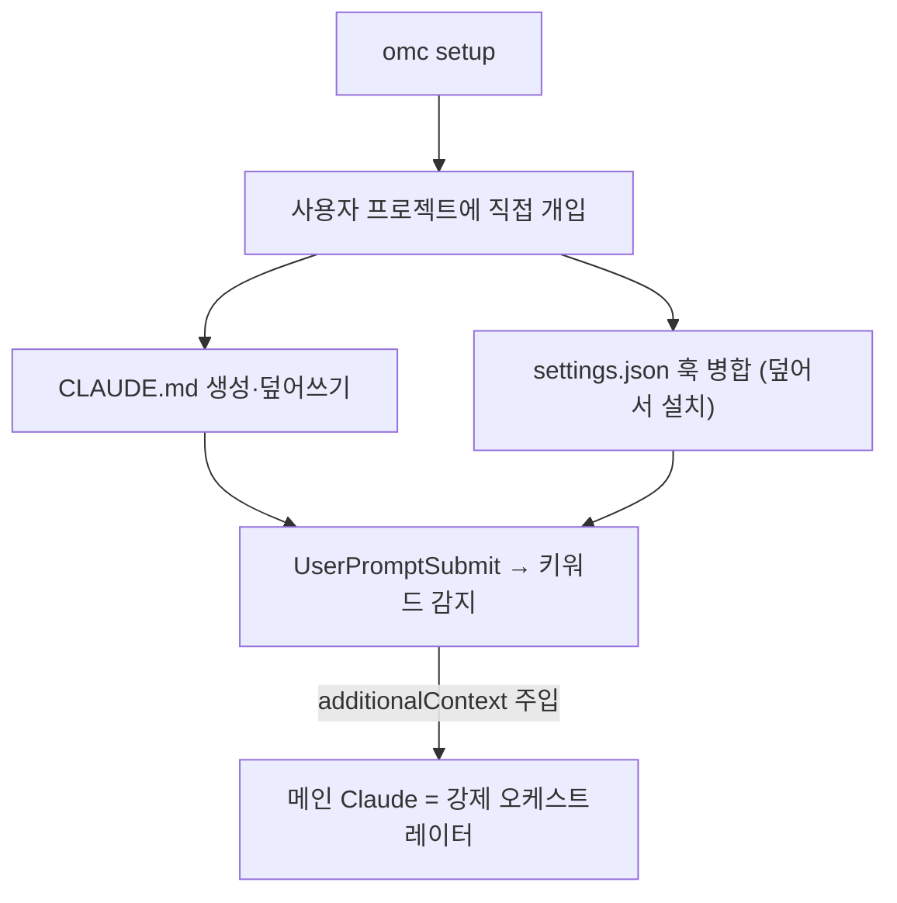
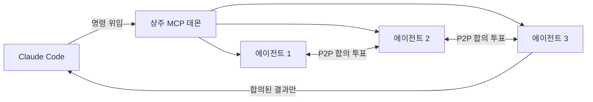

[[harness-8-trimming|지난 편]]에서 기존에 쓰던 하네스를 가볍게 만들었다. 이제는 그것보다 *개발*만 받치고 있던 하네스를 사내 다른 직군의 업무까지 받치려면 일을 나눠 맡길 **에이전트나 플러그인이 여럿** 필요했다.

[[harness-1-benchmarking|1편]]에서 나는 "에이전트 열 개가 동시에 도는 대규모 병렬 오케스트레이션"을 *복잡성 대비 이득이 없다*며 접었었다. 그 판단은 첫 버전에선 옳았다. 하지만 영역을 넓히려니 그 문제를 다시 봐야 했다. 단일 에이전트는 **컨텍스트 윈도우**(context window; 모델이 한 번에 참고하는 대화/파일의 총량)가 차 버리고, 한 에이전트에게 작업과 리뷰를 동시에 시키면 *역할이 충돌*한다. 그래서 다시 벤치마킹해보기로 했다. 1편을 쓸 때와 한 가지 달라진 건, 이제는 *겉모습이 아니라 작동 원리*를 조금 더 깊게 봤다는 점이다.

## 네 길로 갈라진 방법

거대한 "라우터 에이전트" 하나가 모든 걸 통제하는 **블랙박스 모델**은 이미 한물갔다. 대신 마크다운·JSON 훅·작업 폴더를 활용하는 **화이트박스 라우팅**(whitebox routing; 어느 에이전트로 일이 가는지 코드로 들여다보이는 방식)이 대세였다. 구동 환경과 라우팅 철학에 따라 크게 네 갈래로 갈렸다.

| 갈래         | 대표                                | 환경              | 라우팅 방식                      | 무게     |
| ---------- | --------------------------------- | --------------- | --------------------------- | ------ |
| 공식         | Claude Code agent-teams           | 로컬 파일시스템        | 공유 태스크 큐 + 파일 잠금            | 중간     |
| 네이티브 강화형   | agent-teams(wshobson)·SuperClaude | Claude Code 그대로 | description 의미론 / 훅 컨텍스트 주입 | 가장 가벼움 |
| 워크스페이스 변조형 | Oh-My-Claudecode                  | 사용자 프로젝트 폴더     | CLAUDE.md 심기 + 훅 가로채기       | 중간     |
| 외부 데몬형     | ruflo                             | 상주하는 MCP 서버     | P2P 합의 투표                   | 가장 무거움 |

## 공식 방법인 agent-teams

[Anthropic이 공식 문서로 제시한 방식](https://code.claude.com/docs/en/agent-teams)은 의외로 소박했다. 외부 서버 없이 *오직 로컬 파일시스템과 프로세스 제어*만으로 여러 에이전트를 굴린다. `CLAUDE_CODE_EXPERIMENTAL_AGENT_TEAMS=1`을 켜고 첫 에이전트를 불러내는 순간, 메인 세션이 **팀장**(Team Lead)으로 전환된다.

팀장이 일을 하위 태스크로 쪼개 `~/.claude/tasks/{팀}/`에 상태 파일로 등록하면, 팀원들이 그 폴더를 훑다가 `pending` 상태인 작업을 집어 간다. 여럿이 동시에 같은 걸 집지 않도록 **OS 수준의 파일 잠금**으로 선점하고 상태를 `in progress`로 바꾼다.



흥미로운 건 마지막 부분이었다. 팀원이 작업을 마치고 쉬려 하면 `TeammateIdle` 훅이 트리거되는데, 여기서 만약 하네스 스크립트를 조정해서 **종료 코드 2**(exit code 2)를 돌려주도록 설정해 놓으면, 팀원의 종료가 막히고 검증자의 피드백을 받아 교정 루프를 다시 돌 수도 있게끔 할 수 있다. [[harness-2-self-bypass|2편]]에서 `PreToolUse` 훅이 `block`으로 편집을 되돌렸던 것과 정확히 같은 수법이다. *훅의 종료 코드로 흐름을 조정하는* 패턴은 어디서나 통하는 것 같다.

## 가장 가벼운 방법은 네이티브를 강화하는 것

별도 **데몬**(백그라운드에서 계속 떠있는 서버)을 안 띄우고 Claude Code 기능만 극대화하는 방법이다. 지금 우리 하네스가 하고 있는 방법이기도 하다. 두 가지 플러그인을 조사해 보았다.

**agent-teams**(by wshobson)에는 중앙 라우터 코드가 *아예 없다*. 대신 `.claude/agents/`에 에이전트 마크다운 파일들을 모아 두고, 각 파일의 `description`에 "언제 이 에이전트를 부르는가"를 아주 상세히 적는다. 메인 스레드는 이 설명들을 도구 목록처럼 읽고, 사용자 요청과 견주어서 가장 맞는 에이전트를 *모델의 문맥적인 이해 과정*으로 골라 위임한다.

```md .claude/agents/biz-writer.md
---
name: biz-writer
description: 기획서·제안서 초안 작성. 문서/기획/PRD 키워드나 docs 폴더 작업일 때 호출.  # [!code highlight]
tools: [Read, Write, Edit]
---
당신은 비즈니스 문서 초안을 쓰는 에이전트다. 사내 정책을 준수하고, 논리 맹점을 남기지 않는다.
```

**SuperClaude**는 `hooks.json`으로 `UserPromptSubmit`을 가로챈다. 사용자가 엔터를 치면 0.1초 만에 스크립트가 돌아 현재 작업 경로(`cwd`)를 분석한다. `package.json`이 보이면 "프론트엔드구나", `docs` 폴더면 해당 지침서를 읽어 `additionalContext`로 메인 프롬프트에 끼워 넣는다. 다른 에이전트로 *이동하지 않고도* 메인 스레드가 즉시 그 분야 전문가처럼 답하게 만드는, 가벼운 멀티에이전트 효과다.


이게 우리 하네스의 `pipeline-injector.mjs`가 이미 하던 일과 똑같다는 걸 알아챘을 때, 방향이 조금은 잡혔다. **우린 이미 이 방법을 사용**하고 있었다.

## 내가 틀렸던 것

여기서 가장 크게 헛짚었던 걸 바로잡아야겠다. [[harness-1-benchmarking|1편]]에서 나는 **OMC**(Oh-My-ClaudeCode)를 "라우터가 작업을 쪼개 권한이 분리된 서브 에이전트들에게 강제로 위임"한다고만 적었다. 그때 내 머릿속 그림은 *플러그인 안에 라우터가 들어 있고,* ***플러그인의 CLAUDE.md를 단일 진입점*** *삼아 흐름을 탄다*였다. 근데 그게 틀렸었다.

실제 OMC는 **샌드박스 바깥에서 사용자의 진짜 프로젝트 폴더로 침투한다.** 이유가 있는데, Claude Code에는 "플러그인 *내부*의 설정 파일(`CLAUDE.md` 등)은 무시하라"는 기본 규칙이 있다. 그래서 플러그인 안에 아무리 라우팅 방법을 적어 둬도 먹히질 않는다. OMC는 이 격리를 *우회*하려고, `omc setup`을 사용할 때 사용자가 실제로 작업하는 폴더에 자기 설정을 심게 된다.

- 프로젝트 최상단에 `.claude/`를 만들고, 프로젝트의 '헌법' 격인 **`CLAUDE.md`를 내려받아 생성하거나 덮어쓴다.** 그 안에 "직접 코딩하지 말고 반드시 전문 에이전트에게 위임하라"는 지시문이 들어 있다.

- `settings.json`에는 `UserPromptSubmit`·`Stop` 훅 등록을 *병합*한다(기존 설정은 보존하되, 자기 스크립트를 끼워 넣는다).

```jsonc settings.json (OMC가 병합해 넣는 훅 등록의 형태)
{
  "hooks": {
    "UserPromptSubmit": [
      { "hooks": [{ "type": "command", "command": "node .../keyword-detector.mjs" }] }  // [!code highlight]
    ],
    "Stop": [ { "hooks": [{ "type": "command", "command": "node .../skill-injector.mjs" }] } ]
  }
}
```

그러고 나면 채팅에서 가로채는 현상이 일어난다. 사용자가 프롬프트를 보내면 메인 세션의 Claude가 읽기 *전에* `keyword-detector`가 먼저 돌아 *plan*이나 *team* 같은 매직 키워드를 스캔하고, 스캔이 완료되면, "이 작업은 `team-plan`에게 넘겨라"는 지시를 `additionalContext`로 찔러 넣는다. 메인 Claude는 **덮어쓴** **`CLAUDE.md`** **규칙과 방금 주입된 지시에 의해**, 스스로 판단하길 멈추고 *오케스트레이터 역할만* 하게 된다.



정리하면, 1편의 나는 OMC의 "강제 위임"이 *플러그인 안*에서 일어난다고 봤지만, 실제로는 *사용자 작업 공간을 변조*해서 일으킨다. 우리가 채택하지 않은 이유이기도 하다. 사내 도구가 사용자의 `CLAUDE.md`를 말없이 덮어쓰는 건, [[harness-8-trimming|8편]]에서 세운 기준("사람의 동의 없이 돌이키기 어려운 일을 하지 않는다")에 정면으로 어긋나기 때문이었다.

## 가장 무거운 방법

마지막 **ruflo**(구 claude-flow)는 결이 완전히 다르다. 백그라운드에 Node.js/Python 기반 **MCP 서버 데몬**(daemon; 상시 떠 있는 프로그램)을 영구히 띄워 둔다. 사용자가 명령을 내리면 Claude Code가 그걸 통째로 데몬에 넘기고, 데몬 안의 중앙 오케스트레이터가 전문가 에이전트 서너 명을 불러낸다. 이들이 **P2P 네트워크**로 의견을 주고받으며 "어떤 코드가 최선인가"를 *투표로 결정*하고, 최종 결과만 화면에 돌아온다.



강력하지만 보안 설정이 까다롭고 자원을 많이 먹는다. *일반적인 부서 업무에는 과한 스펙*이라는 게 결론이었다. 초반에 대규모 병렬을 접었던 그 판단이, 여기서도 유효했다.

## 그래서 우리 하네스는 어디로

네 방법을 겹쳐 놓으니 길이 조금은 보였다. 무거운 외부 데몬(ruflo)도, 사용자 폴더를 변조하는 방식(OMC)도 필요 없었다. 우리는 이미 *가장 가벼운 갈래*(네이티브 강화형)에 서 있었고, 비개발 영역으로 넓히는 건 이미 가진 훅 아키텍처(`hooks.json`·`pipeline-injector.mjs`) 위에 세 가지만 얹으면 됐다.

1. **에이전트 역할 세분화**. 코드를 짜는 `implementer` 외에, 문서 초안을 쓰는 `biz-writer`와 그 논리를 비판하는 `critic-reviewer`를 더한다.
2. **분류기 정규식 확장**. `pipeline-injector.mjs`가 `/제안서|기획서|초안/` 같은 키워드와 작업 폴더(`cwd`)를 보고, 코드 작업인지 문서 작업인지 *스스로 판단*해 알맞은 라우팅 지침을 주입한다.
3. **검증의 의미 재정의**. 개발 작업의 Verify가 `lint`·`build`를 돌렸다면, 문서 작업의 Verify는 `critic-reviewer`의 **토론 통과**(Debate; 비판 에이전트가 논리 맹점을 따져 APPROVE)로 바꾼다.

부서 간 인수인계도 단순 텍스트가 아니라 구조화된 JSON으로 넘겨, 투명하게 확인할 수 있게 하면 좋을 것 같다.

```json .claude/handoffs/PRD-{id}.json
{
  "task_id": "PRD-101",
  "from_agent": "biz-writer",
  "to_agent": "critic-reviewer",
  "context": "신규 기능 PRD 초안",
  "focus_areas": ["빠진 정책 없는지", "추가 검토가 필요한 항목"]  // [!code highlight]
}
```

결국 개발의 `Plan → Exec → Verify → Fix`를 **문서 영역으로** ***치환***한 것이다. 컴파일러가 못 하는 검증을 에이전트 간 교차 검토가 대신한다.

## 결론

1편이 "잘 쓰고 있는 하네스를 처음 뜯어본" 기록이라면, 지금 글은 *같은 일을 더 깊이 다시 한* 기록이다. 그사이 보는 눈이 달라졌다. 그때는 기능 목록과 규모를 판단했고, 이번엔 라우팅이 어디서 어떻게 일어나는지를 봤다. 그러자 1편에서 OMC를 잘못 읽었던 것도 드러났다.

기준은 [[harness-8-trimming|8편]] 그대로였다. *AI가 멋대로 건너뛸 수 있는 일은 단단히 잡되, 무거운 건 버린다.* 데몬도, 사용자 폴더 변조도 버리고, 들여다보이는 훅 라우팅만 가져오면 될 것 같다. 내 블로그이자 사내 도구라는 두 마음이 같은 결론을 가리킨 게, 이번엔 꽤 다행이었다.

참고한 글은 Anthropic의 [Building Effective Agents](https://www.anthropic.com/engineering/building-effective-agents), Claude Code의 [서브에이전트](https://code.claude.com/docs/en/sub-agents)·[agent-teams](https://code.claude.com/docs/en/agent-teams) 문서, [agent-teams(wshobson)](https://github.com/wshobson/agents/tree/main/plugins/agent-teams)·[SuperClaude](https://github.com/SuperClaude-Org/SuperClaude_Framework)·[OMC](https://github.com/Yeachan-Heo/oh-my-claudecode)·[ruflo](https://github.com/ruvnet/ruflo)의 코드이다. 같이 확인해보면 좋을 것 같다. ☺️
