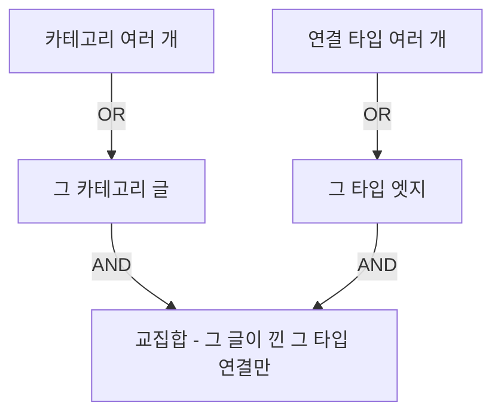

글은 꾸준히 쌓였는데, 정작 그 글을 *읽고 쓰는* 화면은 손이 덜 간 자리가 많았다. 그래서 날을 잡고 네 부분으로 나눠서 다듬게 되었다. 읽는 화면, 쓰는 화면, 글 안의 다이어그램/표, 그리고 [그래프](/graph/)다. 무엇을 더했는지, 그게 왜 필요했는지, 만든 코드 한두 줄을 같이 첨부해서 적어두려고 한다.

## 우측 하단의 버튼 추가하기

글을 읽다 보면 **공유하고 싶을 때**가 있고, **본문만 보고 싶을 때**도 있다. 그래서 두 기능을 각각 버튼으로 두게 되었는데, 글의 우측 하단이 금세 복잡해졌다. 그래서 **스피드다이얼**(speed dial; 버튼 하나를 누르면 위로 항목이 펼쳐지는 UI)로 합쳤다. 평소엔 버튼 하나, 누르면 **집중/공유/맨 위로**가 나온다.

집중 읽기 모드는 헤더/목차/푸터를 감추고 본문만 남긴다. 처음엔 글을 넘기면 모드가 풀려 버렸다. 다음 글도 계속 집중해서 읽고 싶은데 매번 다시 켜야 했다. 그래서 상태를 `localStorage`에 남겨 해결했다.

```ts src/components/PostReading.astro
const setFocus = (on: boolean) => {
  if (on) {
    document.documentElement.dataset.focus = 'true';
    localStorage.setItem('focus-read', '1'); // [!code highlight]
    setOpen(false);
  } else {
    delete document.documentElement.dataset.focus;
    localStorage.removeItem('focus-read');
  }
};
```

집중 모드를 켜면 표식을 저장하고, 끄면 지운다. 그 표식을 글 상세 페이지가 처음 켜지기 전에 다시 읽어 적용하므로, 글을 넘겨도 헤더가 나오지 않고 집중 상태가 이어진다. 목록이나 그래프 같은 다른 화면에선 적용하지 않는다.

## 쓰다 만 글이 사라지지 않게

글쓰기 화면(`/write`)은 발행하면 곧장 GitHub 저장소로 커밋된다. 그런데 쓰다가 탭을 닫거나 실수로 새로고침하면 쓰던 내용이 그냥 날아갔다. 그래서 폼을 `localStorage`에 자동으로 저장하고, 다시 열면 "**이어 쓰기**"를 물어보게 했다. 새 글뿐 아니라 기존 글을 수정하던 것도 글별로 따로 저장한다.

여기서 **조용한 버그**를 하나 발견했다. 기존 글을 불러오면 본문을 채우는 동작이 자동 저장을 예약하는데, 그게 1초 뒤에 *방금 불러온 원본*을 초안 자리에 덮어써 버렸다. 그래서 다시 불러오면 "이어 쓰기"를 눌러도 내가 고치던 게 아니라 원래 글로 돌아갔다.

```ts src/pages/write.astro
function saveDraft() {
  const f = collectForm();
  if (!f.title.trim() && !f.body.trim()) return;
  if (formSignature() === loadedSignature) return; // [!code highlight]
  localStorage.setItem(draftKey(), JSON.stringify(f));
}
```

그래서 불러온 직후 폼 상태의 지문(제목/본문 등을 이어 붙인 문자열)을 찍어 두게 했다. 자동 저장은 그 지문과 지금 상태가 *다를 때만*, 그러니까 사람이 실제로 한 글자라도 고쳤을 때만 저장한다.

## 다이어그램과 표에 생기를 불어넣기

글 안의 블록들도 손 보게 되었다. 먼저 다이어그램이다. Injoy의 [다이어그램](/posts/markdown-styleguide/)은 대부분 흐름(누가 무엇으로 이어지는지)을 그린다. 그 화살표 방향대로 선에 물결이 흐르게 했다.

```css src/pages/posts/[slug].astro
.mermaid-diagram.flow-on :is(g.edgePaths path, path.flowchart-link) {
  stroke-dasharray: 6 5 !important; /* [!code highlight] */
  animation: injoy-edge-flow 0.9s linear infinite;
}
@keyframes injoy-edge-flow { to { stroke-dashoffset: -11; } }
```

결국 이 규칙은 관계선을 짧은 대시로 만들고 그 대시를 화살표 쪽으로 밀어 흐르게 한다. `!important`가 붙은 건 mermaid가 그린 SVG 안에 자기 스타일을 ID로 심어 두기 때문이다. 화면에 보이는 다이어그램만 재생하고(스크롤로 벗어나면 멈춘다), 모션을 줄이는 설정이면 정지한다.

표는 격자선이 빽빽하고 긴 값이 안 쪼개져 가로로 넘치곤 했다. 격자선을 걷어내고 헤더에 옅은 강조색, 첫 열은 굵게, 셀은 줄바꿈되게 바꿔 비교 카드에 가깝게 만들었다. 좁은 화면에선 아예 행마다 카드로 쌓아 첫 열을 제목으로 올린다. 이 글 아래 [요약](#요약) 표가 바로 그 모양이다.

## 그래프에 재생과 필터를 추가

가장 공들인 건 그래프다. 두 가지를 더하게 되었다.

첫째, **재생**이다. 글이 쓰인 순서대로 노드가 하나씩 돋아난다. 블로그가 자라온 과정을 몇 초로 압축해 보여준다. 여기서 조심한 건, 노드의 물리 계산은 건드리지 않았다는 점이다. 이미 자리 잡은 좌표 위에 등장만 시켰다.

```ts src/pages/graph.astro
const revealOf = (id) => {
  if (!playing) return 1;
  const p = (performance.now() - playStart) / playMs;
  return Math.max(0, Math.min(1, p * nodes.length - appearIndex.get(id))); // [!code highlight]
};
```

강조한 줄이 연출의 전부다. 진행도에 노드 수를 곱해, 순서상 i번째 노드는 진행도가 i를 지날 때 서서히 나타난다. 물리 법칙을 다시 적용하진 않으니 예전처럼 화면이 출렁일 일이 없다. ([[polish-round-12]]에서 잡았던 그 문제)

둘째, **필터**다. 처음엔 노드 두 개를 눌러 사이 경로를 찾는 기능을 넣었는데, 막상 얻는 의미가 크지 않았다. 대신 범례를 눌러 그 종류만 밝히는 필터로 바꿨다. 그런데 첫 버전이 두 번 걸렸다. 하나는 UI였다. 기능이 캔버스를 덮어서, 정작 필터를 걸어도 결과가 안 보였다. 그래서 그래프 위에 항상 보이는 바로 옮겼다.

다른 하나는 더 근본적이었다. 카테고리와 연결 타입을 여러 개 고를 수 있게 했는데, 처음엔 그냥 **합집합**이었다. 그러면 "AI이면서 확장인 글"을 못 집는다. AI 글 전부와 확장 연결 전부가 *따로* 밝아질 뿐이다. 같은 그룹 안은 **OR**, 그룹을 가로지르면 **AND**가 되어야 했다.

```ts src/pages/graph.astro
// 둘 다 선택 - 선택 타입 엣지 중 한쪽이 선택 카테고리 글이면 밝게
for (const e of edges) {
  if (!activeEdges.has(e.type)) continue;
  if (isCatPost(e.a) || isCatPost(e.b)) { // [!code highlight]
    ovEdgeKeys.add(ekey(e.a.id, e.b.id));
    ovSet.add(e.a.id);
    ovSet.add(e.b.id);
  }
}
```

이 분기가 **교집합**을 만든다. 연결 타입에 든 엣지 중에서, 한쪽 끝이 고른 카테고리의 글인 것만 남긴다. 그러니 "AI + 확장"은 AI 글이 낀 확장 연결만 밝힌다. 걱정한 건 이걸 더하면서 아무것도 안 고른 평소 화면이 깨지는 것이었는데, 다행히 멀쩡했다. 필터도 재생도 없을 때는 예전 그리기 경로를 그대로 타게 뒀기 때문이다. 숫자로도 확인했다. 합집합일 땐 25개가 밝던 것이, 교집합에선 9개로 정확히 좁혀졌다.



모바일 쪽도 하나를 더 챙겼다. 데스크톱은 마우스를 올리면 노드가 강조되는데, 모바일은 그럴 호버가 없어 노드를 잡아도 밋밋했다. 그래서 터치로 노드를 잡으면 강조가 걸릴 수 있게 했다.

```ts src/pages/graph.astro
if (ev.pointerType === 'touch') selected = n; // [!code highlight]
```

터치일 때만이다. 데스크톱에서 이걸 걸면, 노드를 끌어 옮긴 뒤에도 강조가 안 풀려 나머지가 계속 어두워지는 회귀 문제가 생겼다.

## 요약

| 회차 | 더한 것                 | 어디에  | 담긴 의미                  |
| -- | -------------------- | ---- | ---------------------- |
| 1  | 공유 버튼, 집중 읽기 모드      | 글 상세 | 읽는 데 방해를 덜고, 상태를 이어 준다 |
| 2  | 초안 자동 저장/복구          | 글쓰기  | 쓰다 만 글을 잃지 않는다         |
| 3  | 다이어그램 흐름 효과, 표 비교 카드 | 글 본문 | 블록이 흐름과 비교로 읽힌다        |
| 4  | 그래프 재생, 필터(교집합)      | 그래프  | 자라온 과정을 보고, 조건으로 좁혀 본다 |

결국 이 과정은 하나로 이어진다. 특히 그래프 필터는 단순히 종류를 켜고 끄는 데서 그치지 않고 조건을 겹쳐 물을 수 있게 되어, 이 블로그가 말하는 "타입 있는 지식 그래프"에 한 걸음 더 가까워졌다고 생각한다. 남은 건 위키링크에 미리보기를 붙이는 일인데, 그건 다음에 손볼 것 같다. 🌱
