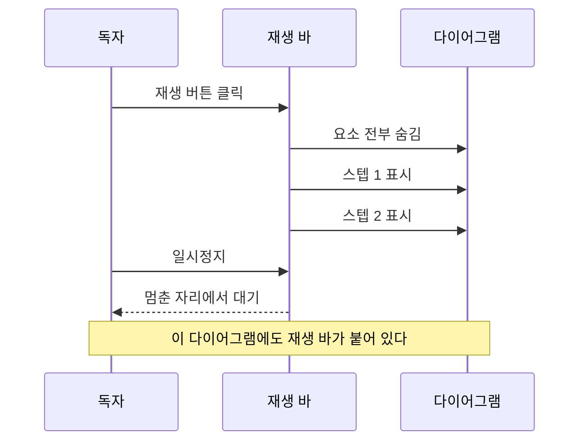

모바일로 [[singleton-pattern]] 글을 읽다가 이상한 걸 발견했다. 시퀀스 다이어그램의 박스 안의 텍스트가 **수직 정렬된 게 아니라 위로 살짝 떠** 있었다. 박스는 제자리에 있는데 글자만 천장에 붙어 있는 모습이었다. 처음에는 이것만 고치려고 했다가, 이런저런 욕심이 들어서 다이어그램에 재생 버튼도 달고, 코드에도 실행 순서를 보여주는 과정으로 확대되었다. 이번 글에서는 그 과정을 하나씩 짚어 볼 예정이다.

## 박스 위로 떠 있던 텍스트

먼저 문제부터 잡게 되었다. 원인은 바로 전날에 넣은 옵션이었다. 긴 한글 텍스트가 박스 밖으로 넘어가는 문제를 잡으려고 mermaid에 `sequence: { wrap: true }`를 켰는데, 이 wrap 모드가 **텍스트의 세로 배치를 바꾼다**. 데스크톱의 Chrome 화면에서는 멀쩡한데 iOS Safari에서는 글자가 박스 위로 떠 보이게 된다. 브라우저마다 SVG 텍스트의 기준선(baseline; 글자가 떠있는 가상의 줄)을 다르게 처리하기 때문이다.

브라우저마다 다르게 나타나는 문제라면, 원인을 좇기보다 **문제가 되는 결과를 실측해서 되돌리는 쪽**이 확실했다. 그래서 렌더가 끝난 직후에 박스와 텍스트의 실제 좌표를 재서, 차이만큼 텍스트를 옮기는 보정을 렌더링 과정에 더했다.

```ts mermaid-render.ts
const tr = t.getBoundingClientRect(); // [!code step:1]
const rr = rect.getBoundingClientRect(); // [!code step:1]
const dy = (rr.top + rr.height / 2) - (tr.top + tr.height / 2); // [!code step:2]
const dx = (rr.left + rr.width / 2) - (tr.left + tr.width / 2); // [!code step:2]
if (Math.abs(dy) < 1 && Math.abs(dx) < 1) continue; // [!code step:3]
prependTranslate(t, dx * scale, dy * scale); // [!code step:4]
```

결국 이 코드는 박스의 중앙과 텍스트 중앙의 차이를 두 개의 축으로 재서, 그만큼 텍스트를 밀어 넣는 일을 한다. 1픽셀 미만이면 손대지 않으니 **이미 정렬된 브라우저에서는 아무 일도 일어나지 않는다.** 문제가 되는 브라우저에서만 발동하는 안전망이다.

여기서 한 가지 배운 게 있다. 처음 계획은 텍스트의 **줄마다** 따로 중앙 보정을 하는 것이었는데, 실측해 보니 그건 공수가 조금 드는 과정이었다. 두 줄짜리 노트의 각 줄을 전부 박스 중앙으로 옮기면 두 줄이 같은 자리에 겹치게 된다. 그래서 여러 줄을 한 덩어리로 보고 **덩어리 전체를 같은 거리만큼** 옮기는 방식으로 바꿨다.

> [!NOTE]
> **공용 렌더러**\
> 이 보정 과정은 글 본문, 확대 모달, 글쓰기 화면의 미리보기가 공유하는 렌더러에 들어갔다. 한 곳을 고치면 세 화면이 같이 고쳐지고, 앞으로 새로 그리는 시퀀스 다이어그램에도 자동으로 적용된다.

## 시퀀스 다이어그램에 재생 버튼

버그를 고치고 나니 욕심이 생겼다. 시퀀스 다이어그램은 원래 **시간 순서**가 있는 그림이다. 위에서 아래로 메시지가 오가는 순서가 곧 이야기의 순서인데, 완성본을 한 번에 보여주면 그 순서가 눈에 잘 안 들어온다. 다른 사이트에서 단계별로 하나씩 나타나는 시퀀스 다이어그램을 봤던 기억이 나서, 우리 블로그에도 재생 버튼을 달기로 했다.

동작은 이렇다.

- **초기 상태는 완성본** - 재생을 누르지 않으면 지금까지와 똑같다.

- **재생을 누르면** 전부 사라졌다가 메시지가 0.9초 간격으로 하나씩 나타난다.

- **일시정지/이전/다음/처음부터** - 원하는 단계에 멈춰 두고 글을 읽을 수 있다.

바로 아래 다이어그램이 실제 동작이다. 하단의 재생 버튼을 눌러 보면 된다.



구현에서 가장 재미있던 부분은 **스텝을 어떻게 나누느냐**였다. mermaid가 그린 SVG에는 "이건 1번째 메시지"라는 표시가 없다. 처음에는 세로 좌표가 비슷한 요소끼리 묶으면 되겠지 하고 그룹핑을 설계했는데, 실제로 보니 메시지 텍스트가 자기 화살표보다 35픽셀이나 위에 있었다. 그룹핑으로는 한계가 있었다. 그래서 요소를 세로 순서로 줄 세운 뒤, **텍스트가 나타날 때마다 새 스텝을 여는 방식으로 풀게 되었다.** 그 사이의 화살표, 텍스트, 활성화되는 박스는 직전 스텝에 따라붙는다.

```ts sequence-player.ts
const items = [...svg.querySelectorAll(SELECTOR)].map((el) => ({
  el, y: el.getBoundingClientRect().top,
  starter: el.tagName.toLowerCase() === 'text' && el.classList.contains('messageText'),
}));
items.sort((a, b) => a.y - b.y);
for (const it of items) {
  if (it.starter || steps.length === 0) steps.push({ els: [] }); // [!code highlight]
  steps[steps.length - 1].els.push(it.el);
}
```

강조하는 한 줄이 그룹핑의 전부다. 텍스트가 스텝의 문을 열어주고, 나머지는 그 열린 문으로 들어간다. 확대 모달에서도 같은 과정이 붙는데, 스텝 수집이 화면 좌표 기반이라 **줌 되기 전에** 붙여야 한다는 순서 문제가 하나 있었다.

## 코드 블록에도 실행 순서를

여기까지 하고 나니 자연스러운 질문이 생겼다. 코드 블록에도 이런 걸 달 수 있을까? 코드야말로 실행 순서가 있는 텍스트인데.

정직하게 말하면, **자동으로는 안 된다.** 임의의 코드 조각에서 실행 순서를 알아내는 건 언어마다 파서를 붙여야 하는 일이고, 그마저도 설정 파일이나 CSS처럼 순서라는 개념 자체가 없는 블록이 많다. 그래서 방향을 틀었다. 순서는 글쓴이가 안다. 글쓴이가 코드 주석으로 순서를 표시하면, 빌드가 그걸 읽어 재생 바를 붙여 주는 방식이다.

마커는 기존 강조 마커와 같은 문법 가족인 `[!code step:1]`을 쓴다. 파이썬이면 `#` 주석으로, CSS면 `/* */` 주석으로, 그 언어의 주석 문법을 그대로 따른다. 빌드 과정에서 마커 텍스트는 지워지고 그 줄에 순서 정보만 남으니, 독자에게 마커가 보일 일은 없고 복사 버튼도 깨끗한 코드만 복사하게 된다. 마커가 코드 내용 속 주석이라는 점이 핵심인데, 덕분에 글쓰기 화면의 에디터를 한 줄도 고치지 않고도 왕복 검증을 통과했다. 저장했다 다시 열어도 마커가 그대로 산다.

재생하면 **지금 단계의 줄만 파랗게 짚고**, 지나간 줄은 옅은 잔상으로 남는다. 위의 정렬 보정 코드 블록이 실제 예시다. 재생을 눌러 보면 좌표를 재고, 차이를 구하고, 문턱을 검사하고, 옮기는 순서가 한 줄씩 짚인다.

기존 글에도 넣을 수 있는 만큼 넣어 보려고 28편의 코드 블록 약 120개를 전부 훑었다. 결과는 예상보다 훨씬 보수적이었다. **넣은 건 싱글톤 글의 구현 6개뿐이다.** 나머지는 설정 파일이거나, 한두 줄짜리이거나, 이미 강조 마커가 "이 줄이 전부다"라는 이야기를 하고 있는 블록이었다. 강조가 하는 말이 있는 코드에 스텝까지 얹으면 두 장치가 서로를 방해하게 된다. 확신이 없으면 빼는 게 맞다고 판단했다.

## 연결된 글이 지도가 되었다

글 하단의 "연결된 글" 영역도 크게 바뀌었다. 원래는 관계 문구와 제목이 줄줄이 놓인 목록이었는데, 이번에 **현재 글을 중심에 둔 작은 관계도**를 그 자리에 올렸다. 중심에서 뻗은 선이 연결된 글로 이어지고, 선 색은 그래프 화면과 같은 관계 타입 색을 그대로 쓴다.

만듦새에서 마음에 드는 결정 세 가지.

- **빌드 타임 SVG** - 물리 시뮬레이션 없이 원형 배치를 빌드할 때 계산해 둔다. 이 관계도를 위한 클라이언트 JavaScript는 0줄이다.

- **선이 흐른다** - 본문 다이어그램의 흐름 애니메이션을 재사용해서, 화면에 보일 때만 중심에서 바깥으로 대시가 흘러간다. 시선이 자연스럽게 연결된 글 쪽으로 끌리게 된다.

- **마우스를 올리면 카드가 뜬다** - 노드에 올리면 관계 문구, 제목, 설명, 연결에 달아 둔 메모까지 카드로 보여준다. 목록이 주던 정보를 그래프가 잃지 않는다.

기존 목록은 버리지 않고 "목록으로 보기" 접이식으로 아래에 남겼다. 모바일처럼 마우스 올리기가 없는 환경에서는 여전히 목록이 안전망 역할을 한다.

하버카드는 본문에도 퍼졌다. 본문의 위키링크에 마우스를 올리면 대상 글의 제목과 설명이 미리 뜨고, 각주 번호에 올리면 페이지 맨 아래로 내려가지 않고도 각주 내용을 그 자리에서 읽을 수 있다. 링크를 눌러야 할지 말지를 **누르기 전에** 판단하게 해 주는 장치다.

## 읽는 화면의 잔모션

큰 기능 사이사이에 작은 모션도 여럿 들어갔다.

- **본문 블록의 은은한 등장** - 스크롤로 새 문단이 들어올 때 8픽셀만 살짝 떠오른다. 첫 화면에 이미 보이는 블록은 아예 손대지 않아서, 로드 순간 번쩍이는 일이 없다.

- **플로차트 노드의 순차 등장** - 다이어그램이 처음 화면에 들어올 때 노드가 60밀리초 간격으로 하나씩 자리를 잡는다. 딱 한 번만 재생되고, 테마를 바꿔 다시 그려져도 반복하지 않는다.

- **목차 마커** - 데스크톱 목차의 세로선을 따라 현재 섹션 위치가 미끄러지듯 따라온다. 툭툭 끊기며 바뀌던 강조가 흐르는 움직임이 되었다.

전부 `prefers-reduced-motion`(모션 줄이기; 어지러움 등으로 화면 움직임을 줄여 달라는 시스템 설정)을 존중한다. 설정이 켜져 있으면 모션 없이 즉시 완성 상태로 간다.

## 그래프 첫 화면과 일시정지

그래프 화면에도 두 가지 손질이 들어갔다.

하나는 첫 화면이다. 지금까지는 페이지를 열면 축소된 그래프가 몇 초 꿈틀거리다가 정착한 뒤에야 화면에 맞춰졌다. 이제는 **열자마자 화면에 꼭 맞은 그래프**가 보인다. 비결은 단순한데, 첫 그리기 전에 물리 시뮬레이션을 동기로 미리 돌려 거의 정착시킨 뒤 화면 맞춤을 한 번만 하는 것이다. 매 프레임 맞춤을 반복하면 그래프가 흔들리는 버그를 예전에 겪은 적이 있어서, 맞춤은 딱 한 번으로 못 박았다.

다른 하나는 성장 재생이다. 글이 쌓인 순서대로 노드가 나타나는 재생 기능에 **일시정지와 초기화**가 생겼다. 일시정지의 구현이 소소하게 재미있다. 재생 진행도를 시계에서 직접 읽으면 멈출 방법이 없으니, 멈출 때까지의 경과 시간을 따로 쌓아 두고 재개하면 그 위에 이어 붙인다.

```ts graph.astro
const playProgress = () =>
  (playElapsed + (playPaused ? 0 : performance.now() - playStart)) / playMs; // [!code highlight]
```

강조한 한 줄이 일시정지의 전부다. 멈춰 있는 동안은 쌓아 둔 시간만 읽고, 흐르는 동안은 현재 시각을 더해 읽는다. 버튼은 아이콘만 남기고 글자를 뗐다. 재생 삼각형이 무슨 뜻인지 모르는 사람은 없다.

## 요약

한 줄 요약으로는 이렇다. 멈춰 있던 화면들이 순서를 갖고 움직이기 시작했다.

- 시퀀스 다이어그램 텍스트 정렬을 실측 기반으로 보정했다. 본문/모달/미리보기가 같이 고쳐졌다.

- 시퀀스 다이어그램과 코드 블록에 재생 바가 생겼다. 코드는 주석 마커로 순서를 지정하는 방식이다.

- 연결된 글이 미니 관계도가 되었고, 위키링크와 각주에 미리보기 카드가 붙었다.

- 본문 등장, 노드 순차 등장, 목차 마커, 그래프 첫 화면 맞춤과 재생 일시정지까지 들어갔다.

남은 것도 있다. 정렬 보정이 실제 iOS 기기에서 발동하는 모습은 아직 육안으로 못 봤고, 코드 스텝 마커는 이제 시작이라 앞으로 쓰는 글에서 진가가 나올 것으로 예상된다. 하나를 고치러 들어갔다가 열 가지를 만들고 나온 회차인데, 이상하게 피곤하지 않다. 내 블로그가 움직이는 걸 보는 재미가 있어서 그런 것 같다 😎
