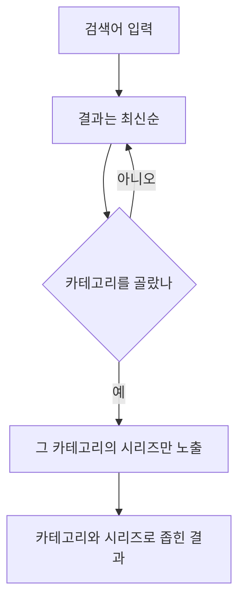
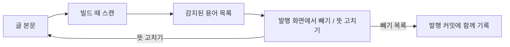
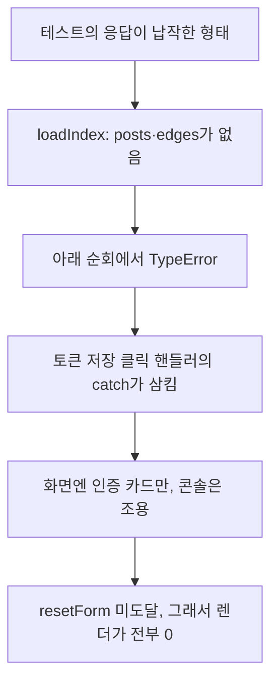
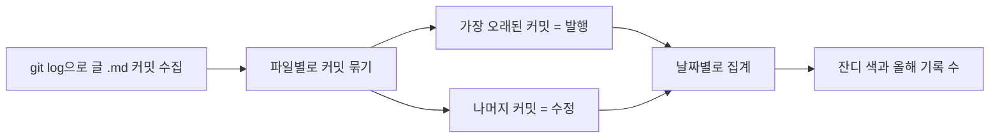

글이 30편을 넘기니 문제가 하나 생겼다. 쓰는 건 편해졌는데, 정작 **쌓인 글을 다시 찾고 이어서 보는 게** 불편해진 것이다. 검색 페이지에서는 최신 글만 위로 올라왔고, 글에 나온 전문 용어는 매번 그 글로 돌아가야 뜻을 알 수 있었다. 그래서 최근 며칠은 새 글을 쓰는 대신 블로그 내부를 탐색하기 좋게 만드는 기능들을 붙였다. 기능 목록만 늘어놓으면 심심하니, 각각을 붙이며 실제로 만난 버그들과 그걸 어떻게 풀었는지를 함께 적어 둔다. 붙인 것보다 헤맨 게 더 많았던 것 같기도 하다.

## 검색 필터에 계층 구조를 넣다

검색은 **Pagefind**(pagefind; 정적 사이트에 얹는 검색 색인)로 제목과 본문을 뒤진다. 여기에 카테고리와 시리즈로 좁히는 필터를 더하려는데, 첫 시도부터 조용한 데이터 문제에 부딪혔다.

Pagefind는 글마다 `data-pagefind-filter` 속성을 지정해두면 그 값으로 필터를 만들어 준다. 한 속성에 콤마로 여러 개를 담을 수 있다길래 이렇게 넣게 되었다.

```astro
<!-- 처음 시도: 한 속성에 콤마로 두 필터 -->
<article data-pagefind-filter={`category:${category}, series:${series}`}> <!-- [!code --] -->
```

그런데 빌드 로그를 확인해보니 `Indexed 1 filter`라고 찍혔다. 둘을 넣었는데 하나만 잡혔다는 뜻이다. 필터 값을 열어 보니 시리즈가 있는 글의 카테고리 값이 `개발`이 아니라 `개발, series:네트워크`와 같이 통째로 들어가 있었다. Pagefind가 콤마로 쪼개지 않은 것이다. 결국 키마다 별도 요소로 나누게 되었다.

```astro
<!-- 고친 뒤: 키마다 빈 span 하나씩 (화면엔 안 보인다) -->
<span data-pagefind-filter={`category:${post.data.category}`}></span> <!-- [!code ++] -->
{post.data.series && <span data-pagefind-filter={`series:${post.data.series}`}></span>} <!-- [!code ++] -->
```

이러니 빌드 로그가 `Indexed 2 filters`로 바뀌고 값도 깨끗해졌다. 이 코드가 결국 하는 일은 **글마다 카테고리/시리즈를 색인에 따로 채워 두는 것**이다.

그 다음은 계층이었다. 카테고리와 시리즈를 나란히 늘어놓으니 **그 시리즈가 어느 카테고리 것인지 알 수 없었다.** 그래서 카테고리를 먼저 고르면 그 카테고리의 시리즈만 아래에 펴지도록 했다.



카테고리별 시리즈 목록은 빌드할 때 미리 모아 두도록 했다.

```ts
// 시리즈가 여러 카테고리에 걸치면(예: "블로그 다듬기 기록"이 블로그/회고 양쪽) 각각에 넣는다
const seriesByCategory: Record<string, string[]> = {};
for (const post of posts) {
  const { category, series } = post.data;
  if (!category || !series) continue;
  (seriesByCategory[category] ??= []).push(series); // [!code highlight]
}
```

`??=`로 그 카테고리의 배열이 없으면 만들고, 있으면 이어 붙인다. 결국 **카테고리 하나에 어떤 시리즈들이 속해 있는지** 표 하나를 만들어 두고, 검색 화면은 이 표를 보고 시리즈의 버튼들을 그리게 된다.

마지막으로 가장 신경 쓰이던 건, **검색어를 지웠는데 방금의 결과가 다시 나타나는 문제**였다. 입력을 지우면 화면은 즉시 비우지만, 그 전에 날아간 검색 요청이 **뒤늦게 도착해** 결과를 다시 화면을 그리고 있었다. 그래서 검색마다 번호표를 붙여서 막게 되었다.

```ts
let searchGen = 0;
async function run(term: string) {
  const myGen = ++searchGen; // 이번 검색의 번호표
  const results = await pagefind.search(term, opts);
  if (myGen !== searchGen) return; // 그새 더 새 검색이 있었으면 이 결과는 버린다 // [!code highlight]
  render(results);
}
```

비동기 작업이 순서를 지키지 않을 때 흔히 쓰는 방법이다. `await` 다음 줄에서 번호가 최신인지 확인하고, 아니면 버리도록 했다.

## 용어집 페이지

이 블로그는 전문 용어가 처음 나올 때 `용어(뜻)`처럼 굵은 용어와 괄호 풀이를 함께 적는 규칙이 있다. 이미 구조가 정해진 글이니, 빌드할 때 이 패턴만 긁으면 **용어집**(glossary; 용어와 뜻을 한곳에 모은 페이지)이 공짜로 만들어진다. 규칙 하나가 그대로 데이터가 되는 셈이다.

문제는 아무 괄호나 다 모으면 안 된다는 것이었다. `공인 IP(public IP)`처럼 괄호가 뜻이 아니라 영어 원어인 경우가 섞였다. 그래서 괄호 안에 한국어 뜻이 있을 때만 모으도록 걸러두게 되었다.

```ts
// 괄호가 영어 원어(public IP)가 아니라 진짜 한국어 뜻인지 가린다
function isKoreanDef(gloss: string): boolean {
  if (!/[가-힣]/.test(gloss)) return false;        // 한글이 없으면 영어 원어 // [!code highlight]
  return /\s/.test(gloss) || gloss.length >= 6;    // 짧은 뜻 풀이 제외
}
```

한글이 하나도 없으면 거르고, 있더라도 너무 짧으면(공백 없이 6자 미만) 풀어쓴 단어로 보고 거른다. 이 한 함수로 33개 후보가 실제로 뜻이 붙은 13개로 정리되었다.

그 다음 용어집에 검색을 붙였는데, 여기서도 조금 헤맸다. 개수는 "1/13"으로 정확히 줄어드는데 화면에서는 전체 용어가 사라지지 않았다. 스크립트는 안 맞는 항목에 `hidden`을 제대로 붙이고 있었다. 그런데도 계속 보이는 문제가 있었다.

```css
.g-item {
  display: grid; /* 이 한 줄이 hidden을 이기고 있었다 */
}
.g-item[hidden] {
  display: none; /* [!code ++] */
}
```

원인은 CSS의 우선순위였다. 내가 준 `display: grid`가 브라우저 기본값인 `[hidden]`의 숨김보다 세서, `hidden` 속성이 붙어도 화면에선 계속 grid로 깔렸다. `.g-item[hidden]`에 다시 `display: none`을 못 박아 해결했다.

이 과정에서 교훈이 하나 생겼다. 나는 검증할 때 "hidden 속성이 붙었나"만 보고 됐다고 넘겼는데, 정작 봐야 할 건 **실제로 화면에서 사라지는가**였다. 속성이 아니라 계산된 스타일(`getComputedStyle`)을 측정해야 이런 문제를 잡을 수 있다.

마지막으로, 무작정 자동 등록만 두는 것도 마음에 걸렸다. 그래서 글 발행 화면에, 연결된 글에 설명을 다는 것처럼, 용어를 감지해서 빼거나 뜻을 고치는 기능을 추가하게 되었다.



빼기로 한 용어의 목록은 발행할 때 글과 같은 커밋에 함께 올라가고, 뜻을 고치는 과정은 본문의 괄호를 직접 바꿀 수 있다. 용어집의 단일 출처는 어디까지나 글의 본문이라는 뜻이다. 새 데이터를 다른 곳에 숨겨 두면 나중에 어긋날 수도 있다.

## 발행 화면이 통째로 막히던 버그

용어 관리 기능을 붙이고 검증하는데, 발행 화면에서 용어 목록이 아예 안 떴다. 그냥 안 뜬 게 아니라 점검과 연결 목록까지 전부 비어 있었다. 그런데 **콘솔에는 에러 한 줄 없었다.**

한참 파 보니 연쇄적인 문제였다.



발행 화면은 열릴 때 글 목록을 먼저 받아 온다(`loadIndex`). 그런데 내 테스트 시나리오는 `posts`와 `edges`가 없는 납작한 형태였다. 그 상태로 아래에서 목록을 순회하니 `TypeError`가 났고, 이 예외가 토큰 저장 버튼의 `catch`로 굴러 들어가 **인증 카드 안에만** 표시됐다. 그래서 초기화 함수(`resetForm`)까지 못 가고, 용어/점검/연결 부분이 전부 빈 채로 남았다.

```ts
async function loadIndex() {
  try {
    const raw = await (await fetch(CFG.siteIndexUrl, { cache: 'no-store' })).json();
    // 응답이 어떤 모양으로 오든 posts·edges를 항상 배열로 정규화한다
    state.index = {
      posts: Array.isArray(raw?.posts) ? raw.posts : [], // [!code highlight]
      edges: Array.isArray(raw?.edges) ? raw.edges : [], // [!code highlight]
    };
  } catch {
    state.index = { posts: [], edges: [] };
  }
}
```

그래서 위와 같이 고치게 되었다. 이제는 응답이 어떤 모양으로 오든 `state.index`는 항상 배열 두 개를 갖는다. 덤으로 화면을 갱신하는 각 단계도 서로 격리해서, **한 곳이 실패해도 다음이 멈추지 않게 했다.**

```ts
const scheduleRefresh = () => {
  safe(renderPreview);
  safe(renderSuggestions);
  safe(renderGlossary); // 앞 단계가 던져도 여기는 돈다 // [!code highlight]
  safe(runLint);
};
```

`safe`는 안에서 예외가 나면 `console.error`로 드러내고 넘어가는 부분이다.

## 통계 페이지

추가적으로 블로그가 얼마나 자랐는지 한눈에 보는 **통계 페이지**를 만들었다. 여기서는 먼저 글의 수정 횟수가 실제보다 한참 적게 나왔다. 처음엔 글의 수정일 하나로 셌는데, 글 하나에 수정일은 하나뿐이라 **여러 번 고쳐도 1번**으로만 잡혔다. 실제로는 한 글을 열 번도 넘게 손본 적이 있는데 말이다.

그래서 글 파일의 커밋 기록을 통째로 세기로 했다. 각 글의 가장 오래된 커밋이 발행, 나머지가 수정으로 판단했다.



빌드할 때 git의 기록을 한 번 읽어 파일별로 커밋 날짜를 모으고, 발행과 수정으로 분류한다.

```ts
// git log는 최신순 → 각 파일의 마지막(가장 오래된) 커밋이 발행, 나머지는 수정
for (const dates of datesByFile.values()) {
  for (let i = 0; i < dates.length; i++) {
    const isPub = i === dates.length - 1; // [!code highlight]
    if (isPub) { bump(pubByDate, dates[i]); totalPub++; }
    else { bump(modByDate, dates[i]); totalMod++; }
  }
}
```

이 코드가 결국 하는 일은 **커밋 하나하나를 발행 아니면 수정으로 분류해 날짜별로 쌓는 것**이다. 이걸로 수정 횟수가 24번에서 181번으로 바뀌었다. 이제야 실제 손댄 양에 훨씬 가까워진 것이 느껴졌다.

그런데 문제가 하나 더 있었다. 이 계산은 빌드할 때 git의 기록을 읽는데, **배포된 서버는 기본적으로 커밋을 하나만 받아 온다.** 그대로 두면 라이브 화면(현재 이 화면)에서는 각 글의 커밋이 1개뿐이라 수정이 전부 0으로 측정된다. 그래서 배포 설정에서도 전체 기록을 받도록 키게 되었다.

```yaml
- uses: actions/checkout@v4
  with:
    fetch-depth: 0 # 전체 커밋 기록을 받는다(없으면 라이브 잔디의 수정이 0) # [!code ++]
```

배포하고 라이브를 확인하니 잔디가 "올해 214번 기록했어요"로 떴다. 얕은 클론이었다면 발행 수만큼인 30 언저리였을 테니, 이 한 줄이 그 측정을 막게 된 것이다.

## voice 린터 과정, 그리고 제거한 것

글을 발행하기 전에 말투를 계속 점검하는 건 손이 가는 일이다. 그래서 발행 화면 점검에 **voice 린터**(글의 말투 규칙을 룰 기반으로 훑어내는 검사 과정)를 얹게 되었다. 전반적인 말투보다도 AI가 자주 사용하는 엠대시, 제목의 콜론, 합쇼체처럼 판정이 분명한 것만 경고하도록 했다. 그런데 합쇼체를 잡는 규칙에서 작은 문제가 있었다.

```ts
// 문장 끝 '니다'는 합쇼체로 보되, 평서체 '아니다'는 빼야 한다
return /니다[.!?)\]]?$/.test(t) && !/아니다[.!?)\]]?$/.test(t); // [!code highlight]
```

`습니다`로만 찾으면 `납니다`나 `갑니다`를 놓친다. 그래서 문장 끝의 `니다`를 넓게 잡았는데, 그러면 평서체인 `아니다`까지 걸린다. 뒤 조건으로 그것만 뺐다. 전반적으로 훑어보니 잡힌 합쇼체는 전부 **인용**이나 **예시**였다. 본문의 말투는 이미 깨끗했다는 뜻이라 다행이었다.

솔직히 실패해서 걷어낸 것도 있다. 긴 글을 읽다 중간에 자리를 뜨면, 그 자리를 기억했다가 **"이어서 읽기"로 돌아오게 하는 기능**을 넣었었다. 그런데 눌러도 곧장 그 자리로 가지 않고 살짝 튀는 현상을 목격했다. 이미지와 다이어그램이 뒤늦게 그려지며 **문서 높이가 도중에 바뀌는 탓**이었다. 즉시 이동으로 바꿔도 애매했고, 애초에 "어디까지 읽었나"를 정확히 재는 것 자체가 어려운 문제라 후순위로 미루고 통째로 빼게 되었다. 이와 더불어 홈 목록에 붙였던 읽음 표시도 함께 걷어냈다. *<u>넣는 것만큼 빼는 것도 다듬기의 일부라고 생각한다.</u>*

## 요약

며칠 사이 검색/용어집/통계 페이지가 블로그에 자리를 잡았다. 이제 쌓인 글을 찾고, 뜻을 모으고, 얼마나 자랐는지 볼 수 있다. 정작 기억에 남는 건 기능보다 그 사이사이의 조용하게 나타나는 버그들이다. 콤마 하나에 뭉치게 되는 필터, 화면 뒤에서만 일어나는 예외, 얕은 클론에 잘려 나가게 된 기록 등등, 하나씩 들춰 보며 기록하는 것도 좋은 성장의 과정이라고 생각한다. 🌱
