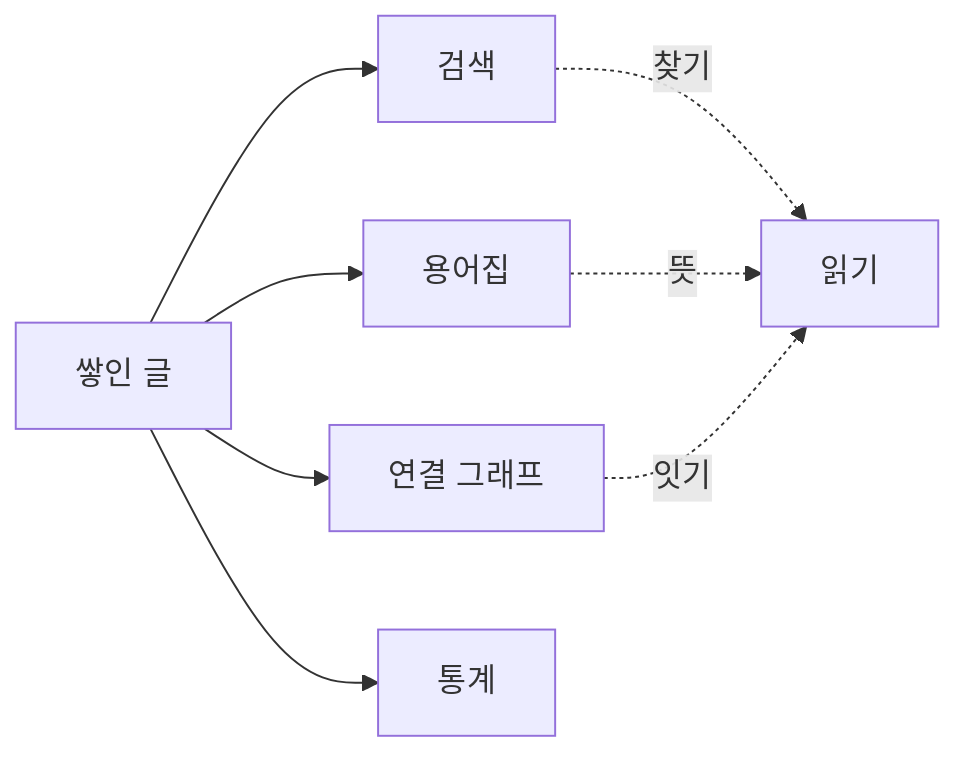

글이 30편을 넘기니 문제가 하나 생겼다. 쓰는 건 편해졌는데, 정작 **쌓인 글을 다시 찾고 이어 보는 게** 불편해진 것이다. 검색은 최신 글만 위로 올리고, 글에 나온 전문 용어는 매번 그 글로 돌아가야 뜻을 알 수 있었다. 그래서 최근 며칠은 새 글을 쓰는 대신, 블로그 안을 걷기 좋게 만드는 도구들을 붙였다. 무엇을 왜 넣었고, 그러다 무엇을 도로 뺐는지까지 적어 둔다.



## 검색에 위계를 넣다

검색은 원래 **Pagefind**(pagefind; 정적 사이트에 얹는 검색 색인)로 제목과 본문을 뒤지고 있었다. 여기에 카테고리와 시리즈로 좁히는 필터를 더했는데, 처음엔 두 가지가 다 걸리는 게 문제였다.

첫째, 정렬을 관련도순으로 뒀더니 무엇이 왜 위에 왔는지 알 수가 없었다. 관련도 점수가 화면에 보이지도 않으니 그냥 최신순으로 고정했다. 둘째, 카테고리와 시리즈 칩을 나란히 늘어놓으니 그 시리즈가 어느 카테고리 것인지 알 수 없었다. 그래서 **카테고리를 먼저 고르면 그 카테고리의 시리즈만** 아래에 펴지도록 위계를 뒀다.

필터 값은 빌드할 때 미리 모아 둔다. 아래 코드는 결국 카테고리별로 어떤 시리즈가 있는지 표 하나를 만드는 일이다.

```ts
// 시리즈가 여러 카테고리에 걸치면(예: "블로그 다듬기 기록"이 블로그·회고 양쪽) 각각에 넣는다
const seriesByCategory: Record<string, string[]> = {};
for (const post of posts) {
  const { category, series } = post.data;
  if (!category || !series) continue;
  (seriesByCategory[category] ??= []).push(series); // [!code highlight]
}
```

가장 신경 쓰이던 건 따로 있었다. 검색어를 지웠는데 방금 결과가 잠깐 다시 나타나는 것이었다. 입력을 지우면 화면은 즉시 비우지만, 그 전에 날아간 검색 요청이 **뒤늦게 도착해** 결과를 다시 그리고 있었다. 검색마다 번호표를 붙이고, 도착한 결과의 번호가 최신이 아니면 버리는 식으로 막았다.

## 용어집을 자동으로 모으고, 손으로 고르게

이 블로그는 전문 용어가 처음 나올 때 `**용어**(뜻)`처럼 굵은 용어와 괄호 풀이를 함께 적는 규칙이 있다. 이미 구조가 정해진 글이니, 빌드할 때 이 패턴만 긁어모으면 **용어집**(glossary; 용어와 뜻을 한곳에 모은 페이지)이 공짜로 만들어진다.

문제는 아무 괄호나 다 모으면 안 된다는 것이었다. `**공인 IP**(public IP)`처럼 괄호가 뜻이 아니라 영어 원어인 경우가 섞였다. 방문한 사람이 "냉각은 alpha cooling"이라는 줄을 봐도 뜻을 알 수 없다. 그래서 괄호 안에 **한국어 뜻이 있을 때만** 모으도록 걸렀다.

그리고 무작정 자동 등록만 두는 것도 마음에 걸렸다. 그래서 발행 화면에, 연결된 글에 설명을 다는 것처럼, **용어를 감지해서 빼거나 뜻을 고치는** 자리를 만들었다. 빼기로 한 용어의 목록은 발행할 때 함께 커밋되고, 뜻 고치기는 본문의 괄호를 직접 바꾼다. 용어집의 단일 출처는 어디까지나 글 본문이라는 뜻이다.

여기서 한 번 크게 헤맸다. 용어집에 검색을 붙였는데, 개수는 "1/13"으로 정확히 줄어드는데 화면에서는 항목이 안 사라졌다. 원인은 이랬다.

```css
.g-item {
  display: grid; /* 이 한 줄이 hidden을 이겼다 */
}
.g-item[hidden] {
  display: none; /* [!code ++] */
}
```

검색 스크립트는 안 맞는 항목에 `hidden`을 제대로 붙이고 있었다. 그런데 내가 준 `display: grid`가 브라우저 기본값인 `[hidden]`의 숨김을 덮어쓰고 있었다. `.g-item[hidden]`에 다시 `display: none`을 못 박아 해결했다. **속성만 보고 다 됐다고 넘긴** 내 검증이 놓친 자리라, 이후로는 실제로 화면에서 사라지는지까지 재기로 했다.

## 글끼리 어떻게 이어지나

글은 서로 연결된다. 확장·뒷받침·선행 같은 관계에 타입이 붙는데, 그 뜻을 독자가 알 방법이 없었다. 그래서 관계 타입을 설명하는 **연결 스키마** 페이지를 따로 만들고, 그래프에서 바로 닿게 했다. 색과 라벨의 단일 출처는 그래프 코드 안의 `EDGE_TYPES` 하나다.

그래프에는 제목 검색도 붙였다. 처음엔 브라우저 기본 `datalist`(입력창에 붙는 자동완성 목록)로 대충 띄웠는데, 글이 수백 개로 늘면 목록이 통째로 쏟아질 게 뻔했다. 그래서 입력한 글자와 맞는 제목을 **최대 7개까지만** 보여주는 드롭다운으로 다시 만들었다. 고르면 그 노드를 화면 가운데로 끌어와 확대한다.

## 글쓰기 품질을 자동으로 점검

말투를 한 결로 지키는 건 은근히 손이 간다. 그래서 발행 화면의 점검 항목에 **voice 린터**를 얹었다. 엠대시, 제목의 콜론, 합쇼체처럼 기계가 판정할 수 있는 규칙만 훑어서 경고를 띄운다.

합쇼체를 잡는 규칙에서 작은 함정이 있었다. `습니다`로만 찾으면 `납니다`나 `갑니다` 같은 걸 놓친다. 그래서 문장 끝의 `니다`를 넓게 잡되, 평서체인 `아니다`는 빼야 했다.

```ts
// 문장 끝이 '니다'면 합쇼체로 보되, 평서체 '아니다'는 제외
return /니다[.!?)\]]?$/.test(t) && !/아니다[.!?)\]]?$/.test(t);
```

전수로 훑어보니 정작 잡힌 합쇼체는 전부 인용이나 예시였다. 다행히 본문 말투는 이미 깨끗했다는 뜻이라, 자동으로 고친 건 거의 없었다.

## 얼마나 쌓였는지 재는 통계

블로그가 지금까지 얼마나 자랐는지 한눈에 보는 **통계** 페이지를 만들었다. 글 수, 방문자 수, 글 사이의 연결 수를 큰 카드로 두고, 글자 수나 태그 수 같은 보조 지표는 한 줄로 정리했다. 발행한 날을 색으로 칠하는 잔디도 올해 1월부터 12월까지 스크롤 없이 한눈에 펴 두었다.

여기서 수정 횟수가 실제보다 한참 적게 나왔다. 처음엔 글의 수정일 하나로 셌는데, 글 하나에 수정일은 하나뿐이라 **여러 번 고쳐도 1번**으로만 잡혔다. 그래서 글 파일의 커밋 기록을 통째로 세기로 했다. 각 글의 가장 오래된 커밋이 발행, 나머지가 수정이다.

```ts
// 글 .md의 커밋 기록. 최신순이라 마지막(가장 오래된) 커밋이 발행, 나머지는 수정
for (const dates of datesByFile.values()) {
  for (let i = 0; i < dates.length; i++) {
    const isPub = i === dates.length - 1; // [!code highlight]
    if (isPub) totalPub++;
    else totalMod++;
  }
}
```

이걸로 수정 횟수가 24번에서 181번으로 바뀌었다. 실제 손댄 양에 훨씬 가깝다.

한 가지 함정이 있었다. 이 계산은 빌드할 때 git 기록을 읽는데, 배포 서버는 기본적으로 **커밋을 하나만** 받아 온다(얕은 클론). 그대로 두면 라이브에서는 수정이 전부 0으로 나온다. 배포 설정에서 전체 기록을 받도록 `fetch-depth: 0`을 켜서 맞췄다.

## 밖에서도 읽기 좋게

요즘은 사람만 블로그를 읽는 게 아니다. 그래서 **llms.txt**(llmstxt.org; LLM이 사이트 구조를 읽기 좋게 정리한 표준 파일)를 두고, 각 글의 원문 마크다운도 주소 끝에 `.md`를 붙이면 그대로 볼 수 있게 했다. 다른 도구가 이 위키를 읽을 때 렌더된 화면 대신 깨끗한 원문을 집어 가라는 뜻이다. 덤으로 연결이 하나도 없는 고아 글이나 깨진 링크를 빌드할 때 짚어 주는 점검 스크립트도 붙였다.

## 넣었다 도로 뺀 것

솔직히 실패한 것도 있다. 긴 글을 읽다 나가면 그 자리를 기억했다가 "이어서 읽기"로 돌아오게 하는 기능을 넣었었다. 그런데 눌러도 곧장 그 자리로 가지 않고 살짝 튀었다. 이미지와 다이어그램이 뒤늦게 그려지면서 문서 높이가 도중에 바뀌는 탓이었다.

즉시 이동으로 바꿔도 애매했고, 애초에 "어디까지 읽었나"를 정확히 재는 것 자체가 어려운 문제라는 생각이 들었다. 그래서 후순위로 미루고 통째로 걷어냈다. 홈 목록에 붙였던 읽음 표시도 굳이 필요하지 않아 함께 뺐다. 넣는 것만큼 빼는 것도 다듬기의 일부라고 생각한다.

## 요약

며칠 사이 검색·용어집·연결 스키마·통계가 블로그에 자리를 잡았다. 이제 쌓인 글을 찾고, 뜻을 모으고, 얼마나 자랐는지 재고, 밖으로도 열 수 있다. 조이 산책시키는 짬짬이 붙인 것치고는 꽤 많이 바뀌었다. 내 블로그가 조금씩 정원처럼 손질되는 걸 보는 재미가 있어서 그런 것 같다 🌱
