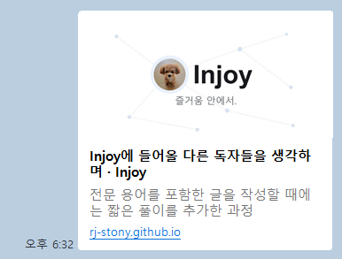

[[polish-round-3|지난 글]]에서 "글 안"을 코드를 모르는 독자에게 열었다. 그런데 글은 두 군데서 독자를 더 맞이한다. 하나는 *링크로 공유될 때*, 다른 하나는 *읽는 동안*이다. 이번엔 그 두 군데를 손봤다.

## 카톡에 공유하면 휑하던 링크

글 URL을 카카오톡이나 슬랙에 붙이면 보통 작은 미리보기 카드가 뜬다. 제목과 함께 그림 한 장이 제공된다. 그런데 Injoy는 그 그림이 비어 있었다. 대표 이미지(커버)를 넣은 글이 8편 중 2편뿐이라, 나머지는 제목만 덩그러니 떴다.

그래서 **기본 공유 카드** 한 장을 만들었다. 커버가 없는 글은 이 카드를 대신 내보낸다. 블로그가 점·선으로 글을 잇는 곳이니, 그 그래프를 옅게 깔고 **조이의 사진**과 이름을 얹었다.



코드로는 한 줄이다. 글에 커버가 있으면 그 썸네일을, 없으면 기본 카드를 공유 이미지로 고른다.

```ts src/pages/posts/[slug].astro
// 커버가 있으면 그걸, 없으면 기본 카드를 공유 이미지로
const ogImageURL = new URL(ogImage ?? withBase('/og-default.png'), Astro.site);
```

여기서 OG 이미지(링크를 공유했을 때 미리보기에 뜨는 그림)가 늘 하나는 있게 되었다. 지금 이 글도 커버가 없으니, 어딘가에 공유되면 그 기본 카드로 뜬다.

## 읽는 동안 편하게

글에 머무는 동안을 위한 작은 장치도 몇 개 더했다.

- **읽기 진행 막대.** 화면 맨 위에 가는 줄이 깔리고, 스크롤한 만큼 왼쪽부터 오른쪽까지 차오른다. 긴 글에서 "얼마나 남았지?"가 한눈에 보인다.

- **맨 위로.** 한참 내려가면 오른쪽 아래에 작은 버튼이 뜬다. 누르면 맨 위로 부드럽게 올라간다.

- **제목 링크.** 제목에 마우스를 올리면 🔗가 뜬다. 누르면 그 단락으로 바로 가는 주소가 복사된다. 글의 한 대목만 콕 집어 공유할 때 쓴다.

셋 다 없어도 글은 읽힌다. 다만 있으면 조금 덜 번거롭다. 그 정도의 장치들이다.

## 검색 엔진에게 또박또박

사람 눈엔 안 보이지만, 글마다 검색엔진에게 건네는 쪽지도 한 장 넣었다. **JSON-LD**(검색엔진이 읽기 좋게 정리한 구조화된 정보)라고 부른다. "이 페이지는 블로그 글이고, 제목은 이것, 발행일은 이때, 글쓴이는 누구"라고 또박또박 적어 둔다.

```ts
{
  "@type": "BlogPosting",
  "headline": "글 제목",
  "datePublished": "2026-06-22",
  "author": { "@type": "Person", "name": "노준석" }
}
```

구글이 알아서 추측하던 걸, 굳이 한 번 더 분명히 일러 주는 셈이다. 검색 결과에 제목·날짜가 조금 더 단정하게 뜨길 바라며...

## 마우스 없이도 그래프 조작 가능

[그래프](/graph/) 화면의 점·선 지도는 그림 한 장(캔버스(브라우저가 그림을 그리는 화면 영역))으로 그려진다. 그래서 마우스로 끌고 누르는 건 되지만, 키보드만 쓰는 사람은 점을 선택할 수 있는 방법이 없었다.

이제 그래프에 `Tab`으로 들어가면 화살표로 점 사이를 옮기고, `Enter`로 그 글로 이동할 수 있다. 고른 점에는 또렷한 테두리가 둘러져, 지금 어디에 있는지 보인다. 마우스가 없거나 화면 낭독기를 쓰는 사람도 같은 지도를 따라갈 수 있게 됐다.

## 남은 것

돌아보면 [[polish-round-3]] 이후로 한 일은 다 한 곳을 향한다. 글이 독자에게 닿는 길목마다 *불편한 부분을 한 겹씩 걷어내는 것.* 공유될 때 휑하지 않게, 읽는 동안 덜 번거롭게, 검색과 키보드에도 친절하게. 발행 과정은 [[how-to-write|예전 그대로]]고, 이번에 바뀐 건 그 중 일부분이다. 천천히, 그러나 꾸준히 계속 다듬어 보겠다. 🌱
