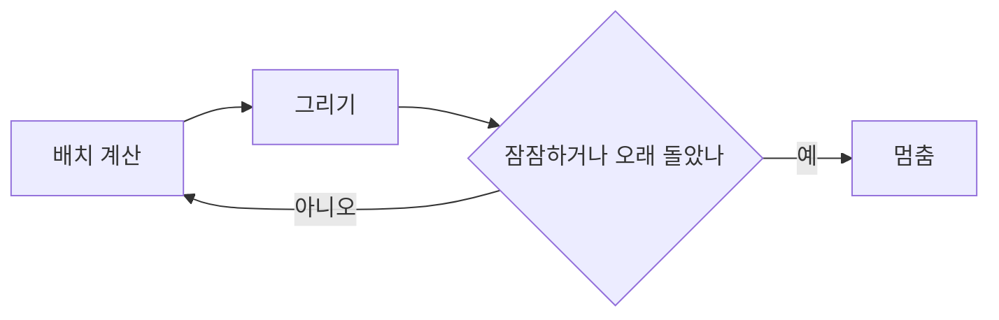

이번 회차에는 새 기능을 더하진 않았다. 대신 이미 있는 것들의 문제들을 하나씩 풀어냈다. 눈에 잘 안 띄지만, 쌓이면 쓰는 맛과 읽는 맛을 올려주는 과정들이라고 생각한다.

## 쓰는 화면

[[slash-menu]]에서 슬래시 메뉴를 붙인 뒤로도 쓰는 화면엔 수정할 곳이 남아 있었다.

글자를 드래그하면 그 자리에 작은 서식 버튼이 뜬다. 굵기, 기울임, 밑줄, 취소선 등이 존재한다. 마크다운 문법을 외우지 않아도 Notion에서처럼 누르면 된다. 밑줄은 표준 마크다운에 없어서 `<u>`로 풀어서 저장하는데, 발행 결과가 어긋나지 않는지 [[wysiwyg-editor]] 때처럼 왕복 검증을 몇 번이고 진행했다.

이미지는 누르면 바로 아래에 설명을 적는 칸이 열린다. 그동안은 대체 텍스트를 넣을 자리가 아예 없었다. 각주 버튼은 번호를 알아서 붙이고, 본문에는 참조를, 글 끝에는 그 정의를 함께 넣는다. 삽입 토글은 글을 길게 써 내려가도 화면 위에 붙어 따라온다. 예전엔 콜아웃 하나 넣으려고 맨 위로 올라갔다 내려오곤 했다.

## 읽는 화면

쓰는 쪽만 다듬은 건 아니다.

휴대폰에서 글 머리의 읽기 시간/연결/조회수가 위쪽 날짜와 엉켜서 답답했다. 이것들을 제목 아래로 내려 한 텀 쉬어 가게 만들었다. 발행된 체크리스트 앞에 붙던 점도 떼어 체크박스만 단정하게 남겼다. 처음 홈 화면에서는 모바일에서 썸네일이 맨 위로 올라와 있었는데, 제목과 글을 먼저 보이고 썸네일을 아래로 내렸다.

목차는 읽는 자리를 따라 하이라이트하는 기능을 추가했다. 스크롤하면 지금 보고 있는 단락이 목차에서 옅게 강조된다.

원리는 단순하다. 고정 헤더의 약간 아래에 기준선을 하나 놓고, 그 선을 지난 마지막 제목을 '지금 보는 곳'으로 본다.

```ts
function initToc(nav) {
  const links = [...nav.querySelectorAll('a[href^="#"]')];
  const entries = links.map((a) => ({ a, el: document.getElementById(a.hash.slice(1)) }));
  const LINE = 88; // 고정 헤더(66px) 약간 아래의 기준선
  const update = () => {
    let active = entries[0];
    for (const e of entries) {
      if (e.el.getBoundingClientRect().top <= LINE) active = e; // [!code highlight]
      else break;
    }
    for (const { a } of entries) a.classList.toggle('active', a === active.a);
  };
  window.addEventListener('scroll', () => requestAnimationFrame(update), { passive: true });
}
```

강조한 줄이 판단의 전부다. 제목들을 위에서부터 훑다가 기준선(`LINE`)보다 위에 있는 마지막 제목에서 멈춘다. 스크롤 이벤트는 `requestAnimationFrame`으로 묶어, 한 프레임에 한 번만 다시 계산하게 했다. 매 스크롤마다 위치를 계산하면 무겁기 때문이다.

또한, 대표 이미지가 없는 글에는, 본문에 다이어그램이 있으면 그 첫 다이어그램을 그대로 작은 미리보기로 얹었다. 지금 이 글의 썸네일이 바로 그렇게 적용된다.

이건 본문에서 첫 mermaid 블록을 찾아 펜스를 벗겨 내는 함수 하나로 끝난다.

```ts
export function firstDiagram(post) {
  const { codeBlocks } = splitCode(post.body ?? '');
  const block = codeBlocks.find((b) => /^\s*`{3,}\s*mermaid/.test(b)); // 첫 mermaid 블록
  if (!block) return null; // 다이어그램이 없으면 썸네일도 없다
  const inner = block.split('\n').slice(1); // 펜스 머리 줄 제거
  if (/^\s*(`{3,}|~{3,})\s*$/.test(inner.at(-1) ?? '')) inner.pop(); // 닫는 펜스도 제거
  return inner.join('\n').trim() || null;
}
```

여기서 돌려준 다이어그램 소스를 카드가 본문과 똑같은 mermaid 렌더러로 그려, 커버 없는 글도 빈 카드로 남지 않는다.

## 계속 돌고만 있던 그래프 화면 수정

가장 흥미로운 건 [그래프](/graph/)였다. 휴대폰에서 미세하게 렉이 걸려서 들여다봤더니, 돌아가는 시뮬레이션이 영영 멈추질 않고 있었다. 중력과 척력(?)이 어중간하게 맞물려서 에너지가 0으로 내내 떨어지지 않았고, 그래서 화면을 쉼 없이 다시 렌더링하고 있었다. 눈에 잘 안 띄는, 조용한 버그였다.



해결은 단순했다. 배치가 자리를 잡거나 충분히 오래 돌면 루프를 끝내도록 상한을 뒀다. 프레임 수를 세는 변수 하나와, 끝내는 조건에 `또는` 하나를 더한 게 전부다.

```ts
let frames = 0;
const loop = () => {
  frames++; // [!code ++]
  tick(); // 힘 계산 + 위치 갱신
  draw(); // 캔버스에 다시 그리기
  const energy = nodes.reduce((s, n) => s + Math.abs(n.vx) + Math.abs(n.vy), 0);
  calmFrames = energy < 0.5 ? calmFrames + 1 : 0;
  // 중력·척력 균형 탓에 에너지가 0까지 안 떨어질 수 있다 → 프레임 상한을 backstop으로
  const maxFrames = isSmall() ? 180 : 300; // [!code ++]
  if (calmFrames > 30 && !dragging) { // [!code --]
  if ((calmFrames > 30 || frames > maxFrames) && !dragging) { // [!code ++]
    running = false; // 루프 종료. 더 이상 rAF를 걸지 않는다
    return;
  }
  requestAnimationFrame(loop);
};
```

빨간 줄이 옛 조건이다. '잠잠해지면'(`calmFrames > 30`) 멈춘다는 건데, 에너지가 영영 0 근처로 안 내려오면 이 조건은 영원히 거짓이다. 초록 줄에 `frames > maxFrames`를 `또는`으로 더하니, 잠잠해지지 않아도 정해진 프레임 수가 지나면 무조건 멈춘다. 그러자 그래프가 펼쳐진 뒤엔 한 프레임도 더 돌지 않는다.

휴대폰에서의 픽셀도 함께 줄였다. 고해상도 화면은 화소 배율이 2\~3배라, 매 프레임 칠하는 픽셀이 폭주하기 쉽다. 배율을 2배로 잘랐다.

```ts
// 고DPR(모바일 2~3배) 백킹스토어가 매 프레임 칠하는 픽셀을 폭주시키지 않게 2배로 캡
const dpr = Math.min(window.devicePixelRatio || 1, 2); // [!code ++]
```

`Math.min(..., 2)` 한 줄이다. 화면이 아무리 고해상도여도 캔버스는 2배까지만 칠한다. 나중에 노드가 많이 쌓이게 되어도 괜찮을 것으로 예상된다.

## 남은 것

발행 과정은 예전 그대로다. 글을 쓰고 다듬는 길은 [[how-to-write]]에 적어 둔 그대로고, 이번에 바뀐 건 그 길 위의 마찰뿐이다. 보이지 않는 곳을 다듬는 일은 끝이 없겠지만, 그래서 더 즐겁다. 천천히, 그러나 꾸준히 계속 수정해보겠다. 🌱
