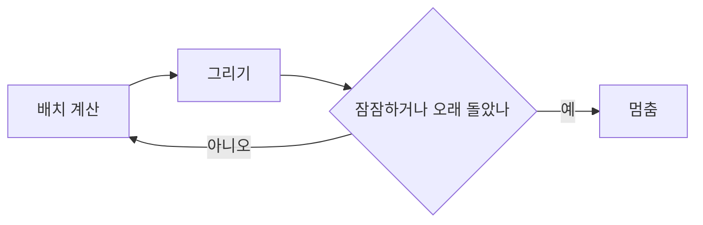

이번 회차에는 새 기능을 크게 더하지 않았다. 대신 이미 있는 것들의 거친 모서리를 하나씩 깎아냈다. 눈에 잘 안 띄지만, 쌓이면 쓰는 맛과 읽는 맛을 바꾸는 손질들이다.

## 쓰는 화면

[[slash-menu]]에서 슬래시 메뉴를 붙인 뒤로도 쓰는 화면엔 잔손질할 곳이 남아 있었다.

글자를 드래그하면 그 자리에 작은 서식 막대가 뜬다. 굵게, 기울임, 밑줄, 취소선. 마크다운 기호를 외우지 않아도 노션에서처럼 누르면 된다. 밑줄은 표준 마크다운에 없어서 `<u>`로 풀어 저장하는데, 발행 결과가 어긋나지 않는지 [[wysiwyg-editor]] 때처럼 왕복(round-trip)을 몇 번이고 확인했다.

이미지는 누르면 바로 아래에 설명을 적는 칸이 열린다. 그동안은 대체 텍스트를 넣을 자리가 아예 없었다. 각주 버튼은 번호를 알아서 붙이고, 본문에는 참조를, 글 끝에는 그 정의를 함께 넣는다. 삽입 도구 막대는 글을 길게 써 내려가도 화면 위에 붙어 따라온다. 예전엔 콜아웃 하나 넣으려고 맨 위로 올라갔다 내려오곤 했다.

## 읽는 화면

쓰는 쪽만 다듬은 건 아니다.

휴대폰에서 글 머리의 읽기 시간·연결·조회수가 위쪽 날짜와 엉켜 답답했다. 이것들을 제목 아래로 내려 한 줄 쉬어 가게 했다. 발행된 체크리스트 앞에 붙던 점도 떼어 체크박스만 단정하게 남겼다. 목록 카드는 휴대폰에서 사진이 맨 위로 올라와 있었는데, 제목과 글을 먼저 보이고 사진을 아래로 내렸다.

목차는 읽는 자리를 따라 짚어 준다. 스크롤하면 지금 보고 있는 단락이 목차에서 옅게 강조된다. 대표 이미지가 없는 글에는, 본문에 다이어그램이 있으면 그 첫 다이어그램을 그대로 작은 미리보기로 얹었다. 지금 이 글의 목록 그림이 바로 그것이다.

## 조용히 돌고 있던 그래프

가장 흥미로운 건 [그래프](/graph/)였다. 휴대폰에서 미세하게 버벅여서 들여다봤더니, 힘 시뮬레이션이 영영 멈추질 않고 있었다. 중력과 척력이 어중간하게 맞물려 에너지가 0으로 떨어지지 않았고, 그래서 화면을 쉼 없이 다시 칠하고 있었다. 눈에 잘 안 띄는, 조용한 부류의 버그였다.

해결은 단순했다. 배치가 자리를 잡거나 충분히 오래 돌면 루프를 끝내도록 상한을 뒀다. 그러자 그래프가 펼쳐진 뒤엔 한 프레임도 더 돌지 않는다. 휴대폰에서 칠하는 픽셀도 함께 줄였다.

## 남은 것

발행 과정은 예전 그대로다. 글을 쓰고 다듬는 길은 [[how-to-write]]에 적어 둔 그대로고, 이번에 바뀐 건 그 길 위의 마찰뿐이다. 보이지 않는 곳을 다듬는 일은 끝이 없겠지만, 그래서 더 즐겁다. 천천히, 그러나 꾸준히. 🌱
