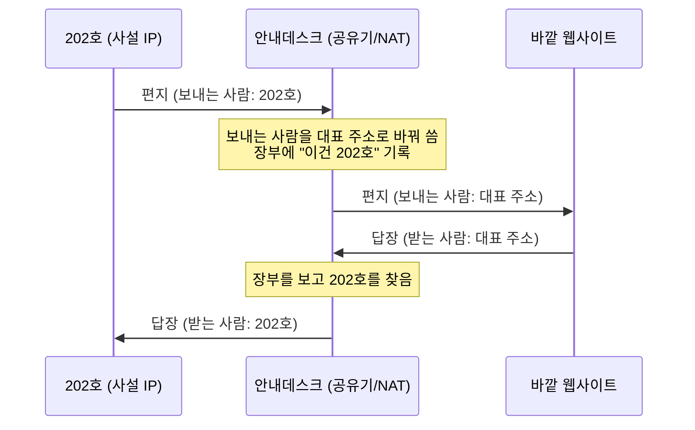

집에 있는 컴퓨터에 웹서버를 하나 띄웠다고 하자. 같은 집 안에서는 브라우저에 `192.168.0.10:8080`만 치면 잘 열린다. 그런데 밖에 나가서, 카페의 노트북으로 그 서버에 접속하려고 하면 아무리 해도 닿지 않는다. 분명 서버는 켜져 있는데 말이다.

여기서 **포트포워딩**(port forwarding)이 등장한다. 밖에서 우리 집 안의 특정 컴퓨터로 들어오는 길을 뚫어 주는 기술이다. 그런데 이걸 제대로 이해하려면, "왜 원래는 밖에서 못 들어오는가"부터 알아야 한다. 그 뿌리에는 **NAT**라는 게 있고, NAT의 뿌리에는 "주소가 부족했다"는 오래된 사정이 있다.

이 글은 그 사정부터 차근차근 올라온다. 어려운 용어가 꽤 나오지만, 건물 하나를 머릿속에 지어 두면 전부 그 안에서 설명된다.

## 1. 먼저, 주소가 부족했다

인터넷에서 모든 기기는 **IP 주소**(IP address; 인터넷에서 기기를 찾아가는 주소)라는 걸 하나씩 가진다. 편지를 보내려면 받는 사람 주소가 있어야 하는 것과 같다. 문제는 초기 인터넷 주소 체계(**IPv4**)로 만들 수 있는 주소가 약 43억 개뿐이었다는 것이다. 처음엔 넘치도록 많아 보였지만, 인터넷에 붙는 기기가 폭발적으로 늘면서 43억 개로는 세상 모든 기기에 하나씩 나눠 줄 수 없게 되었다.

그래서 나온 절충안이 이렇다. **주소를 두 종류로 나눈다.**

- **공인 IP**(public IP) - 인터넷 전체에서 유일한, 진짜 주소. 개수가 한정돼 있어 아껴 써야 한다.

- **사설 IP**(private IP) - 우리 집이나 회사 **안에서만** 통하는 주소(`192.168.x.x`, `10.x.x.x` 같은 것). 집집마다 똑같은 주소를 써도 상관없다. 어차피 그 집 안에서만 쓰니까.

여기서 이 글 내내 쓸 비유를 하나 세우자.

> 우리 집(또는 회사) 네트워크는 **큰 건물** 하나다.
>
> \- 건물에는 바깥세상에 공개된 **도로명 주소가 딱 하나** 있다. 이게 **공인 IP**다. 우체국(인터넷)은 이 주소까지만 배달할 줄 안다.
> \- 건물 안에는 **호실 번호**가 있다(201호, 202호…). 이게 **사설 IP**다. 건물 안에서는 호실로 서로를 찾지만, 바깥 우체국은 호실이 있는지도 모른다.

공인 IP가 부족하니, 기기마다 하나씩 주는 대신 **건물 한 채에 대표 주소 하나만** 주고, 그 안의 컴퓨터들은 호실 번호(사설 IP)로 관리하기로 한 것이다. 이 "주소를 아껴 쓰는 살림법"을 자동으로 해 주는 게 바로 NAT다.

## 2. 나갈 때 무슨 일이 벌어지나

건물에는 **1층 안내데스크**가 있다. 드나드는 모든 우편물이 이 데스크를 반드시 거친다. 우리 집으로 치면 **공유기**(라우터, 게이트웨이)가 바로 이 안내데스크다. 그리고 안내데스크가 하는 핵심 일이 **NAT**(Network Address Translation; 네트워크 주소 변환), 즉 **주소 바꿔치기**다.

202호 사람이 바깥 회사(예: 어떤 웹사이트)로 편지를 부친다고 하자. 편지 봉투에는 원래 이렇게 적혀 있다.

- 받는 사람: 바깥 회사 주소
- 보내는 사람: **202호** (사설 IP)

이 봉투를 그대로 내보내면 큰일이다. 받는 회사가 답장을 쓰려고 보내는 사람 칸을 보면 "202호"라고만 적혀 있는데, 바깥 우체국은 그 202호가 세상 어느 건물의 202호인지 알 방법이 없다. 답장이 영영 못 돌아온다.

그래서 안내데스크가 편지가 **밖으로 나가는 순간** 봉투를 고쳐 쓴다. 보내는 사람 칸을 **202호에서 우리 건물 대표 주소(공인 IP)로** 바꾼다. 그리고 장부에 한 줄 적어 둔다. "방금 나간 이 편지, 원래 주인은 202호."

바로 이것이 **"밖으로 나갈 때만 공인 IP를 쓴다"** 는 말의 정체다. 건물 안에서 돌아다닐 땐 호실 번호로 충분하다. 하지만 편지가 건물 밖으로 나가는 순간에는, 바깥이 알아들을 수 있는 유일한 주소인 대표 주소로 반송 주소를 바꿔 붙인다. 안에서는 호실, 밖으로 나갈 때는 대표 주소. 이 갈아 끼우기를 매번 해 주는 게 안내데스크(NAT)다.



답장이 대표 주소로 돌아오면, 안내데스크는 장부를 뒤져 "아, 이건 202호가 시작한 대화지" 하고 202호로 전달한다. 이렇게 하면 건물 안 컴퓨터가 수십 대여도 **대표 주소 하나를 같이** 쓸 수 있다. 안내데스크가 장부로 누가 누구인지 구분하기 때문이다. 여러 대가 주소 하나를 나눠 쓰는 이 방식을 따로 **PAT**(Port Address Translation)라고 부르는데, 집 공유기가 기본으로 하는 일이 바로 이것이다.

## 3. 그런데 밖에서 안으로는 왜 못 들어오나

여기까지 오면 1번의 수수께끼가 풀린다. 카페에서 우리 집 서버로 접속이 안 되던 이유 말이다.

지금까지의 그림은 전부 **안에서 먼저 말을 건 대화**였다. 202호가 편지를 부쳤고, 안내데스크가 장부에 적어 뒀기 때문에 답장을 돌려줄 수 있었다. 그런데 이번엔 반대다. 바깥의 낯선 손님(카페의 내 노트북)이 **먼저** 우리 건물로 편지를 보낸다.

- 받는 사람: 우리 건물 대표 주소
- 보내는 사람: 카페 노트북

이 편지가 안내데스크에 도착한다. 안내데스크는 난감하다. 대표 주소로 오긴 왔는데, **이 손님을 몇 호로 보내야 할지** 알 수가 없다. 장부에는 이 대화에 대한 기록이 없다(안에서 먼저 시작한 적이 없으니까). 건물에 컴퓨터가 여러 대인데, 이 편지가 201호 것인지 202호 것인지 데스크로선 알 도리가 없다. 그래서 그냥 **문전박대**한다. 버려진다.

이게 NAT의 근본적인 부작용이다. 안에서 밖으로 시작한 대화의 답장은 잘 돌려주지만, **밖에서 안으로 먼저 걸어오는 연결은 어느 호실인지 몰라 막아 버린다.** 딱히 보안을 하려던 게 아니라, 주소를 아끼려다 생긴 구조가 우연히 방어벽 노릇을 하게 된 것이다.

## 4. 포트포워딩은 안내데스크에 붙인 상시 규칙이다

그러면 밖에서 우리 집 서버로 들어오게 하려면 어떻게 해야 할까. 답은 단순하다. 안내데스크에 **상시 규칙**을 하나 붙여 두면 된다.

> "앞으로 8080번 용건으로 오는 외부 편지는, 묻지 말고 무조건 202호로 보내라."

이게 바로 **포트포워딩**이다. 특정 번호로 들어오는 외부 요청을 미리 정해 둔 내부 호실로 넘겨주는 규칙이다. 이제 카페에서 `우리집대표주소:8080`으로 접속하면, 안내데스크가 규칙표를 보고 곧장 202호의 웹서버로 연결해 준다.

여기서 "8080번 용건"이라고 한 그 번호가 **포트**(port)다. 잠깐 정리하고 가자.

- **IP 주소**는 "어느 건물"인지를 가리킨다(건물 도로명 주소).

- **포트**는 그 건물 안에서 "어느 창구/용건"인지를 가리킨다. 한 컴퓨터가 웹도 돌리고 파일 공유도 돌릴 때, 들어온 요청을 어느 프로그램에 줄지 이 번호로 구분한다. 웹은 보통 80·443, SSH 원격 접속은 22를 쓴다. 0부터 65535까지 있다.

그러니까 `대표주소:8080`은 "우리 건물, 8080 용건"이라는 두 단계 주소인 셈이다.


조금 더 깊이 들어가면, 이 "주소 바꿔치기"는 방향에 따라 이름이 다르다. 나갈 때 보내는 사람(출발지)을 바꾸는 건 **SNAT**(Source NAT), 들어올 때 받는 사람(목적지)을 내부 호실로 바꾸는 건 **DNAT**(Destination NAT)다. **포트포워딩은 이 DNAT를 미리 규칙으로 박아 둔 것**이다. 리눅스 공유기라면 실제로 이런 한 줄로 그 규칙을 만든다.

```bash
# 대표주소의 8080으로 온 요청을 192.168.0.10의 80으로 넘겨라
iptables -t nat -A PREROUTING -p tcp --dport 8080 \
  -j DNAT --to-destination 192.168.0.10:80
```

이 명령이 결국 안내데스크 규칙표에 "8080 → 202호 80번 창구" 한 줄을 붙이는 일이다. `PREROUTING`은 "편지가 어디로 갈지 정하기 **전에** 손본다"는 뜻이라, 목적지를 내부 호실로 바꿔치기하기에 딱 맞는 자리다.

> [!NOTE]
> **방화벽에 뚫는 구멍**\
> 안내데스크의 기본 방침은 "밖에서 먼저 들어오려는 건 원칙적으로 다 막음"이다. 이 방침을 맡은 게 **방화벽**(firewall)이다. 포트포워딩은 그 방화벽에 구멍을 하나 의도적으로 뚫는 행위다. 그래서 편리한 만큼, 그 구멍이 곧 약점이 되기도 한다. 이 이야기는 6번에서 다시 한다.

## 5. 포트포워딩이라 불리는 것들

실무에서 "포트포워딩"이라 뭉뚱그려 부르는 것은 사실 몇 갈래로 나뉜다. 방향이 서로 다르다.

| 종류 | 방향 | 하는 일 | 대표 용도 |
| --- | --- | --- | --- |
| 라우터 포트포워딩 | 밖 → 안 | 공유기가 외부 요청을 내부 기기로 넘김 | 집 NAS·웹서버를 외부에 공개 |
| SSH 로컬 포워딩 (`ssh -L`) | 내 PC → 원격 | 내 로컬 포트를 원격 서버 뒤의 서비스로 연결 | 방화벽 뒤 DB에 안전하게 접속 |
| SSH 원격 포워딩 (`ssh -R`) | 원격 → 내 PC | 원격 서버의 포트를 내 로컬 서비스로 연결 | 로컬 개발 서버를 잠깐 외부에 노출 |
| UPnP | 자동 | 기기가 공유기에 직접 포트 개방을 요청 | 게임 콘솔·P2P 앱의 자동 설정 |

앞의 넷 중 **SSH 터널링**은 기억해 둘 만하다. 라우터에 상시 구멍을 뚫는 대신, 암호화된 SSH 연결 안으로 다른 트래픽을 잠깐 통과시키는 방식이다. 필요할 때만 안전한 통로가 생겼다 사라진다.

```bash
# 로컬 포워딩(-L): 내 PC의 5432 포트를 → 점프서버 뒤의 DB로
ssh -L 5432:db-internal:5432 user@jump-server

# 원격 포워딩(-R): 점프서버의 9000 포트를 → 내 PC의 로컬 서버로
ssh -R 9000:localhost:3000 user@jump-server
```

첫 줄은 방화벽 뒤에 꽁꽁 숨은 DB에 마치 내 PC에 있는 것처럼 붙게 해 주고, 둘째 줄은 내 노트북에서 돌리는 개발 서버를 원격 서버 쪽에서 잠깐 볼 수 있게 열어 준다. 둘 다 라우터 설정을 건드리지 않는다.

마지막 **UPnP**(Universal Plug and Play)는 편의를 위해 나온 자동화다. 기기가 사람 손을 거치지 않고 공유기에 직접 "제 앞으로 오는 8080 손님 다 들여보내 주세요"라고 요청해 포트포워딩 규칙을 스스로 만든다. 편하지만, 바로 이 자동·무인증이 다음 문제의 씨앗이 된다.

## 6. 열어 둔 포트는 곧 공격 표면이다

포트포워딩의 핵심 위험은 한 문장으로 요약된다. **열어 둔 포트는 곧 공격 표면이다.** 방화벽 뒤에 안전하게 숨어 있어야 할 서비스가, 구멍 하나로 인터넷 전체에 그대로 드러나기 때문이다.

- **노출된 서비스가 표적이 된다.** 관리자가 무심코 열어 둔 포트 너머의 서비스를, 공격자는 자동화된 스캐너로 끊임없이 찾아다닌다. 낡은 버전이거나 비밀번호가 허술하면 그대로 뚫린다.

- **UPnP는 인증 없이 문을 연다.** UPnP는 기기가 아무 확인 절차 없이 조용히 포트를 열게 해 준다. 게다가 대부분의 공유기 화면은 사람이 직접 만든 규칙과 UPnP가 만든 규칙을 구분해 보여 주지 않는다. 그래서 무엇이 왜 열려 있는지 알기 어렵다.

- **감염된 기기가 스스로 백도어를 판다.** 집 안의 어떤 기기든 악성코드에 감염되면, 그 기기가 UPnP로 공유기에 "내 쪽으로 포트를 열어 달라"고 요청해 바깥에서 들어오는 뒷문을 만들 수 있다. 감염된 스마트 전구 하나가 이런 일을 벌이기도 한다.

이게 상상 속 위험만은 아니다. 2016년 **Mirai**(미라이) 봇넷은 주로 CCTV 카메라 같은 IoT 기기를 UPnP로 장악해, 그 기기들을 한꺼번에 동원한 대규모 **DDoS**(수많은 기기가 한 대상에 트래픽을 퍼부어 마비시키는 공격) 공격을 일으켰다. 그 규모가 미국 동부 해안 상당 지역의 인터넷을 멈춰 세울 정도였다.

그러니 꼭 포트를 열어야 한다면 최소한 이 정도는 지키는 게 기본이다. 접근할 수 있는 출발지 IP를 아는 대역으로 제한하고, 여는 포트 범위를 최소로 줄이고, 열어 둔 규칙을 정기적으로 되돌아본다. 쓰지 않게 된 규칙은 곧바로 닫는다.

## 7. 애초에 직접 열지 않는 길

여기까지 오면 자연스러운 결론에 닿는다. **가능하면 라우터에 구멍을 직접 뚫지 않는 편이 낫다.** 다행히 요즘은 포트를 열지 않고도 밖에서 안으로 닿게 하는 길이 여럿 있다.

- **VPN** - 바깥에서 우리 집·회사 네트워크 안으로 안전하게 들어오는 전용 통로를 만든다. 개별 서비스를 하나씩 여는 대신, 인증된 사람만 네트워크 안으로 들여보낸다.

- **Cloudflare Tunnel·ngrok 같은 릴레이** - 내부 서버가 바깥의 중계 서버로 **먼저** 연결을 걸어 두고(안에서 밖으로 나가는 연결이라 NAT를 자연스럽게 통과한다), 외부 요청은 그 중계 서버를 거쳐 들어온다. 라우터에 구멍이 전혀 필요 없다.

- **SSH 터널** - 5번에서 본 그 방식이다. 필요한 순간에만 통로를 열고 닫는다.

이들의 공통점은 하나다. **연결을 안에서 밖으로 먼저 건다**는 것이다. 안내데스크는 안에서 시작한 대화의 답장은 원래 잘 돌려준다고 했다. 그 성질을 그대로 이용해, 바깥에 상시 구멍을 뚫지 않고도 통로를 얻는 것이다. 사내에서 개발자가 "로컬 서버를 밖에서 보게 해 달라"고 할 때 보통 정말 필요한 것도 라우터 포트포워딩이 아니라 이런 터널·릴레이인 경우가 많다.

## 정리

한 건물로 시작해 여기까지 왔다. 되짚어 보면 이렇다.

- 공인 IP가 부족해서, 건물 한 채에 대표 주소 하나만 주고 안은 호실(사설 IP)로 관리하게 되었다. 이 살림을 해 주는 게 **NAT**다.

- 그 덕에 나갈 때는 대표 주소로 잘 나가지만, 밖에서 안으로 먼저 걸어오는 연결은 어느 호실인지 몰라 막힌다.

- **포트포워딩**은 안내데스크에 "이 번호는 저 호실로" 상시 규칙을 붙여 그 길을 여는 일이다.

- 열린 포트는 공격 표면이 되니, 되도록 직접 열기보다 VPN·터널·릴레이처럼 안에서 밖으로 거는 길을 먼저 떠올리는 게 좋다.

"주소가 부족하다"는 오래된 사정 하나가 사설 IP를 낳고, NAT를 낳고, NAT가 만든 벽이 다시 포트포워딩과 UPnP를 낳았다. 흩어져 보이던 용어들이 사실은 한 가족이었던 셈이다. 이렇게 뿌리부터 따라가면, 낯선 약어들도 "아, 그래서 나온 거구나" 하고 자리를 잡는다. 네트워크는 유독 이런 맥락이 힘이 세다. <span class="tossface">🌐</span>
