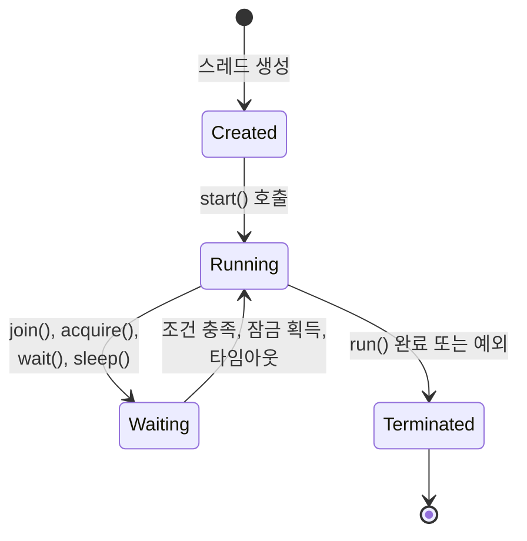
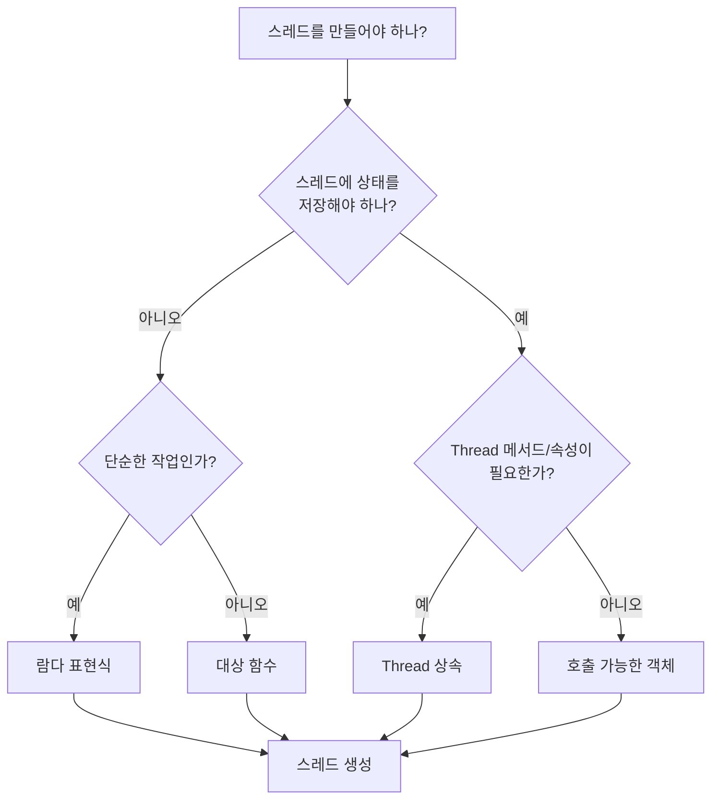
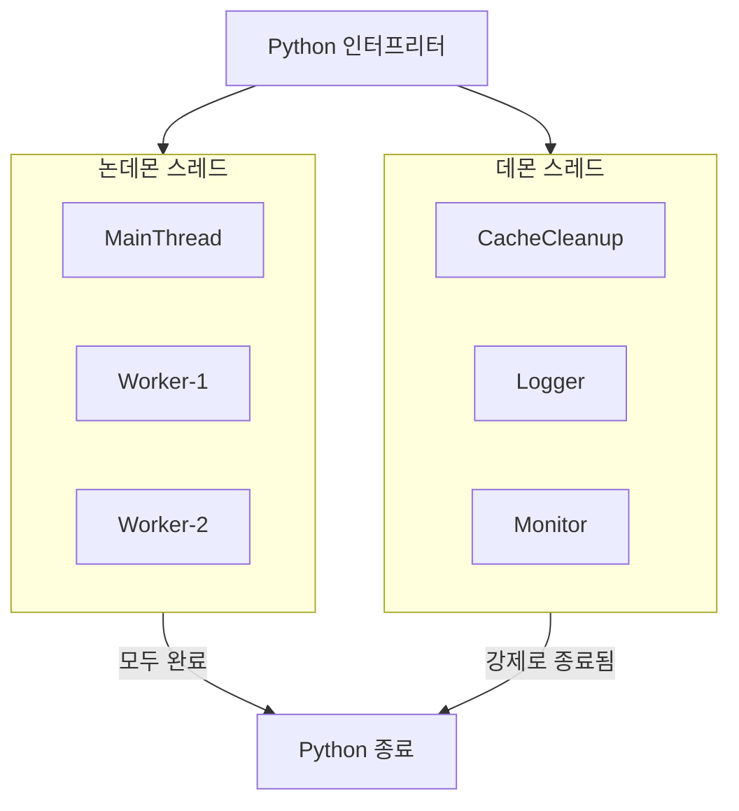
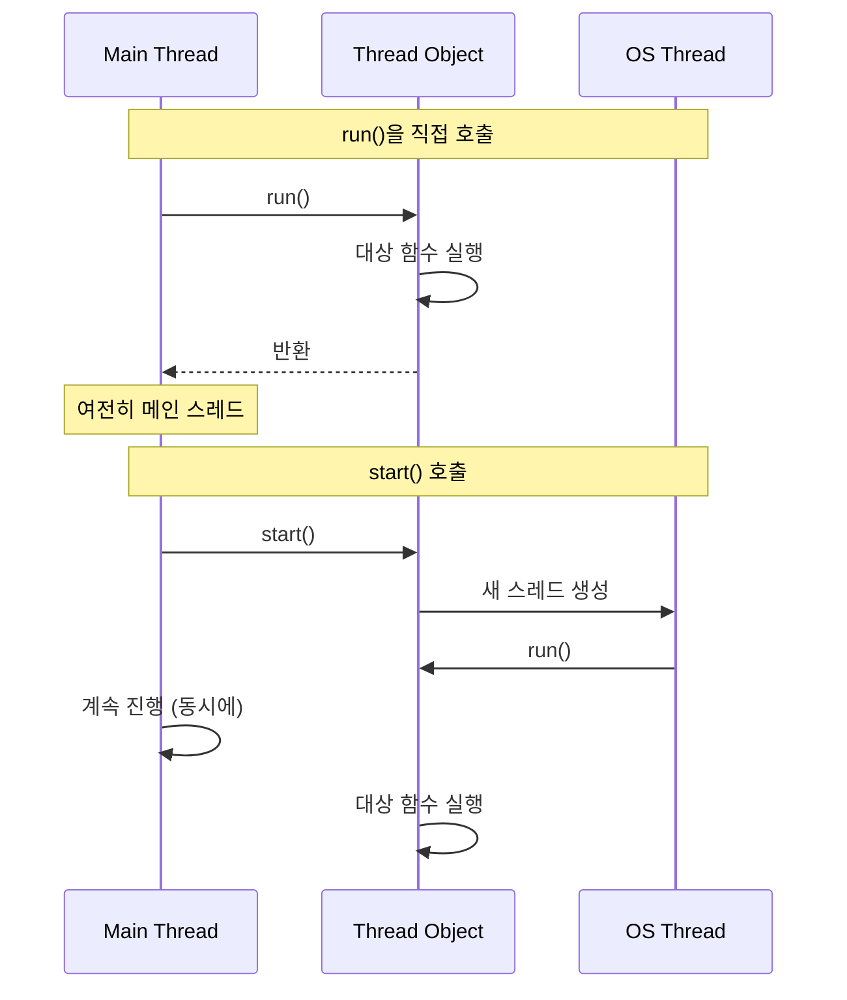

[[singleton-pattern]] 글에서 싱글톤 패턴을 구현하고, 실제로 캐시 매니저를 만들 때 `threading.Lock`으로 스레드 안전성을 지키게 되었다. 그때 잠깐 작성된 **threading 모듈**을 이번엔 제대로 파보려고 한다.

파이썬의 스레드는 주요 언어 중에서도 독특하다. threading 모듈은 1999년에 나온 1.5.2 버전부터 있었다. 여기서 유명한 단서가 하나 나오는데, 바로 **GIL**(Global Interpreter Lock; 한 번에 한 스레드만 파이썬 바이트코드를 실행하게 하는 전역적인 잠금)이다. GIL은 파이썬 객체 접근을 보호하는 **뮤텍스**(mutex; 한 번에 하나만 지나가게 하는 잠금)라, 여러 스레드가 동시에 파이썬 바이트코드를 실행하지 못하게 막는다.

그래서 파이썬 스레드는 멀티코어에서 CPU 작업을 빠르게 돌리지 못한다. 대신 **I/O 작업**에는 여전히 강력하다. 스레드가 외부 자원을 기다리며 대부분의 시간을 보내는 동안 GIL이 풀리기 때문이다. 파일을 읽거나 네트워크 응답을 기다리는 일에는 스레드가 제값을 한다.

이 글에서는 `threading.Thread` API, 스레드를 만드는 여러 방법(함수 참조, 상속, 호출 가능한 객체), 설정, 생명주기 관리, 실무에서 만나는 패턴까지 하나씩 짚어 볼 예정이다.

## 1. Thread 클래스

파이썬 스레드 모델의 중심에는 `threading.Thread`가 있다. 프로그램의 모든 스레드는 이 클래스 혹은 그 하위 클래스의 인스턴스로 표현된다.

### 생성자

Thread 생성자는 여러 매개변수를 받는다.

```python
import threading

# 전체 생성자 시그니처
threading.Thread(
    group=None,      # 향후 확장용 (항상 None)
    target=None,     # 스레드에서 실행할 callable
    name=None,       # 스레드 이름 (None이면 자동 생성)
    args=(),         # target에 넘길 위치 인자
    kwargs=None,     # target에 넘길 키워드 인자
    daemon=None,     # 데몬 여부 (None이면 부모에서 상속)
)
```

`group`은 언젠가 `ThreadGroup`이 구현될 때를 위해 남겨 둔 자리다(자바의 ThreadGroup과 비슷하다). 지금은 늘 None이어야 한다.

```python
import threading

def process_order(order_id, priority=1):
    print(f"주문 {order_id} 처리 중 (우선순위 {priority})")

# 인자를 넘겨 스레드 생성
thread = threading.Thread(
    target=process_order,
    args=(123,),             # 위치 인자는 튜플로
    kwargs={"priority": 5},  # 키워드 인자는 딕셔너리로
    name="OrderProcessor-1",
)
```

### 주요 속성

스레드는 동작과 디버깅에 영향을 주는 속성 몇 가지를 제공한다.

**name** - 디버깅용 이름이다. 지정하지 않으면 파이썬이 "Thread-1", "Thread-2"처럼 자동으로 붙인다.

```python
import threading

thread = threading.Thread(target=work)
thread.name = "OrderProcessor-1"

# 생성자에서 지정해도 된다
thread = threading.Thread(target=work, name="OrderProcessor-1")

# 현재 스레드 이름 얻기
current_name = threading.current_thread().name
```

**ident** - 스레드가 시작될 때 배정되는 **고유 정수의 식별자**다. OS가 준 식별자이고, 시작하지 않은 스레드에서는 None이다.

```python
thread = threading.Thread(target=work)
print(thread.ident)  # None (아직 시작 안 함)

thread.start()
print(thread.ident)  # OS가 배정한 정수, 예: 123145307557888
```

**native\_id** - 커널이 배정하는 네이티브 스레드 ID다(파이썬 3.8+). `ident`와 달리 `top`이나 `ps` 같은 시스템 도구에서 보이는 값과 일치한다.

```python
import threading

def show_id():
    print(f"네이티브 ID: {threading.current_thread().native_id}")

thread = threading.Thread(target=show_id)
thread.start()
thread.join()
```

**daemon** - 데몬 스레드인지 나타내는 불리언이다. 데몬 스레드는 논데몬 스레드가 전부 끝나면 자동으로 종료된다.

```python
thread = threading.Thread(target=background_task)
thread.daemon = True  # start() 전에 설정해야 한다
thread.start()
```

**is\_alive()** - 스레드가 시작됐고 아직 안 끝났으면 True를 돌려준다.

```python
thread = threading.Thread(target=work)
print(thread.is_alive())  # False (아직 시작 안 함)

thread.start()
print(thread.is_alive())  # True (실행 중)

thread.join()
print(thread.is_alive())  # False (종료됨)
```

## 2. 스레드의 상태

자바나 C#과 달리, 파이썬은 스레드 상태를 열거형(enum)으로 노출하지 않는다. 생명주기가 더 단순하다.



상태는 언제든 확인할 수 있다.

| 상태         | 확인 방법                      | 설명                         |
| ---------- | -------------------------- | -------------------------- |
| Created    | `ident is None`            | 스레드는 생성됐지만 `start()`를 안 부름 |
| Running    | `is_alive() == True`       | 실행 중이거나 실행 준비됨             |
| Waiting    | (직접 조회 불가)                 | I/O, 잠금, sleep, join으로 블록됨 |
| Terminated | 시작 뒤 `is_alive() == False` | 실행 완료                      |

```python
import threading
import time

def slow_work():
    time.sleep(2)

thread = threading.Thread(target=slow_work)
print(f"시작 전: ident={thread.ident}, alive={thread.is_alive()}")
# 시작 전: ident=None, alive=False

thread.start()
print(f"시작 후: ident={thread.ident}, alive={thread.is_alive()}")
# 시작 후: ident=123145307557888, alive=True

thread.join()
print(f"join 후: ident={thread.ident}, alive={thread.is_alive()}")
# join 후: ident=123145307557888, alive=False
```

결국 이 코드는 스레드가 시작 전, 실행 중, 종료 후로 넘어가며 `ident`와 `alive`가 어떻게 바뀌는지 보여준다.

## 3. 스레드를 만드는 세 가지 방법

파이썬에서 스레드는 그저 어떤 callable을 실행하는 "일꾼"이다. threading 모듈은 그 일꾼이 무엇을 실행할지 정하는 깔끔한 방법 세 가지를 준다.



세 방법 모두 결국 같은 일을 한다. 스레드가 실행할 callable을 넘겨준다. 차이는 **작업과 상태를 어떻게 포장하느냐**다.

### 대상 함수 넘기기 (권장)

가장 흔하고 대개 가장 좋은 방법이다. `target`으로 콜러블을, `args`와 `kwargs`로 인자를 넘긴다.

```python
import threading

def process_order(order_id, customer_name):
    print(f"{customer_name}님의 주문 {order_id} 처리 중")
    # 실제 처리

# 스레드 생성 후 시작
thread = threading.Thread(
    target=process_order,
    args=(123, "지민"),
    name="OrderProcessor",
)
thread.start()
thread.join()
```

이 방법이 권장되는 이유는 이렇다.

- **관심사 분리** - 작업 로직이 Thread에 묶이지 않는다.

- **재사용성** - 같은 함수를 직접 부를 수도, 스레드에서 돌릴 수도 있다.

- **테스트 용이성** - 스레딩을 걷어내고 함수만 테스트한다.

- **명확함** - 스레드가 무엇을 실행할지 한눈에 보인다.

람다는 간단한 인라인 로직에 편하다.

```python
import threading

# 간단한 작업엔 람다
thread = threading.Thread(
    target=lambda: print(f"{threading.current_thread().name}에서 실행 중")
)
thread.start()

# 변수를 캡처하는 람다
multiplier = 10
thread = threading.Thread(
    target=lambda: print(f"결과: {5 * multiplier}")
)
thread.start()
```

다만 로직이 단순하지 않으면 람다는 피한다. 여러 단계나 예외 처리, 로깅이 필요해지는 순간 이름 붙은 함수가 더 읽기 쉽고 디버깅하기 좋다.

### Thread 상속

`threading.Thread`를 상속해 `run()`을 재정의할 수 있다. "작업"을 스레드 모양의 객체로 묶는 방식이다.

```python
import threading

class OrderProcessor(threading.Thread):
    def __init__(self, order_id, priority=1):
        super().__init__(name=f"OrderProcessor-{order_id}")
        self.order_id = order_id
        self.priority = priority
        self.result = None

    def run(self):
        print(f"주문 {self.order_id} 처리 중")
        # 처리 시뮬레이션
        self.result = f"주문 {self.order_id} 완료"

# 사용
processor = OrderProcessor(order_id=123, priority=5)
processor.start()
processor.join()
print(processor.result)  # 주문 123 완료
```

이 방법이 쓸모 있을 때는 이렇다.

- 스레드 객체 자체에 상태를 저장해야 할 때.

- 스레드 인스턴스로 결과에 접근하고 싶을 때.

- 스레드가 특정 동작을 갖는 프레임워크를 만들 때.

단점도 있다.

- **결합** - 로직이 Thread 클래스에 묶인다.

- **단일 상속** - 파이썬은 다중 상속을 허용하지만, 얽히면 지저분해진다.

- **낮은 유연성** - 스레딩 밖에서 로직을 재사용하기 어렵다.

### 호출 가능 객체 쓰기

**호출 가능 객체**(callable object; `__call__`을 구현해 함수처럼 불리는 객체)를 쓰면 좋은 절충안이 된다.

```python
import threading

class DataProcessor:
    def __init__(self, data):
        self.data = data
        self.result = None

    def __call__(self):
        print(f"{len(self.data)}개 항목 처리 중")
        self.result = [x * 2 for x in self.data]

# 사용
processor = DataProcessor([1, 2, 3, 4, 5])
thread = threading.Thread(target=processor, name="DataProcessor")
thread.start()
thread.join()
print(processor.result)  # [2, 4, 6, 8, 10]
```

target 방식의 유연함과, 상속 방식이 상태를 지니는 점을 함께 가져간다. 객체가 상태를 쥐면서도 Thread에 묶이지 않는다.

| 방식        | 상태 접근        | 재사용성 | 테스트성 | 용도             |
| --------- | ------------ | ---- | ---- | -------------- |
| 대상 함수     | args/kwargs로 | 높음   | 훌륭함  | 대부분의 작업 (권장)   |
| 람다        | 클로저로         | 중간   | 제한적  | 간단한 인라인 로직     |
| Thread 상속 | 인스턴스 속성      | 낮음   | 보통   | 커스텀 스레드 동작     |
| 호출 가능 객체  | 인스턴스 속성      | 높음   | 좋음   | 상속 없이 상태 가진 작업 |

언제 무엇을 쓰나 정리하면,

- **대상 함수** - 새 코드엔 거의 항상 최선.

- **람다** - 변수 캡처가 있는 짧은 한 줄.

- **상속** - 커스텀 스레드 동작이나 프레임워크 통합이 필요할 때.

- **호출 가능 객체** - 결과를 객체에 담고 싶은, 상태를 가진 작업.

## 4. 스레드 설정

파이썬은 자바나 C#에 비해 스레드 설정 수단이 적다. 특히 스레드 우선순위를 파이썬에서 정할 방법이 없다. OS 스케줄러가 관리하기 때문이다.

### 이름 규칙

좋은 스레드 이름은 디버깅에 큰 도움이 된다. 멀티스레드 애플리케이션의 로그를 분석할 때, 의미 있는 이름이 어느 스레드가 무엇을 남겼는지 알려준다.

```python
import threading
import logging

logging.basicConfig(
    format="%(asctime)s - %(threadName)s - %(message)s",
    level=logging.INFO,
)

def process_order(order_id):
    logging.info(f"주문 {order_id} 처리 중")

# 나쁨 - 일반적인 이름은 아무것도 알려주지 않는다
thread = threading.Thread(target=process_order, args=(123,))
# 이름은 "Thread-1"이 된다

# 좋음 - 설명이 담긴 이름
thread = threading.Thread(
    target=process_order,
    args=(123,),
    name="OrderProcessor-CustomerA-1",
)
```

흔한 이름 패턴은 이렇다.

- `{컴포넌트}-{기능}-{번호}` - "PaymentService-Processor-1"

- `{풀}-{번호}` - "HTTP-Worker-5"

- `{기능}-{ID}` - "UserSession-abc123"

C#과 달리 파이썬은 이름을 언제든 바꿀 수 있다.

```python
thread = threading.Thread(target=work, name="Worker")
thread.name = "RenamedWorker"  # 문제없음, 예외 안 남
```

### 데몬 스레드

**데몬 스레드**(daemon thread; 프로그램 종료를 막지 않는 백그라운드 스레드)는 파이썬 인터프리터가 종료되는 걸 막지 않는다. 논데몬 스레드가 전부 끝나면, 파이썬은 데몬 스레드를 모두 종료하고 빠져나온다.



```python
import threading
import time

def background_cleanup():
    while True:
        print("캐시 정리 중...")
        time.sleep(5)

# 데몬 스레드 - 프로그램 종료를 막지 않는다
daemon = threading.Thread(target=background_cleanup, daemon=True)
daemon.start()

# 생성 뒤에 설정해도 된다
thread = threading.Thread(target=background_cleanup)
thread.daemon = True  # start() 전에 설정해야 한다
thread.start()
```

데몬 스레드에는 몇 가지 규칙이 있다.

- `start()` 전에 daemon을 설정한다. 뒤에 하면 RuntimeError가 난다.

- 자식 스레드는 기본적으로 부모의 데몬 상태를 물려받는다.

- 반드시 끝나야 하는 작업(파일 쓰기, DB 트랜잭션)에는 데몬을 쓰지 않는다.

- 데몬 스레드는 갑자기 종료되므로 정리 코드가 안 돌 수 있다.

- 메인 스레드는 절대 데몬이 아니다.

```python
import threading

def main():
    # 스레드가 데몬인지 확인
    print(f"메인 스레드 데몬: {threading.current_thread().daemon}")  # False

    def child_work():
        print(f"자식 데몬: {threading.current_thread().daemon}")

    # 자식은 메인에서 daemon=False를 물려받는다
    child = threading.Thread(target=child_work)
    child.start()  # 출력: 자식 데몬: False

main()
```

### 우선순위 제어는 없다

자바나 C#과 달리 파이썬 threading 모듈은 스레드 우선순위 제어를 제공하지 않는다. 스케줄링은 전적으로 운영 체제가 관리한다. 우선순위가 꼭 필요하면 이런 길이 있다.

- `os.nice()`로 프로세스 우선순위 조정 (유닉스 전용).

- `ctypes`나 확장으로 플랫폼별 API 사용.

- 우선순위 큐로 애플리케이션 수준에서 직접 구현.

```python
import os

# 유닉스 전용: nice가 낮을수록 우선순위 높음 (-20 ~ 19)
# 음수 값은 root 권한 필요
os.nice(10)  # 우선순위 낮추기
```

## 5. 생명주기 관리

스레드를 제대로 시작하고, 기다리고, 멈추는 법을 아는 것이 올바른 동시성 프로그램의 핵심이다.

### start() 메서드

`start()`를 부르면 파이썬이 새 실행 흐름에서 스레드의 `run()` 메서드를 실행하기 시작한다.

```python
import threading

thread = threading.Thread(target=lambda: print("스레드에서 안녕"))

print(f"시작 전: ident={thread.ident}")  # None
thread.start()
print(f"시작 후: ident={thread.ident}")   # OS가 배정한 ID

thread.join()
```

**중요**: `start()`는 딱 한 번만 부를 수 있다. 다시 부르면 RuntimeError가 난다.

```python
import threading

thread = threading.Thread(target=lambda: print("작업"))
thread.start()
thread.join()
thread.start()  # RuntimeError: 스레드는 한 번만 시작할 수 있다
```

같은 작업을 다시 돌리려면 새 Thread 인스턴스를 만든다.

```python
def work():
    print("작업 중")

for i in range(3):
    thread = threading.Thread(target=work)
    thread.start()
    thread.join()
```

### start()와 run()의 차이 (단골 면접 질문)

스레딩에서 가장 흔한 면접 질문 중 하나다.

```python
import threading

def show_thread():
    print(f"실행 위치: {threading.current_thread().name}")

thread = threading.Thread(target=show_thread, name="Worker")

# 잘못됨 - 메인 스레드에서 실행, 새 스레드 안 생김
thread.run()    # 출력: 실행 위치: MainThread

# 올바름 - 새 스레드에서 실행
thread.start()  # 출력: 실행 위치: Worker
```



`run()`을 직접 부르면 그냥 Thread 객체의 평범한 메서드를 부르는 것이다. 새 스레드는 안 생기고, 코드는 부른 스레드에서 동기적으로 실행된다.

`start()`를 부르면 파이썬이 새 OS 스레드를 만들고 그 위에서 `run()`이 실행되도록 예약해, 부른 스레드와 동시에 돌아간다. 위 다이어그램에서 재생을 눌러 보면, `run()` 직접 호출은 메인 스레드 안에서 끝나고 `start()`만 새 OS 스레드로 갈라져 나가는 순서가 한 단계씩 짚인다.

### join()과 타임아웃

`join()` 메서드는 대상 스레드가 끝날 때까지 부른 스레드를 멈춰 세운다.

```python
import threading
import time

def long_work():
    time.sleep(5)
    print("작업 완료")

thread = threading.Thread(target=long_work)
thread.start()

# 무한정 대기
thread.join()
print("스레드 끝남")

# 타임아웃 두고 대기
thread = threading.Thread(target=long_work)
thread.start()
thread.join(timeout=2)  # 최대 2초 대기

if thread.is_alive():
    print("2초 뒤에도 스레드 실행 중")
```

**중요**: 불리언을 돌려주는 자바의 join()과 달리, 파이썬의 join()은 None을 돌려준다. 타임아웃 뒤에는 `is_alive()`로 스레드가 끝났는지 확인한다.

```python
thread.join(timeout=5.0)
if thread.is_alive():
    # 타임아웃 안에 안 끝남
    print("스레드 타임아웃, 아직 실행 중")
else:
    # 끝남
    print("스레드 완료")
```

### 파이썬엔 interrupt()가 없다

자바와 달리 파이썬 Thread 클래스엔 `interrupt()` 메서드가 없다. sleep 중이거나 블록된 스레드를 강제로 중단할 수 없다. 대신 파이썬은 `Event` 같은 도구로 **협조적 취소**(cooperative cancellation; 스레드가 스스로 멈춤 신호를 확인하고 빠져나오는 방식)를 쓴다.

```python
import threading
import time

# Event로 취소 신호 보내기
stop_event = threading.Event()

def worker():
    while not stop_event.is_set():  # [!code step:1]
        print("작업 중...")
        # 타임아웃 두고 대기 - 그 사이 stop_event를 확인할 수 있다
        stop_event.wait(timeout=1.0)  # [!code step:2]

    print("워커가 정상적으로 빠져나감")  # [!code step:3]

thread = threading.Thread(target=worker)
thread.start()

time.sleep(3)
stop_event.set()  # 멈추라고 신호
thread.join()
```

`Event.wait(timeout)`가 핵심이다. 스레드가 자는 동안에도 멈춤 신호에 반응하게 해 주고, **바쁜 대기**(busy-wait; 할 일 없이 반복문만 도는 것)를 하지 않는다. 순진한 방식과 비교해 보자.

```python
# 나쁨 - sleep 중엔 취소에 반응 못 함
def bad_worker():
    while running:
        print("작업 중...")
        time.sleep(10)  # 이건 중단할 수 없다
```

### 스레드 상태 확인

여러 메서드로 스레드 상태를 지켜볼 수 있다.

```python
import threading

thread = threading.Thread(target=work, name="Worker")

# 시작 전
print(thread.is_alive())  # False
print(thread.ident)       # None
print(thread.name)        # Worker

thread.start()

# 실행 중
print(thread.is_alive())  # True
print(thread.ident)       # OS 스레드 ID (정수)

thread.join()

# 완료 후
print(thread.is_alive())  # False
print(thread.ident)       # 실행 때 받은 ID 그대로
```

메인 스레드와 현재 스레드는 이렇게 얻는다.

```python
import threading

# 현재 스레드
current = threading.current_thread()
print(f"현재 스레드: {current.name}")

# 메인 스레드
main = threading.main_thread()
print(f"메인 스레드: {main.name}")

# 활성 스레드 전부 나열
for t in threading.enumerate():
    print(f"활성: {t.name}, daemon={t.daemon}")

# 활성 스레드 수
print(f"활성 개수: {threading.active_count()}")
```

## 6. 스레드에서 결과 받기

스레드에서 결과를 돌려받는 건 흔한 요구다. 파이썬은 몇 가지 방법을 주는데, 각자 트레이드오프가 있다.

### 잠금을 건 공유 변수

전통적인 방법은 공유 변수를 적절히 동기화해 쓰는 것이다.

```python
import threading

class SumCalculator:
    def __init__(self, numbers):
        self.numbers = numbers
        self.result = None
        self.done = False
        self.lock = threading.Lock()

    def calculate(self):
        total = sum(self.numbers)
        with self.lock:
            self.result = total
            self.done = True

    def get_result(self):
        with self.lock:
            if not self.done:
                raise RuntimeError("아직 안 끝남")
            return self.result

# 사용
calc = SumCalculator([1, 2, 3, 4, 5])
thread = threading.Thread(target=calc.calculate)
thread.start()
thread.join()
print(calc.get_result())  # 15
```

동작은 하지만 세심한 동기화가 필요하고 실수하기 쉽다.

### 큐 기반 통신

`queue.Queue` 클래스는 스레드 사이에 안전한 통신을 제공한다.

```python
import threading
import queue

def worker(input_queue, output_queue):
    while True:
        item = input_queue.get()  # [!code step:1]
        if item is None:  # 독약(poison pill) 신호 [!code step:2]
            break
        result = item * 2  # [!code step:3]
        output_queue.put(result)  # [!code step:4]
        input_queue.task_done()  # [!code step:5]

# 큐 생성
input_q = queue.Queue()
output_q = queue.Queue()

# 워커 스레드 시작
threads = []
for i in range(4):
    t = threading.Thread(target=worker, args=(input_q, output_q))
    t.start()
    threads.append(t)

# 작업 제출
for i in range(10):
    input_q.put(i)

# 모든 작업이 끝날 때까지 대기
input_q.join()

# 워커 정지
for _ in threads:
    input_q.put(None)

for t in threads:
    t.join()

# 결과 수집
results = []
while not output_q.empty():
    results.append(output_q.get())
print(results)
```

강조한 흐름이 워커 하나의 일이다. 큐에서 하나 꺼내고, 독약이면 멈추고, 아니면 처리해 결과 큐에 넣는다.

### concurrent.futures 쓰기 (권장)

`concurrent.futures` 모듈은 비동기 실행을 위한 고수준 인터페이스를 준다.

```python
from concurrent.futures import ThreadPoolExecutor, as_completed

def process_item(item):
    return item * 2

items = [1, 2, 3, 4, 5]

with ThreadPoolExecutor(max_workers=4) as executor:
    # 모든 작업 제출
    futures = {executor.submit(process_item, item): item for item in items}  # [!code step:1]

    # 끝나는 대로 결과 수집
    for future in as_completed(futures):  # [!code step:2]
        original = futures[future]
        try:
            result = future.result()  # [!code step:3]
            print(f"{original} -> {result}")
        except Exception as e:
            print(f"{original} 예외 발생: {e}")
```

더 단순한 경우엔 `executor.map()`을 쓴다.

```python
from concurrent.futures import ThreadPoolExecutor

def fetch_url(url):
    # 가져오기 시뮬레이션
    return f"{url}의 콘텐츠"

urls = ["http://example1.com", "http://example2.com", "http://example3.com"]

with ThreadPoolExecutor(max_workers=4) as executor:
    # 넣은 순서대로 결과 반환
    results = list(executor.map(fetch_url, urls))
    for url, result in zip(urls, results):
        print(f"{url}: {result}")
```

### 스레드 로컬 저장소

각 스레드가 변수의 자기 사본을 가져야 할 때 쓴다.

```python
import threading

# 스레드 로컬 저장소 생성
local_data = threading.local()

def worker(name):
    # 스레드마다 자기 value를 가진다
    local_data.value = name
    process()

def process():
    # 스레드 로컬 데이터 접근
    print(f"처리 대상: {local_data.value}")

threads = [
    threading.Thread(target=worker, args=(f"Worker-{i}",))
    for i in range(3)
]

for t in threads:
    t.start()

for t in threads:
    t.join()
```

스레드 로컬 저장소가 쓸모 있는 곳은 이렇다.

- 스레드별 DB 커넥션

- 웹 애플리케이션의 사용자 컨텍스트

- 요청별 상태

| 방법                 | 스레드 안전성 | 복잡도 | 용도          |
| ------------------ | ------- | --- | ----------- |
| 공유 변수 + Lock       | 직접 처리   | 높음  | 단순한 공유 상태   |
| Queue              | 내장      | 중간  | 생산자-소비자 패턴  |
| concurrent.futures | 내장      | 낮음  | 작업 기반 병렬 처리 |
| 스레드 로컬             | 내장      | 낮음  | 스레드별 상태     |

## 7. 스레드 예외 처리

스레드의 예외는 부모 스레드로 전파되지 않는다. 스레드 안에서 처리해야 한다.

```python
import threading

# 처리 안 된 예외 - 스레드가 조용히 죽는다
def risky_work():
    raise ValueError("뭔가 잘못됐다")

thread = threading.Thread(target=risky_work)
thread.start()
thread.join()
# 메인 스레드엔 예외가 안 보인다

# 올바름 - 스레드 안에서 예외 처리
def safe_work():
    try:
        risky_work()
    except Exception as e:
        print(f"스레드 오류: {e}")
        # 필요에 따라 로깅, 저장, 재발생

# 또는 예외를 잡아 뒀다가 나중에
result_holder = {"result": None, "exception": None}

def work_with_capture():
    try:
        result_holder["result"] = do_work()
    except Exception as e:
        result_holder["exception"] = e

thread = threading.Thread(target=work_with_capture)
thread.start()
thread.join()

if result_holder["exception"]:
    raise result_holder["exception"]  # 메인 스레드에서 다시 발생
```

더 정교한 예외 처리엔 concurrent.futures를 쓴다.

```python
from concurrent.futures import ThreadPoolExecutor

def risky_work():
    raise ValueError("뭔가 잘못됐다")

with ThreadPoolExecutor() as executor:
    future = executor.submit(risky_work)
    try:
        result = future.result()  # 스레드의 예외를 다시 발생시킨다
    except ValueError as e:
        print(f"잡음: {e}")
```

### 전역 예외 핸들러

스레드에서 처리되지 않은 예외를 위한 전역 핸들러를 둘 수 있다.

```python
import threading

def exception_handler(args):
    print(f"{args.thread.name}에서 처리 안 된 예외:")
    print(f"  타입: {args.exc_type.__name__}")
    print(f"  값: {args.exc_value}")

# 전역 핸들러 설정 (파이썬 3.8+)
threading.excepthook = exception_handler

def risky():
    raise RuntimeError("이런")

thread = threading.Thread(target=risky, name="RiskyWorker")
thread.start()
thread.join()
```

싱글톤 글에서 스레드 안전성을 지키느라 잠깐 쓴 threading 모듈을, 이번엔 만드는 법부터 생명주기, 결과 반환, 예외까지 한 바퀴 돌아봤다. 파이썬 스레드는 GIL 때문에 CPU 작업엔 힘을 못 쓰지만, 기다림이 많은 I/O 작업엔 여전히 잘 맞는다. 정리하면서 다시 느낀 건, 대부분의 경우 `Thread`를 직접 다루기보다 `concurrent.futures` 같은 고수준 도구로 한 층 올라서는 게 마음이 편하다는 점이다. 그래도 밑에서 무슨 일이 벌어지는지 알고 쓰는 것과 모르고 쓰는 건 다르니, 한 번쯤 파 보길 잘했다. <span class="tossface">🧵</span>
