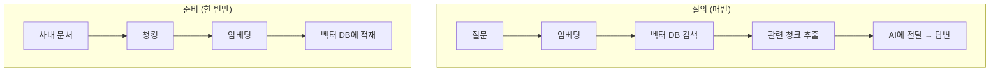
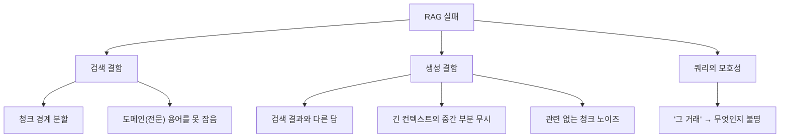

사내에서 사용하는 데이터는 한곳에 있지 않다. 어떤 건 Notion 페이지에, 어떤 건 지난 Slack 대화에, 또 어떤 건 공유 드라이브 폴더 내 깊숙한 곳에 있다. 그래서 *"그 데이터 어디에 있더라?"* 같은 질문이 매번 되돌아오고, 답을 아는 사람이 매번 같은 설명을 다시 한다.

그래서 AI가 사내 문서를 읽고 대신 답해 주는 시스템을 만들어 보기로 했다. 관련 기술을 공부하며 낯선 용어를 꽤 많이 만났는데, 가장 먼저 부딪힌 게 RAG였다. 그래서 개발 전에, *RAG가 대체 뭐고 우리한테 맞긴 한지*부터 조사해 본 기록을 남기려고 한다.

## RAG?

**검색 증강 생성**(Retrieval Augmented Generation; 답을 만들기 전에 관련 문서를 먼저 찾아오는 방식)은 이름 그대로다. AI가 곧장 대답하지 않고, 외부 지식 베이스에서 관련 정보를 먼저 검색한 뒤 그것을 근거로 답변을 생성한다.

쉽게 비유하면 이렇다. 자료 없이 머릿속 지식만으로 답하는 사람이 **그냥 AI**라면, RAG는 **질문을 받을 때마다 인터넷에서 관련된 자료를 찾아보고 답하는 사람**이다. 내가 만들려는 건 *그걸 쉽게 만드는* 일이다. 사내 문서를 작은 조각으로 나눠 "의미가 담긴 데이터"로 바꿔 전용 데이터베이스에 넣어 두고, 질문이 들어오면 의미가 가까운 조각을 찾아내 AI에게 건네준다.

동작은 두 단계로 나뉜다. 문서를 넣어 두는 과정은 한 번만, 질문에 답하는 질의 과정은 매번 반복한다.



여기서 세 용어가 한꺼번에 나온다. **청킹**(chunking; 긴 글을 검색용 조각으로 자르기)은 문서를 일정 길이로 잘라 두는 과정이고, **임베딩**(embedding; 글을 의미가 담긴 데이터로 바꾸기)은 그 조각을 숫자인 벡터로 변환하는 일이다. 그 벡터를 담아 두는 곳이 **벡터 DB**(vector DB; 의미가 담긴 데이터 전용 데이터베이스)다.

RAG라는 용어는 2020년 한 논문(Lewis et al., NeurIPS)에서 처음 정의되었다. 여러 도메인의 QA 벤치마크 3개에서 당시 최고 성능(SOTA)을 달성했고, 단순 AI보다 더 구체적이고 사실에 기반한 답을 낸다는 걸 보였다. 재미있는 건 저자 Patrick Lewis 본인이 나중에 한 인터뷰에서 "*이렇게 널리 쓰일 줄 알았다면 이름에 더 신경 썼을 것*"이라고 했다는 점이다. (지금은 세 글자 약어가 업계 표준어가 됐으니 후회할 만도 하다.)

RAG가 거의 모든 AI의 기본 패턴이 된 이유는 뚜렷하다. AI를 재학습하지 않고도 새 지식을 바로 반영할 수 있고, 무엇보다 **모델이 답의 출처를 인용할 수 있게 된다.** 사용자가 근거가 되는 문서를 직접 확인할 수 있다는 뜻이다. NVIDIA는 이를 두고 "*거의 모든 AI를 거의 모든 외부 자료에 연결해 주는 범용 레시피*"라고 표현했다. 여기에 **환각**(hallucination; AI가 그럴듯하게 답변을 지어내는 현상)까지 줄여 준다. 다만 여기서 중요한 단어는 '줄인다'지 **'없앤다'가 아니다.**

## RAG도 자주 틀린다

조사해보면서 가장 인상 깊었던 건, RAG를 붙여도 <u>환각이 완전히 사라지진 않는다는 사실</u>이었다. Stanford 연구에서는 전문 법률 관련 AI조차 **17\~33%** 정도는 틀린 답을 냈다. RAG는 만능 해결책이 아니라 환각 확률을 낮추는 장치에 가깝다.

학술 리뷰(MDPI 2025)와 업계에서 나온 분석이 정리한 실패 케이스는 크게 세 부류였다.



**검색 단계**에서는 정답이 하필 청크의 경계에 걸쳐 두 조각으로 갈라지면 어느 쪽도 온전히 못 찾는다. 도메인 특수 용어를 일반 임베딩이 못 잡기도 한다.

**생성 단계**에서는 검색은 잘해 놓고 엉뚱한 답을 내거나(**정합성 문제**), 긴 컨텍스트의 중간 부분을 AI가 통째로 무시하거나(**lost in the middle**), 관련 없는 청크가 섞여 헷갈리는 일이 생긴다. 마지막으로 "그 거래"처럼 지시어가 모호한 질문은 애초에 무엇을 찾아야 할지 정할 수 없다. 원본 문서 자체에 오류가 있으면 RAG도 그대로 틀린다는 건 덤으로 생기는 문제다.

## 직접 구축하려면 정해야 하는 네 가지

RAG를 직접 만들려면 크게 네 가지를 정해야 한다. **임베딩 모델, 벡터 DB, 프레임워크, 생성 전용 AI**다.

첫째, **임베딩 모델**이다. 2026년의 임베딩 모델 시장을 정리하면 이렇게 된다.

| 순위 | 모델                            | 고른 이유                   |
| -- | ----------------------------- | ----------------------- |
| 1  | Cohere embed-v4               | 한국어 지원, 128K의 컨텍스트, 안정성 |
| 2  | OpenAI text-embedding-3-small | 가장 보편적, 안전, 저비용         |
| 3  | Google text-embedding-005     | 최저가 (Google Cloud 사용 시) |

여기서 한 가지 문제가 있다. **<u>Anthropic은 임베딩 모델을 제공하지 않는다.</u>** Claude를 생성용 AI로 쓰더라도 임베딩은 별도 제공자가 필요하다. (Anthropic 문서도 Voyage 계열의 모델을 권한다) 우리 사내 데이터가 한국어라는 점 때문에, 한국어를 얼마나 잘 잡는지가 사실상 1순위 기준이었다.

둘째, **벡터 DB**이다. 결론부터 말하면 규모가 웬만큼 크지 않는 한 선택이 크게 중요하지 않았다.

```text
1M 벡터 이하   : 어떤 DB든 95% 이상의 정확도, 선택 무관
10M 벡터 이하  : pgvector로 충분 (PostgreSQL 있으면 가장 저렴)
50M 벡터 이하  : 관리형 서비스가 자체 호스팅보다 저렴
100M 벡터 이상 : Pinecone/Weaviate가 운영 부담에서 유리
```

셋째, **프레임워크**는 직접 짜야할지 기성 도구를 사용할지의 문제인데, 모델과 DB를 정한 뒤에 붙여도 늦지 않다고 보았다. 넷째, **생성 전용 AI**는 회사가 이미 Claude Team 플랜을 쓰고 있어서 Claude Sonnet 4.6이나 Opus 4.7 모델을 그대로 쓰는 게 자연스러웠다.

## 비용은 가격표 그대로 나오지 않았다

비용을 가늠하려고 예시 조건을 세워 시뮬레이션을 돌려보았다.

```yaml
문서_규모: 약 1만 페이지 (~1,000만 토큰)
청크_크기: 500 토큰   # [!code highlight]
임베딩_모델: OpenAI text-embedding-3-small
생성_모델: Claude Sonnet 4.6
일일_질의: 100건
```

해당 청크 크기 기준이면 전체가 **약 2만 청크**로 잘린다. 같은 조건에서 **CAG**(Cache-Augmented Generation; 문서를 미리 프롬프트 캐시에 추가하는 방식)로 계산하면 **약 567달러/월 수준**(캐시 갱신 하루에 24회 가정)이었다. 흥미롭게도 RAG의 *단순* 비용은 오히려 이보다 낮게 나올 수 있었다. 문제는 가격표에 적히지 않은 부분이다.

업계의 사례를 종합한 분석에 따르면, 가격 페이지의 추정치와 실제 청구액이 **2.5\~4배**까지 벌어진다. 청크 수, 검색 top-k, 호출 패턴에 따라 변동이 심하기 때문이다. 여기에 청킹 전략, 평가 파이프라인, 모니터링, 재인덱싱 같은 운영 공수가 추가된다. 임베딩 모델을 한 번 바꾸면 전체 문서를 다시 임베딩해야 하는 재처리 비용도 있다. 참고로 OpenAI 3-large로 100만 문서를 임베딩하면 **벡터 데이터만 12GB**(인덱스는 별도다)다.

## 결론

조사의 결론은 의외로 담백했다. 우리 규모에선 **벡터 DB는 pgvector면 충분했다.** 사내 문서가 아무리 늘어도 수백만 청크 안쪽일 텐데, 그 구간에선 어떤 DB를 써도 정확도 차이가 거의 없고, 이미 쓰고 있는 PostgreSQL에 확장만 추가하면 되기 때문에 가장 저렴하다. pgvector로 구축하면 대략 이런 모양이 된다.

```sql
-- pgvector 확장 기능을 켜고, 청크마다 임베딩 벡터를 한 칸에 저장한다
CREATE EXTENSION IF NOT EXISTS vector;

CREATE TABLE kb_chunks (
  id         bigserial PRIMARY KEY,
  doc_id     text,
  chunk_text text,
  embedding  vector(1024)          -- 임베딩 모델이 출력하는 차원의 수
);

-- 질문 벡터와 '의미가 가까운' 청크 5개를 거리순으로 꺼낸다
SELECT chunk_text
FROM kb_chunks
ORDER BY embedding <=> :query_embedding   -- [!code highlight]
LIMIT 5;
```

`<=>`로 벡터 거리를 재서 가까운 순으로 뽑는 게 사실상 "도서관에서 **비슷한 책 찾기**"의 전부다.

남은 고민은 **임베딩 모델**이다. 시장을 정리한 바로는 한국어를 지원하는 Cohere embed-v4가 1순위였다. 그런데 여기엔 걸리는 게 있다. 클라우드 임베딩 API를 쓴다는 건 *사내 문서를 통째로 외부에 보낸다*는 뜻이다. 한국어 사내 문서라는 조건과 데이터 통제를 함께 놓고 보면, 로컬에서 도는 한국어 임베딩 모델도 진지하게 저울에 올려야 했다.

200개 기업의 배포 경험을 정리한 자료는 한 문장으로 못을 박았다. **RAG 자체 구축은 "필요할 때 꺼내 쓰는 패턴"이지 "기본 선택지"가 아니다.** 실제로 HR이나 규정처럼 잘 안 바뀌는 정적 문서는 앞서 말한 **CAG가 더 단순하고 저렴**하다. Claude의 긴 컨텍스트 윈도우에 문서를 그냥 얹는 것만으로 풀리는 질문도 많다.

## 남은 것

여기까지는 리서치다. RAG가 뭔지, 어디서 틀리는지, 우리한테 맞는 조합이 뭔지 그림을 그린 셈이다. 다음은 이 그림을 보고 실제로 갈 길을 고르는 일이다. 벡터 DB는 pgvector로 마음이 기울었지만, 임베딩 모델은 클라우드와 로컬 한국어 모델을 직접 붙여 보고 정해야 한다고 생각했다. 🌱
