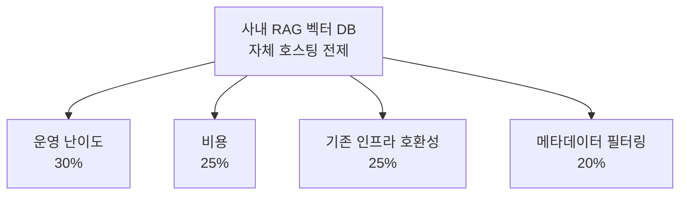
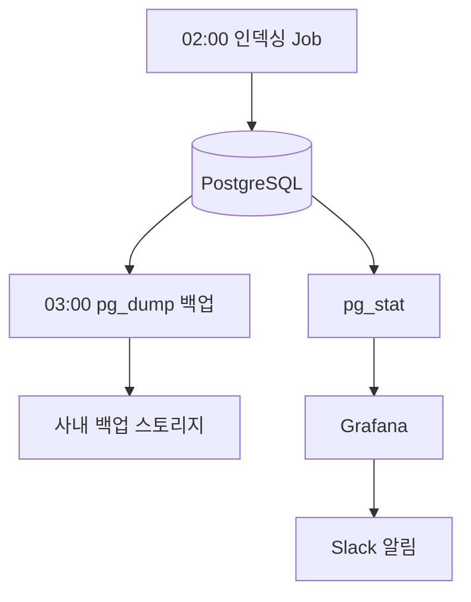

사내 문서를 AI가 대신 찾아 주게 만들자는 계획을 세우고 리서치를 마치고 나니, 남은 결정 사항이 딱 두 개 남았다. 무엇으로 **문장을 숫자로 바꿀 것**인가, 그리고 **그 숫자를 어디에 저장할 것인가**였다.

전자가 **임베딩**(embedding; 문장을 뜻이 담긴 숫자 벡터로 바꾸는 것) 모델이고, 후자가 **벡터 DB**(vector DB; 그 벡터를 저장하고 비슷한 것끼리 빠르게 찾아 주는 저장소)다. 둘 다 한 번 정하면 갈아타는 게 번거로워서, 고르기 전에 기준부터 세우기로 했다.

## 점수를 토대로 골랐다

후보를 늘어놓고 감으로 고르게 되면 나중에 "왜 이걸 골랐냐"에 답을 못하게 된다. 그래서 임베딩 모델을 채점할 기준을 **필수 요건**과 **권장 요건**으로 분류해 적었다.

필수 요건은 두 가지였다. 하나, 데이터를 사내에 보관할 수 있을 것. 인사/재무 문서를 다루니 데이터를 외부로 흘려보내면 안 된다. 두번째는, 한국어 검색이 정확할 것. 사내 문서가 거의 다 한국어라, 영어 위주 모델은 아무리 유명해도 뒤로 밀린다.

애초에 평가에서 뺀 항목도 적어 뒀다. API 안정성이나 SLA는 로컬 모델을 쓸 거라 따질 이유가 없었고, 토큰당 가격도 무료 모델끼리는 비교가 안 된다.

## 임베딩 모델 후보 5종

위 기준으로 후보 5종을 세웠다. 한국어 검색 성능은 **KURE 한국어 임베딩 리더보드**의 Retrieval(검색) 점수로 줄을 세웠다.

| 모델                                           | 방식  | KURE Retrieval | 사내 데이터 보관 |
| -------------------------------------------- | --- | -------------- | --------- |
| `dragonkue/snowflake-arctic-embed-l-v2.0-ko` | 로컬  | **79.44**      | 가능        |
| KURE-v1                                      | 로컬  | 77.24          | 가능        |
| BAAI/bge-m3                                  | 로컬  | 75.32          | 가능        |
| OpenAI text-embedding-3-large                | API | 리더보드 없음        | 불가        |
| Solar 계열                                     | API | 리더보드 없음        | 불가        |

표를 보면 결론이 거의 보인다. API 모델 두 종은 데이터를 외부로 보내야 해서 필수 요건 첫 번째(사내 내부 보관)에서 탈락했다. KURE 리더보드에 아예 올라 있지도 않아 한국어 검색 정확도를 직접 견줄 수도 없었다. 남은 로컬 모델 셋 중에서는 `dragonkue/snowflake-arctic-embed-l-v2.0-ko`(줄여서 arctic-embed-ko)가 79.44로 가장 높았다.

채택 근거는 네 줄로 정리됐다.

- **한국어 검색 성능 1순위.** 79.44로 한국어 특화 오픈소스 모델 중 최상위다. bge-m3는 8192 토큰까지 긴 글을 통째로 넣을 수 있다는 강점이 있었지만, 한국어 검색 점수에서 4점 넘게 뒤쳐졌다.

- **로컬 추론 가능.** 내 노트북에서 `sentence-transformers`로 돌려 보고, 실제로는 사내 임베딩 서버 1대로 옮긴다. 인사/재무 같은 민감 문서를 외부 API로 전송하지 않으니 사내 보관 요건과 맞아떨어진다.

- **운영 비용이 사실상 0.** Apache 2.0 라이선스라 무료로 추론한다. 토큰당 과금이 없다. 참고로 OpenAI text-embedding-3-large는 1M 토큰당 약 0.13달러, small은 0.02달러인데, 로컬 모델은 이 부분을 채울 필요가 없다.

- **차원과 컨텍스트가 청킹 기준에 맞았다.** 1024차원에 1300토큰까지 입력 받는다. 정해 둔 청킹 기준(500자, 오버랩 50자)에 무리 없이 들어가고, 뒤에 붙일 pgvector 인덱스의 운영 부담도 작다.

arctic-embed 시리즈는 MTEB Retrieval 리더보드에서 **모델 크기 대비 성능이 좋은 모델**이라, 작은 서버로도 최상위권 검색 품질을 낼 수 있다는 점이 컸다. 대신 못 박아 두기 애매한 부분은 재평가 시점으로 미뤘다. 6개월이 지나거나, 새 한국어 특화 오픈소스 모델이 나오거나, 한국어 검색 정확도에 대한 사용자 불만이 쌓이면 다시 보려고 했다.

## 어디에 저장하나

벡터 DB는 전제 하나를 먼저 깔고 시작했다. **자체 호스팅**이다. 관리형 SaaS가 편하다는 건 알지만, 임베딩에서 이미 "데이터는 사내에 둔다"고 정한 이상 벡터 데이터도 밖으로 나가면 앞뒤가 안 맞았다.

그 위에서 후보를 채점할 기준 네 개와 가중치를 정했다.



후보는 셋이었다. 개념 학습과 초기 PoC에 좋은 **ChromaDB**, 표준 PostgreSQL 확장 기능인 **자체 호스팅 pgvector**(pgvector; PostgreSQL에 벡터 검색을 더해 주는 확장 기능), 그리고 Rust로 짜여져 있어, 자체 호스팅 DB 중 성능이 가장 좋은 **Qdrant**(p50 기준 약 4ms)였다. ChromaDB는 멀티 유저에 약해 사내 공용으로는 부족하다고 생각했고, Qdrant는 지금 규모에서는 과했다.

남은 pgvector가 왜 SaaS를 제치고 1위였는지가 사실 이 글의 중요한 부분이다.

- **비용 한계가 사실상 0.** 사내 서버 1대로 충분하다. 사내 문서 100건, 청크 약 1,600개 기준으로 시뮬레이션해 보니 인프라 비용은 후보 모두 0원으로 같았고, 실질적인 비용은 운영 인력의 시간뿐이었다.

- **이미 쓰던 PostgreSQL 재사용.** PostgreSQL은 사내 표준 스택이라 백업이나 마이그레이션, 운영 경험을 그대로 쓴다. 새 시스템을 배울 학습 비용이 거의 없다.

- **메타데이터를 SQL로 같이 걸 수 있다.** 부서/권한/날짜 필터를 벡터 검색과 한 쿼리에서 처리한다. 사내 SSO/권한 시스템과 바로 이어지게 되기 때문에 별도 인증 레이어도 필요 없다.

- **나중에 다른 시스템과 붙이기 쉽다.** 인사 담당 DB나 다른 PoC 데이터와 같은 데이터베이스 안에서 연계할 수 있다.

물론 공짜는 아니다. HNSW 인덱스 튜닝을 직접 배워야 하고, 백업과 모니터링 절차도 손수 구축해야 하며, 장애가 나면 사내 책임으로 돌아간다. 이 값을 치르고도 호환성/메타데이터/비용의 강점이 압도적이라 종합 1위를 줬다.

## 테이블과 인덱스

스키마 같은 경우에는 참고한 도서의 패턴을 거의 그대로 가져왔다. 이 테이블 하나가 문서 조각(청크)과 그 벡터, 그리고 필터에 쓸 메타데이터를 한자리에 담는다.

```sql
CREATE TABLE documents (
  id            bigserial PRIMARY KEY,
  storage_ref   text NOT NULL,
  filename      text NOT NULL,
  document_type text,
  department    text,
  content       text NOT NULL,
  chunk_index   int NOT NULL,
  embedding     vector(1024),   -- [!code highlight]
  created_at    timestamptz DEFAULT now(),
  UNIQUE (storage_ref, chunk_index)
);
```

`vector(1024)`가 임베딩과 벡터 DB가 만나는 지점이다. 앞에서 고른 arctic-embed-ko가 1024차원을 출력하니 컬럼도 1024로 맞춘다. 여기가 어긋나면 저장 자체가 안 된다.

그 위에 검색용 인덱스를 얹는다. **HNSW**(그래프를 여러 층으로 쌓아 비슷한 벡터를 빠르게 찾는 인덱스)를 골랐다.

```sql
CREATE INDEX CONCURRENTLY documents_embedding_hnsw_idx
ON documents
USING hnsw (embedding vector_cosine_ops)
WITH (m = 16, ef_construction = 128);
```

1만 청크 안팎 규모에서는 HNSW가 다른 방식(IVFFlat)보다 압도적으로 유리했다. IVFFlat은 시간당 10만 건 넘는 쓰기 부하가 있을 때나 고려할 인덱스라, 사내 규모와는 거리가 멀었다. `CONCURRENTLY`를 붙인 건 운영 중에 인덱스를 만들 때 쓰기를 막지 않기 위해서다.

검색은 함수 하나로 감쌌다. 이 함수가 결국 하는 일은, 질문 벡터와 가장 가까운 문서 청크를 부서의 필터까지 걸어서 뽑아 오는 것이다.

```sql
CREATE OR REPLACE FUNCTION match_documents(
  query_embedding vector(1024),
  match_count int DEFAULT 5,
  filter_department text DEFAULT NULL
) RETURNS TABLE (
  storage_ref text, filename text, content text,
  chunk_index int, similarity float
)
LANGUAGE sql STABLE AS $$
  SELECT storage_ref, filename, content, chunk_index,
         1 - (embedding <=> query_embedding) AS similarity   -- [!code highlight]
  FROM documents
  WHERE (filter_department IS NULL OR department = filter_department)
  ORDER BY embedding <=> query_embedding
  LIMIT match_count;
$$;
```

강조한 부분이 유사도 계산하는 절차다. `<=>`는 코사인 거리라, `1 -` 을 붙여 거리를 닮은 정도로 뒤집는다. 바로 아래 `WHERE`의 `filter_department`가 앞서 정한 기준 네 번째(메타데이터 필터링)를 그대로 실현한다. 벡터로 비슷한 걸 찾으면서, 볼 권한이 있는 부서의 문서만 걸러 낸다.

## 운영은 Cron Job으로 돌린다

DB를 결정했다고 끝이 아니라, 매일 도는 스케줄링이 있어야 살아 있는 시스템이 된다. 인덱싱과 백업, 모니터링을 시간대를 갈라 배치하려고 했다.



새벽 2시에 바뀐 문서를 인덱싱하고, 1시간 뒤 새벽 3시에 백업을 뜬다. 인덱싱 Job은 사용자의 실시간 검색(쿼리 임베딩)과 분리해서, 배치가 돌아도 검색이 느려지지 않게 했다. 백업은 하루 한 번 덤프를 떠서 30일만 남긴다.

```bash
# crontab
0 3 * * * pg_dump -U postgres knowledge | gzip > /backup/knowledge_$(date +%Y%m%d).sql.gz
0 4 * * 0 find /backup -name "knowledge_*.sql.gz" -mtime +30 -delete  # [!code highlight]
```

위 강조한 부분이 **오래된 백업을 알아서 지우는 부분**이다. 백업만 쌓고 안 지우면 디스크가 언젠가 차게 된다. 이 밖에 주 1회 `VACUUM ANALYZE`로 통계를 갱신하고, 인덱스가 비대해지면 분기에 한 번 `REINDEX`로 다시 만든다. 지표는 `pg_stat`이 Grafana로 들어가고, 임계치를 넘으면 공지 채널로 알림이 온다.

## 결론

돌아보면 이번 결정은 화려한 벤치마크 싸움이 아니라, 기준을 먼저 두고 그것에 맞춰 후보를 지워 나가는 일이었다. "데이터는 사내 내부에 둔다"는 원칙 하나가 임베딩 모델과 벡터 DB를 거의 자동으로 정해 줬다. 고르고 나니 이제는 정말로 구축이 남았다. 😎
