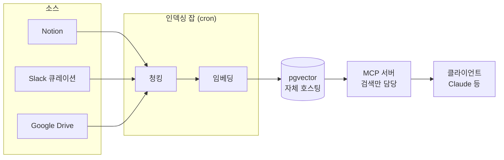
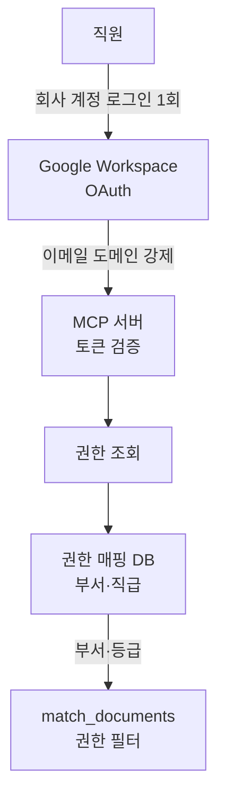

사내 문서를 AI가 대신 찾아 읽게 만드는 일은, 모델을 고르고 벡터 DB를 정하는 데서 끝나지 않는다. 임베딩 모델과 벡터 DB를 추려 놓고 나니 정작 막막해진 건 그다음이었다. 이 조각들을 어디에 올리고, 누가 운영하고, 권한은 어떻게 거를까. 첫 설계서를 쓰면서 세운 그림은 한 문장으로 줄어든다. **전부 우리가 든다.** 외부 서비스에 문서를 넘기지 않고, 서버부터 임베딩 파이프라인과 권한까지 사내 자원으로 짊어지는 쪽이었다.

## 전부 우리가 드는 그림



매일 새벽 도는 인덱싱 잡이 문서 소스에서 바뀐 것만 긁어, 잘게 자르고 숫자로 바꿔 **pgvector**(PostgreSQL 확장; 벡터를 저장하고 유사도로 검색)에 넣는다. 검색은 MCP 서버가 맡고, 답변 문장을 짓는 일은 각자 쓰는 클라이언트가 한다. 벡터 DB는 관리형 서비스가 아니라 사내 서버에 직접 세웠다. CPU 4코어, RAM 8GB, SSD 50GB짜리 서버에 Docker로 PostgreSQL 16과 pgvector를 올리는 정도라, 새로 나가는 외부 비용은 없었다.

**임베딩**(embedding; 문장을 숫자 벡터로 바꾸기)은 로컬에서 돌렸다. 한국어 성능이 좋은 오픈소스 모델을 골라 사내 서버에서 추론하게 했다.

```python
from sentence_transformers import SentenceTransformer

model = SentenceTransformer("dragonkue/snowflake-arctic-embed-l-v2.0-ko")  # [!code highlight]
embeddings = model.encode([d.page_content for d in docs])
```

강조한 줄이 이 코드의 전부다. 문장 뭉치를 1024개짜리 숫자 배열로 바꿔 준다. 이름에 Snowflake가 붙어 있어도 완전 오픈소스라 그 회사 환경과는 무관하고, 사내 서버에서 자유롭게 돌릴 수 있다. 외부 API로 문장을 보내지 않으니 원본이 밖으로 새지 않는다는 점이 컸다.

자르는 규칙은 단순하게 뒀다. 참고한 책의 코드를 그대로 써서, 500자로 자르되 다음 조각이 앞 조각 끝에서 50자를 겹쳐 시작하게 했다. 경계에 걸친 문장이 둘로 쪼개져 검색에서 통째로 놓이는 일을 막으려는 것이다. 그렇게 만든 청크는 부서와 접근 등급 컬럼을 처음부터 박아 둔 `documents` 테이블에 쌓이고, 그 위에 HNSW 색인을 얹어 빠르게 근사 검색하게 했다. **이 부서·등급 컬럼이 뒤에 나올 권한 필터의 토대가 된다.**

## 검색은 도구 하나로

답변 LLM은 사용자가 각자 고르되, 검색과 인용, 권한 통제는 **MCP**(Model Context Protocol; AI가 외부 도구를 부르는 규약) 서버 한 곳이 책임진다. FastMCP로 HTTP 엔드포인트를 세우고, 도구를 세 개만 노출했다. 문서를 검색하는 `search_knowledge`, 목록을 보는 `list_documents`, 한 건을 꺼내는 `get_document`.

가장 신경 쓴 건 검색 도구의 설명글이었다. 도구를 어떻게 쓰라는 규칙을 코드가 아니라 도구 description에 문장으로 박았다.

```text
search_knowledge: 사내 문서를 검색해 관련 청크와 출처를 반환합니다.

엄격한 사용 규칙:
1. 반환된 content만을 근거로 답변하세요. 추측 금지.
2. 모든 사실 진술에 [filename] 형식으로 출처를 표기하세요.
3. 검색 결과가 비어 있으면 "사내 문서에서 관련 내용을 찾지 못했습니다"라고
   답하고, 일반 지식으로 답변을 보충하지 마세요.
4. 출처가 6개월 이상 지났으면 답변 끝에 자료 시점을 덧붙이세요.
5. 부서 권한이 제한된 경우, 그 부서 밖 정보를 추측해 답하지 마세요.
```

결국 이 설명글이 환각을 막는 장치다. 클라이언트가 어떤 모델이든, 도구를 부르는 순간 이 규칙을 함께 읽는다. "찾은 것만 근거로 대고, 못 찾으면 못 찾았다고 말하라"는 태도를 글로 강제한 셈이다.

권한은 검색 함수 안에 넣었다. 등급과 부서를 인자로 받아, 유사도로 줄 세우기 *전에* 걸러낸다.

```sql
CREATE OR REPLACE FUNCTION match_documents(
  query_embedding vector(1024),
  match_count int DEFAULT 5,
  user_dept text DEFAULT NULL,
  user_level text DEFAULT 'employee'
) RETURNS TABLE (storage_ref text, content text, similarity float)
LANGUAGE sql STABLE AS $$
  SELECT d.storage_ref, d.content,
         1 - (d.embedding <=> query_embedding) AS similarity
  FROM documents d, level_hierarchy l
  WHERE
    (CASE d.access_level
       WHEN 'public'   THEN 0
       WHEN 'employee' THEN 1
       WHEN 'manager'  THEN 2
       WHEN 'director'  THEN 3
     END) <= l.user_lvl_val                                        -- [!code highlight]
    AND (d.visible_departments IS NULL OR user_dept = ANY(d.visible_departments))
  ORDER BY d.embedding <=> query_embedding
  LIMIT match_count;
$$;
```

강조한 줄이 판단의 전부다. 사용자 등급보다 높은 등급의 문서는 애초에 검색 후보에서 빠지고, 부서 한정 문서는 본인 부서일 때만 걸린다. 권한을 답변 단계에서 사후에 가리는 게 아니라, DB 검색에서 처음부터 후보를 좁힌다. 권한 밖 문서는 AI 눈에 아예 띄지 않는 것이다.

DB 계정도 역할별로 갈랐다. 검색만 하는 MCP 서버에는 쓰기 권한을 주지 않았다.

```sql
-- 인덱싱 잡: 읽고 쓴다
GRANT SELECT, INSERT, UPDATE, DELETE ON documents TO rag_indexer;

-- MCP 서버: 읽기와 검색 함수 실행만
GRANT SELECT ON documents TO rag_reader;                 -- [!code highlight]
GRANT EXECUTE ON FUNCTION match_documents TO rag_reader;
```

읽기 계정으로만 붙는 검색 서버는 데이터를 건드릴 여지가 구조적으로 없다. "고치지 마세요"라고 부탁하는 대신, 권한 목록에서 빼 버려 못 하게 만든 것이다.

## 권한을 한 곳에 묶기

앞의 함수가 부서와 등급을 인자로 받는다면, 그 값은 어디서 올까. 로그인 한 번에서 온다.



직원이 회사 Google 계정으로 한 번 로그인하면, **OAuth**(비밀번호 없이 로그인 권한만 넘기는 인증)로 발급된 토큰을 MCP 서버가 검증한다. 이때 이메일 도메인이 회사 도메인인지 강제로 확인한다. 통과하면 사내 권한 매핑 DB에서 그 사람의 부서와 직급을 조회해 검색 필터로 넘긴다.

이 구조의 이점은 **권한이 한 곳(Google Workspace)에 묶인다**는 것이다. 클라이언트를 Claude에서 다른 도구로 바꾸거나 하나 더 붙여도, 전부 같은 토큰을 쓰고 같은 검증 로직을 거치니 MCP 서버 코드는 손댈 게 없다.

퇴직까지 이 흐름에 엮었다. 위협 목록에 '퇴직자 잔존'을 넣고, 퇴직 프로세스에 계정 비활성화 항목을 박아 뒀다. 회사 계정 하나만 끄면 지식베이스 접근도 함께 막힌다. 정식 OAuth 통합은 시간이 걸려서, 우선은 임시 토큰으로 가동하고 베타에서 OAuth로 갈아타는 순서로 잡았다.

## CAG와 RAG를 가르는 기준

문서를 전부 검색으로 찾을 필요는 없었다. 자주 바뀌지도 않고 크지도 않은 문서라면, 매번 검색하는 것보다 통째로 미리 넣어 두는 편이 낫다. 그래서 문서를 세 잣대로 갈랐다. 변경 빈도가 월 1회 이하이고, 크기가 작고, 같은 질문이 자주 들어오면 **CAG**(cache-augmented generation; 문서를 미리 넣어 두고 답하기) 후보로 뒀다. 자주 갱신되고 덩치가 큰 문서는 검색으로 찾는 RAG 쪽이다.

실제로는 자주 바뀌는 정책이나 매뉴얼은 RAG로 그때그때 검색하고, 거의 안 바뀌는 사내 규칙 문서 묶음은 CAG로 클라이언트의 시스템 프롬프트에 미리 주입했다. 하나의 답변 안에서 두 방식이 섞여 돌아가는 그림이다.

## pgai를 검토하고 미룬 이유

**pgai**(Timescale이 만든 Python 라이브러리; pgvector 위에서 임베딩을 자동 동기화)를 진지하게 봤다. 원본 텍스트가 바뀌면 워커가 몇 초마다 폴링해 임베딩을 알아서 다시 만들어 주는 편의가 매력적이었다. 인덱싱 잡을 직접 짜지 않아도 되니까.

그런데 도입하지 않기로 했다. 기록으로 남긴 판단은 이렇다.

> MVP에서는 pgai를 도입하지 않는다. 사내 규모(약 1,600청크)는 책의 수동 인덱싱 잡으로 충분하고, 책 코드를 100% 재사용하는 가치가 더 크다. 베이스라인이 안정된 뒤 문서 수가 1만 건을 돌파하거나 변경 빈도가 일 단위로 잦아지면 재검토한다.

편의가 값어치를 하려면 그만한 규모가 있어야 하는데, 지금 코퍼스는 그 선에 한참 못 미쳤다. cron으로 몇 분이면 짜는 수동 잡이 충분한 자리에 새 라이브러리 학습 비용을 얹을 이유가 없었다. 대신 *언제 다시 볼지*를 숫자로 못박아 두는 쪽을 골랐다. 1만 건, 또는 일 단위 변경. 그 선을 넘으면 그때 다시 꺼내 보면 된다.

## 끝을 정의하고 쪼갠 일

설계만큼 신경 쓴 게 일을 어떻게 쪼개느냐였다. 처음 계획은 큰 덩어리 작업 9개였는데, 한 임원이 "이대로면 기한 내 완료가 비현실적"이라고 짚었다. 맞는 지적이었다. "부서별 문서 수집"처럼 뭉뚱그린 작업은 언제 끝났다고 말할 수 있는지가 흐릿했다.

그래서 작업마다 **DoD**(Definition of Done; 무엇이 끝이면 끝인지)를 붙이고 산출물 단위로 잘게 나눴다. 쪼개는 기준은 다섯 질문이었다. 한 사람이 1주일 안에 끝낼 크기인가, DoD가 명확한가, 이 산출물이 다음 작업의 입력이 되는가, 주간 보고에 진행률을 한 줄로 쓸 수 있는가, 막혔을 때 어디서 막혔는지 짚을 수 있는가. 다섯 질문에 모두 "예"가 나오게 쪼개니 작업 9개가 24개 남짓으로 늘었다.

PoC 세 개의 DoD는 이렇게 잡았다.

- **임베딩 파이프라인** - 노션 페이지 100개를 청킹, 임베딩, 벡터 DB 적재까지 자동으로 도는 스크립트.
- **검색 인터페이스** - CLI에서 자연어로 물으면 관련 청크 top-5를 반환하고 정확도를 잰다.
- **챗봇** - Slack 봇이나 Claude 연동으로 출처 링크가 붙은 답변을 낸다.

앞 작업의 산출물이 다음 작업의 입력이 되게 사슬로 엮었다. 파이프라인이 돌아야 검색을 붙이고, 검색이 돌아야 챗봇을 얹는다. 품질 문턱도 숫자로 뒀다. 골든 데이터셋 50건에서 100건을 만들어, 검색이 관련 문서를 상위 5개 안에 얼마나 담는지(Recall@5)와 인용이 실제로 맞는지(Citation Validity)를 재기로 했다.

## 이 설계의 무게

다 쓰고 나서 계획서를 다시 읽으니, "전부 우리가 든다"는 그림의 무게가 그제야 보였다. 서버, 임베딩 파이프라인, 권한 미들웨어, 새벽 백업, 모니터링, 주간 점검까지 전부 사내 운영 몫이다. 외부 비용은 0이지만, 그 자리를 사람 손이 메운다.

자체 호스팅은 원본을 밖으로 내보내지 않는다는 점에서 우리 성격의 조직엔 맞는 선택이었다. 다만 그 대가로 운영 부담을 통째로 떠안는다는 사실을, 솔직히 이 첫 설계에선 "할 수 있는 걸 다 담자"는 욕심에 가려 가볍게 봤던 것 같다. 이 무게를 끝까지 지고 갈지는 실제로 굴려 보고 다시 판단할 몫으로 남겨 뒀다.

## 남은 것

계획서 한 장에 서버 사양부터 SQL 함수, 퇴직 프로세스까지 욱여넣고 나니, 설계라는 게 결국 *무엇을 우리가 지고 무엇을 남에게 맡길지*를 고르는 일이라는 생각이 들었다. 이번엔 거의 다 지는 쪽으로 골랐고, 그 선택이 옳았는지는 조금 더 지나 봐야 알 것 같다 🍀
