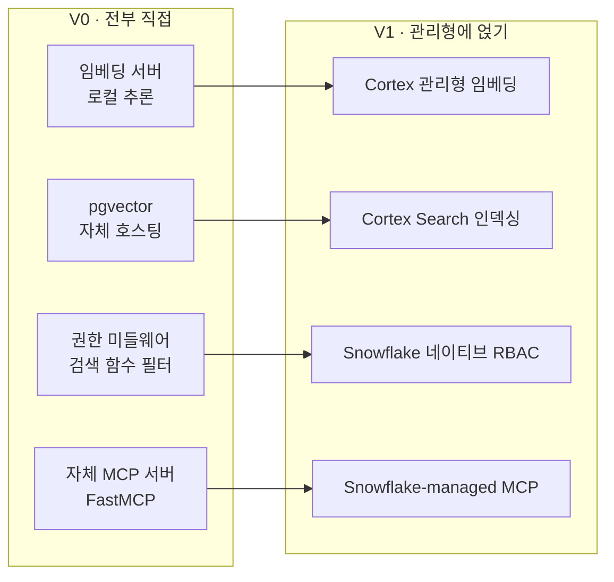
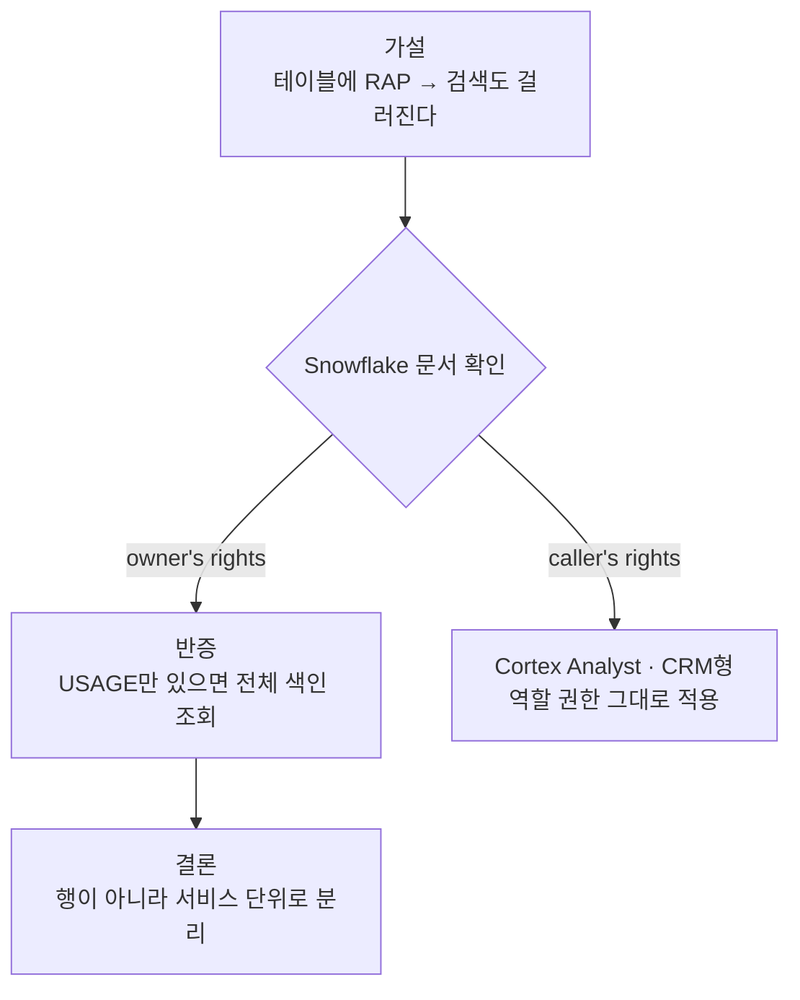

임베딩 모델과 벡터 DB를 고르고 나서, 이제 설계하고, 구현하는 일만 남았다고 생각했다. 이후엔 벡터 DB도, 임베딩 서버도, 권한 관련 미들웨어도 사내에서 직접 구축하고, 운영하는 쪽으로 하고자 했다.

그런데 그 설계를 접게 만든 건 어떤 논문도, 피드백도 아니었다. 그저 사내 데이터 웨어하우스를 담당하는 직원 분과 함께한 인수인계 자리에서 들은 한마디였다.

> "회사가 이미 연 단위로 계약해 둔 **Snowflake**라는 서비스가 있어요. 크레딧이 거의 안 쓰여서 놀고 있고, 심지어 거기에 임베딩 기능도 있는 것 같아요."

이 얘기를 듣고 나서 그동안의 설계가 수정될 필요가 있어 보였다. 임베딩 기능이 *있는 것 같다*는 말을 확인하기 위해 내 자리로 돌아갔다.

## 확인해 보니 이미 다 있었다

Snowflake는 우리 회사가 이미 연 단위로 계약해 둔 **데이터 웨어하우스**(data warehouse; 여러 소스의 데이터를 한 데 모아 **분석용으로 쌓아 두는** 저장소)였다. 계약한 크레딧 중 실제로 쓰고 있는 양은 얼마 안 돼서, 남은 여유가 넉넉했다.

그 안에 **Cortex Search**(임베딩/인덱싱/하이브리드 검색/리랭킹을 SQL만으로 대신 해 주는 Snowflake의 관리형 검색 서비스)가 있었다. 문서를 넣어 두면 임베딩 벡터를 알아서 만들고, 벡터의 인덱스를 만들고, 검색 과정과 리랭킹까지 붙여 준다.

더 컸던 건 데이터의 위치였다. 사내 데이터는 이미 다른 파이프라인을 통해 Snowflake로 적재되던 중이었다. 다른 비즈니스 데이터들을 **Airbyte**로 추출해 Snowflake에 Raw Data로 쌓고 정리하는 흐름이 이미 돌아가고 있었다. 내가 그리던 설계는 그 데이터를 다시 사내 서버의 pgvector로 퍼 나르는 그림이었는데, 데이터가 이미 있는 곳에서 검색까지 지원하면, 그 이사 과정이 통째로 사라지게 된다.

문서를 검색 가능하게 만드는 데 필요한 건 이게 전부다.

```sql
CREATE CORTEX SEARCH SERVICE kb_search
  ON chunk_text
  ATTRIBUTES access_level, source_category
  WAREHOUSE = rag_wh
  TARGET_LAG = '1 hour'
  EMBEDDING_MODEL = 'snowflake-arctic-embed-l-v2.0'   -- [!code highlight]
  AS (
    SELECT chunk_text, access_level, source_category
    FROM page_chunks
  );
```

임베딩 모델 이름 하나만 적으면, 문장을 벡터로 바꾸는 일을 **Snowflake가 관리형으로 맡는다.** `TARGET_LAG`은 **원본이 바뀌면 얼마나 빨리 인덱스가 따라잡을지를 정하는 값**이라, 새벽마다 도는 인덱싱 Job을 내가 짤 필요가 없이 이 값만 설정하면, 자동으로 돌아간다.

## 직접 하기로 했던 게 하나씩 지워졌다

관리형이 대신 한다는 것을 확인하고 나니, V0에서 내가 하기로 했던 것들이 하나씩 지워졌다.



임베딩 서버가 먼저 지워졌다. [[rag-2-embedding|한국어 성능으로 고른 로컬 모델]]을 사내 서버 내에서 추론하게 하려던 그림이, Cortex의 관리형 임베딩 모델로 넘어갔다. pgvector 운영도 같이 지워졌다. 벡터 값의 저장과 HNSW 튜닝, 백업을 손수 하는 대신 Cortex가 인덱스를 관리한다. 검색 함수 안에 고정하려면 부서/직급 필터는 **Snowflake의 역할 권한이 대신 강제**하고, FastMCP로 만들려면 서버는 Snowflake가 제공하는 **관리형 MCP**로 대체됐다.

## 권한 관리

관리형으로 넘어가며 가장 오래 붙들게 된 것은 **권한**이었다. 자체 호스팅에선 검색 함수 내부에 부서나 직급의 필터를 고정해 권한 밖의 문서를 아예 후보에서 빼는 방식으로 풀어낼 수 있었다. 그러나 관리형에선 그 필터를 내가 못 짜기 때문에, Snowflake가 주는 권한 장치에 기대야 했다.

첫 가설은 단순했다. Snowflake엔 **Row Access Policy**(테이블의 **행**을 역할별로 걸러 주는 정책; **RAP**)가 있으니, 청크가 쌓이는 테이블에 이걸 걸어두면 검색 결과도 역할별로 자동으로 걸러지지 않을까?

```sql
-- 가설: 이 정책이 검색 결과까지 걸러 줄 것이다
CREATE ROW ACCESS POLICY chunk_rap
  AS (lvl string) RETURNS boolean ->
    lvl = 'public'
    OR CURRENT_ROLE() IN ('RAG_MANAGER', 'RAG_DIRECTOR');   -- [!code highlight]

ALTER TABLE page_chunks
  ADD ROW ACCESS POLICY chunk_rap ON (access_level);
```

`public` 등급 행은 누구나, 그 위의 등급 행은 매니저나 디렉터 역할일 때만 읽게 한다. 테이블을 직접 조회하면 이 정책이 정확히 그렇게 동작한다.

문제는 검색이었다. Snowflake의 공식 문서("Query a Cortex Search Service")를 읽다 이 본문이 걸렸다.

> 서비스에 USAGE 권한이 있는 역할은, 테이블의 행을 읽을 권한이 없어도 **인덱싱된 모든 데이터를 검색 결과로 받는다.**

원인은 실행하는 모델이었다. Cortex Search는 **owner's rights**(객체를 만든 주인의 권한으로 도는 실행 방식)로 동작한다. 인덱스를 읽을 때 검색을 **부른 사람의 권한이 아니라 서비스를 만든 주인의 권한**으로 읽으니, 테이블에 건 Row Access Policy가 검색에는 통째로 무시된다.

그래서 결론이 뒤집혔다. 행 단위로 못 나눈다면, **서비스 단위로 나눠야** 한다. 등급마다 Cortex Search 서비스를 따로 만들고, 각 서비스에 USAGE 권한을 역할별로 주어야 한다.

```sql
-- 등급마다 서비스를 따로 만들고, 소스 쿼리에서 접근 범위를 가른다
CREATE CORTEX SEARCH SERVICE kb_search_employee
  ON chunk_text
  WAREHOUSE = rag_wh
  TARGET_LAG = '1 hour'
  EMBEDDING_MODEL = 'snowflake-arctic-embed-l-v2.0'
  AS (SELECT chunk_text FROM page_chunks WHERE access_level = 'employee');

GRANT USAGE ON CORTEX SEARCH SERVICE kb_search_employee TO ROLE rag_employee;   -- [!code highlight]
GRANT USAGE ON CORTEX SEARCH SERVICE kb_search_manager  TO ROLE rag_manager;
```

어떤 역할이 어떤 서비스에 USAGE를 갖느냐가 곧 그 사람이 검색할 수 있는 범위다. 결론적으로 권한을 행에 거는 게 아니라 **서비스**에 거는 것이다.

대조되는 경로도 확인해 뒀다. 구조화된 CRM 데이터에 자연어로 답하는 **Cortex Analyst**(질문을 SQL로 바꿔 정형 데이터에 답하는 Snowflake 기능)는 반대로 **caller's rights**(부르는 사람의 권한으로 도는 실행 방식)라, 생성된 SQL이 **호출자 역할로 실행**된다. 그쪽은 역할 권한과 행의 정책이 그대로 적용되기에, 문서형만 서비스 단위로 나누면 되었다.



## 얻은 것, 포기한 것

관리형에 기댄다는 건 공짜가 아니었다. 무엇을 내려놨는지부터 솔직히 적어 둔다.

가장 아쉬운 건 [[rag-2-embedding|한국어 성능으로 고른 로컬 모델]]이었다. arctic-embed의 한국어 파인튜닝 버전을 KURE 리더보드 점수까지 따져 골랐는데, 관리형에선 Cortex가 제공하는 임베딩 모델을 무조건 사용해야 한다. 같은 arctic-embed 계열이라 한국어를 아예 못 하는 건 아니지만, ko 파인튜닝 버전만큼의 검색 정확도는 일부 내려놓는 셈이다. 청킹의 규칙이나 인덱스의 세부 튜닝을 만지려던 계획도 함께 없어졌다.

> snowflake-arctic-embed-l-v2.0 관리형 채택. **한국어 특화 모델 이점 일부 포기**, 운영 단순화 취득

대신 얻은 게 컸다. 서버나 임베딩 파이프라인, 벡터 DB의 운영, 새벽 시간의 백업, 모니터링 과정을 손수 책임질 필요가 없어졌다. 무엇보다 이미 계약해 둔 크레딧 안에서 돌기 때문에, **추가 인프라 비용도 0**이었다.

## 결론

돌아보면 조금 허탈하기도 했다. 서버 사양까지 정해 가며 다 지어 놓은 설계를, 이미 갖고 있던 서비스를 뒤늦게 발견하고 접었기 때문이다.

그런데 아깝지만은 않았다. 자체적인 호스팅을 끝까지 그려 봤기 때문에, 관리형이 정확히 무엇을 대신 해주는지 한 줄씩 짚을 수 있었다. 임베딩 모델이 없어졌다는 걸 실감하려면 그 서버를 만들려는 설계를 먼저 해 봐야 했다. 권한을 서비스 단위로 나눠야 하는 이유도, 검색 함수에 필터를 직접 고정해 봤기에 owner's rights 한 줄의 무게가 와닿게 되었던 것 같다.

이제 남은 건 놀고 있던 Snowflake에 Notion이나 Slack 데이터를 채우고, 서비스를 등급별로 나누고, 역할들을 이어 붙이는 일이다. 다 지어 놓고 나서 더 나은 걸 발견하는 게 처음엔 손해 같았는데, 결국 판단할 눈이 생긴 것이라고 생각하면 그리 나쁜 선택지는 아니었던 것 같다 🍀
