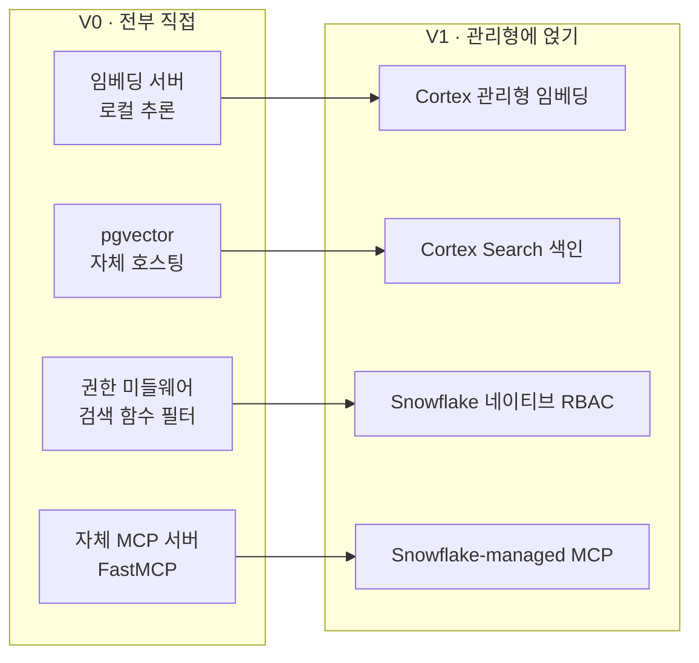
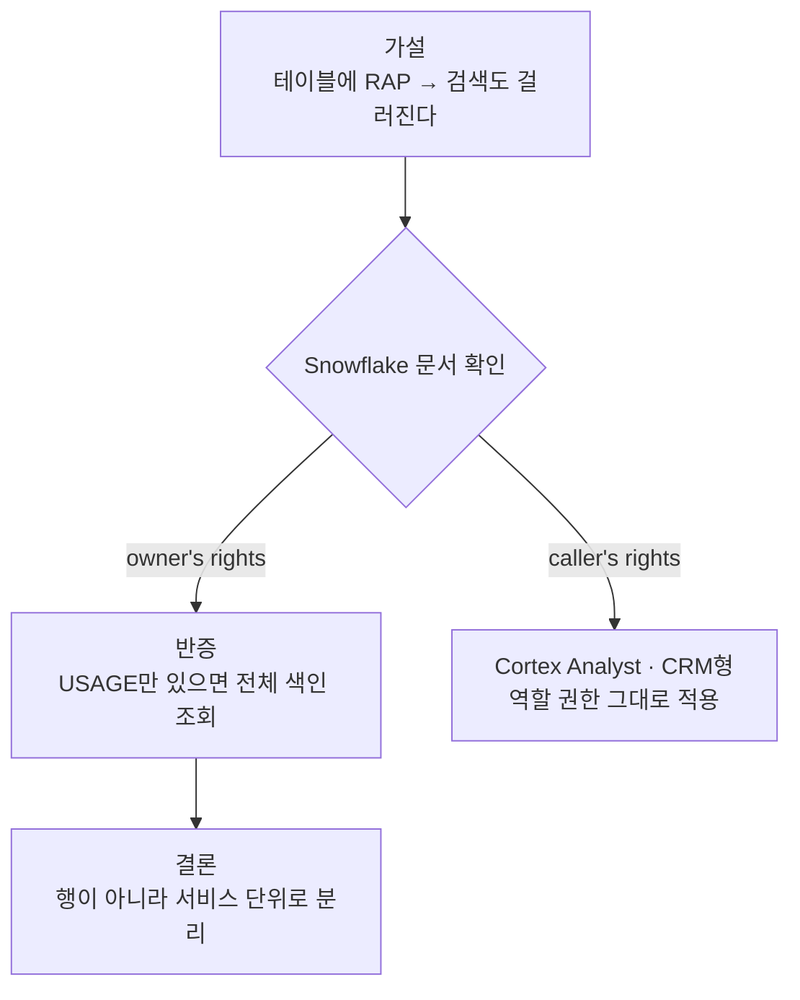

임베딩 모델과 벡터 DB를 고르고 나서, 이제 설계하고, 구현하는 일만 남았다고 생각했다. 서버 사양, SQL 함수, 권한까지 계획서 한 장에 다 담고 나니 뿌듯했다. 이후엔 벡터 DB도, 임베딩 서버도, 권한 미들웨어도 사내에서 직접 구축하고, 직접 운영하는 쪽으로 하고자 했다.

그런데 그 설계를 접게 만든 건 새 논문도, 피드백도 아니었다. 사내 데이터 웨어하우스를 담당하는 자와 함께한 인수인계 자리에서 들은 한마디였다.

> "회사가 이미 연 단위로 계약해 둔 Snowflake가 있어요. 크레딧이 거의 안 쓰이고 놀고 있고, 거기에 임베딩 기능도 있는 것 같던데요."

이 얘기를 듣고 나서 지어 놓은 설계가 수정될 필요가 있어보였다. 임베딩 기능이 있는 것 같다(?)는 말을 확인하기 위해 내 자리로 돌아갔다.

## 확인해 보니 다 있었다

Snowflake는 우리가 이미 연 단위로 계약해 둔 **데이터 웨어하우스**(data warehouse; 여러 소스의 데이터를 한데 모아 분석용으로 쌓아 두는 저장소)였다. 계약한 크레딧 중 실제로 쓰는 양은 얼마 안 돼서, 남은 여유가 넉넉했다. 연 수천 불 규모 계약이 대부분 놀고 있던 셈이다.

그 안에 **Cortex Search**(임베딩·색인·하이브리드 검색·리랭킹을 SQL만으로 대신 해 주는 Snowflake의 관리형 검색 서비스)가 있었다. 문서를 넣어 두면 임베딩을 알아서 만들고, 벡터 색인을 세우고, 검색과 리랭킹까지 붙여 준다.

더 컸던 건 데이터의 위치였다. 사내 문서는 이미 다른 파이프라인을 타고 Snowflake로 적재되던 중이었다. Notion에서 Airbyte로 뽑아 Snowflake에 raw로 쌓고 정리하는 흐름이 돌아가고 있었다. 내가 그리던 설계는 그 데이터를 다시 사내 서버의 pgvector로 퍼 나르는 그림이었는데, 데이터가 이미 사는 곳에서 검색까지 되면 그 이사가 통째로 사라진다.

문서를 검색 가능하게 만드는 데 필요한 게 이게 전부다.

```sql
CREATE CORTEX SEARCH SERVICE kb_search
  ON chunk_text
  ATTRIBUTES access_level, source_category
  WAREHOUSE = rag_wh
  TARGET_LAG = '1 hour'
  EMBEDDING_MODEL = 'snowflake-arctic-embed-l-v2.0'   -- [!code highlight]
  AS (
    SELECT chunk_text, access_level, source_category
    FROM page_chunks
  );
```

강조한 줄이 핵심이다. 임베딩 모델 이름 하나만 적으면, 문장을 벡터로 바꾸는 일을 Snowflake가 관리형으로 맡는다. `TARGET_LAG`은 원본이 바뀌면 얼마나 빨리 색인이 따라잡을지를 정하는 값이라, 새벽마다 도는 인덱싱 잡을 내가 짤 필요가 없어진다.

## 직접 들기로 했던 게 하나씩 지워졌다

관리형이 대신 든다는 걸 확인하고 나니, V0에서 우리가 짊어지기로 했던 것들이 하나씩 지워졌다.



임베딩 서버가 먼저 지워졌다. [[rag-2-embedding|한국어 성능으로 고른 로컬 모델]]을 사내 서버에서 추론하게 하려던 그림이, Cortex의 관리형 임베딩으로 넘어갔다. pgvector 운영도 지워졌다. 벡터 저장과 HNSW 튜닝, 백업을 손수 하는 대신 Cortex가 색인을 관리한다. 검색 함수 안에 박으려던 부서·등급 필터는 Snowflake의 역할 권한이 대신 강제하고, FastMCP로 세우려던 검색 서버는 Snowflake가 노출하는 관리형 MCP 엔드포인트로 대체됐다.

계획서에 남긴 최종 결론은 한 줄로 줄었다. **"자체 서버·인가 코드 제거."**

## 가설이 문서 한 줄에 깨진 곳

관리형으로 넘어가며 가장 오래 붙든 건 권한이었다. 자체 호스팅에선 검색 함수 안에 부서나 직급의 필터를 고정해 권한 밖의 문서를 아예 후보에서 빼는 방식으로 풀 수 있었다. 관리형에선 그 필터를 내가 못 짜니, Snowflake가 주는 권한 장치에 기대야 했다.

첫 가설은 단순했다. Snowflake엔 **Row Access Policy**(테이블의 행을 역할별로 걸러 주는 정책, 줄여서 RAP)가 있으니, 청크가 쌓이는 테이블에 이걸 걸면 검색 결과도 역할별로 자동으로 걸러지지 않을까.

```sql
-- 가설: 이 정책이 검색 결과까지 걸러 줄 것이다
CREATE ROW ACCESS POLICY chunk_rap
  AS (lvl string) RETURNS boolean ->
    lvl = 'public'
    OR CURRENT_ROLE() IN ('RAG_MANAGER', 'RAG_DIRECTOR');   -- [!code highlight]

ALTER TABLE page_chunks
  ADD ROW ACCESS POLICY chunk_rap ON (access_level);
```

강조한 줄의 뜻은 이렇다. `public` 등급 행은 누구나, 그 위 등급 행은 매니저나 디렉터 역할일 때만 읽게 한다. 테이블을 직접 조회하면 이 정책이 정확히 그렇게 동작한다.

문제는 검색이었다. Snowflake 문서("Query a Cortex Search Service")를 읽다 이 대목에 걸렸다.

> 서비스에 USAGE 권한이 있는 역할은, 기반 테이블의 행을 읽을 권한이 없어도 인덱싱된 모든 데이터를 검색 결과로 받는다.

원인은 실행 모델이었다. Cortex Search는 **owner's rights**(객체를 만든 주인 권한으로 도는 실행 방식)로 동작한다. 색인을 읽을 때 검색을 부른 사람 권한이 아니라 서비스를 만든 주인 권한으로 읽으니, 테이블에 건 Row Access Policy가 검색에는 통째로 무시된다. **가설이 문서 한 줄에 깨진 것이다.**

그래서 결론이 뒤집혔다. 행 단위로 못 나눈다면, **서비스 단위로 나눠야** 한다. 등급마다 Cortex Search 서비스를 따로 만들고, 각 서비스에 USAGE 권한을 역할별로 준다.

```sql
-- 등급마다 서비스를 따로 만들고, 소스 쿼리에서 접근 범위를 가른다
CREATE CORTEX SEARCH SERVICE kb_search_employee
  ON chunk_text
  WAREHOUSE = rag_wh
  TARGET_LAG = '1 hour'
  EMBEDDING_MODEL = 'snowflake-arctic-embed-l-v2.0'
  AS (SELECT chunk_text FROM page_chunks WHERE access_level = 'employee');

GRANT USAGE ON CORTEX SEARCH SERVICE kb_search_employee TO ROLE rag_employee;   -- [!code highlight]
GRANT USAGE ON CORTEX SEARCH SERVICE kb_search_manager  TO ROLE rag_manager;
```

강조한 줄이 분리의 실체다. 어떤 역할이 어떤 서비스에 USAGE를 갖느냐가 곧 그 사람이 검색할 수 있는 범위다. 권한을 행에 거는 게 아니라 서비스에 건다.

대조되는 경로도 확인해 뒀다. 구조화된 CRM 데이터에 자연어로 답하는 **Cortex Analyst**(질문을 SQL로 바꿔 정형 데이터에 답하는 Snowflake 기능)는 반대로 **caller's rights**(부르는 사람 권한으로 도는 실행 방식)라, 생성된 SQL이 호출자 역할로 실행된다. 그쪽은 역할 권한과 행 정책이 그대로 먹으니, 문서형만 서비스 단위로 나누면 됐다.



## 얻은 것과 내려놓은 것

관리형에 얹는다는 건 공짜가 아니었다. 무엇을 내려놨는지부터 솔직히 적어 둔다.

가장 아쉬운 건 [[rag-2-embedding|한국어 성능으로 고른 로컬 모델]]이었다. arctic-embed의 한국어 파인튜닝 버전을 KURE 리더보드 점수까지 따져 골랐는데, 관리형에선 Cortex가 제공하는 임베딩 모델을 써야 한다. 같은 arctic-embed 계열이라 한국어를 아예 못 하는 건 아니지만, ko 파인튜닝 버전만큼의 검색 정확도는 일부 내려놓는 셈이다. 청킹 규칙이나 인덱스 세부 튜닝을 손수 만지던 자유도 함께 줄었다. 계획서에도 그대로 적었다.

> snowflake-arctic-embed-l-v2.0 관리형 채택. 한국어 특화 모델 이점 일부 포기, 운영 단순화 취득.

대신 얻은 게 컸다. 서버, 임베딩 파이프라인, 벡터 DB 운영, 새벽 백업, 모니터링이 통째로 사라졌다. 무엇보다 이미 계약해 둔 크레딧 안에서 도니, **추가 인프라 비용이 0**이었다. 놀고 있던 창고를 쓰는 것뿐이라.

## 남은 것

돌아보면 조금 허탈하기도 했다. 서버 사양까지 정해 가며 다 지어 놓은 설계를, 이미 갖고 있던 창고를 뒤늦게 발견하고 접었으니. (인수인계 자리에 진작 앉을걸.)

그런데 아깝지만은 않았다. 자체 호스팅을 끝까지 그려 봤기 때문에, 관리형이 정확히 무엇을 대신 들어 주는지 한 줄씩 짚을 수 있었다. 임베딩 서버가 없어졌다는 걸 실감하려면 그 서버를 세우는 설계를 먼저 해 봐야 했다. 권한을 서비스 단위로 나눠야 하는 이유도, 검색 함수에 필터를 직접 박아 봤기에 owner's rights 한 줄의 무게가 와닿았다.

이제 남은 건 놀고 있던 창고에 문서를 채우고, 서비스를 등급별로 나누고, 역할을 이어 붙이는 일이다. 다 지어 놓고 나서 더 나은 걸 발견하는 게 처음엔 손해 같았는데, 결국 판단할 눈이 생긴 거라 생각하면 그리 나쁜 우회는 아니었던 것 같다 🍀
