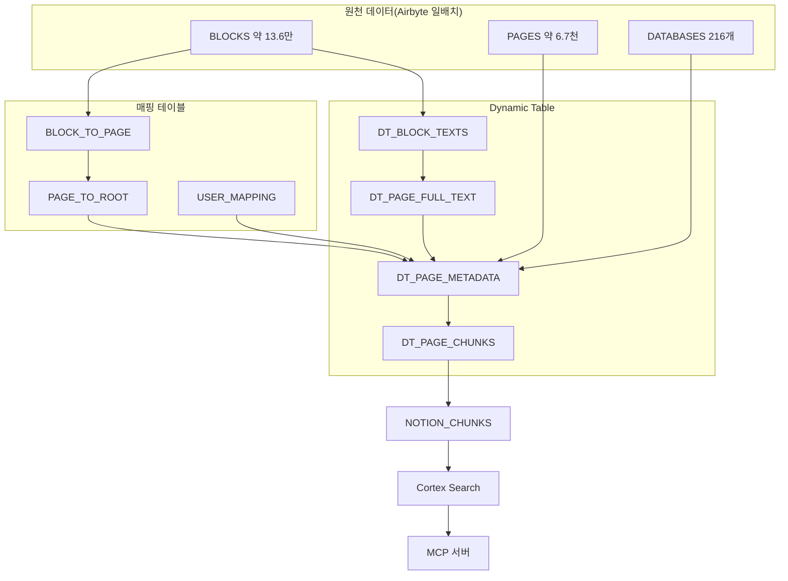
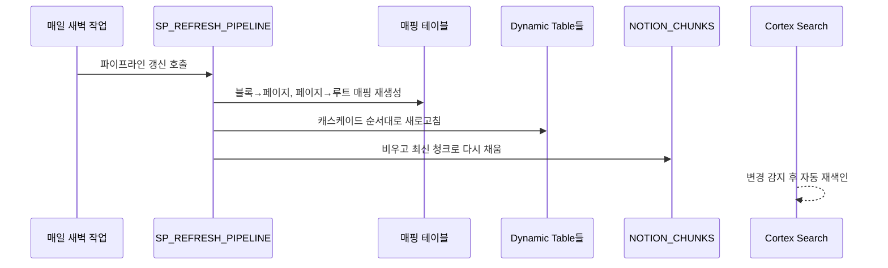

자체 호스팅을 설계하는 그림에서, 서버부터 데이터의 권한 관리까지 전부 내가 담당하려던 부분은, 결국 관리형 서비스 쪽으로 방향을 틀게 되었다. 이미 사내에 사용하던 Snowflake가 있었고, 거기에 임베딩과 검색 서비스도 제공하고 있으니 서버를 따로 만들고 새벽에 백업 과정까지 책임질 이유가 줄어들었다. 방향을 정했으니 이제 필요한 데이터를 올릴 차례였다. 첫 소스는 텍스트 위주의 사내 자료가 가장 두껍게 쌓인 **Notion**이었다.

그런데 막상 들어오는 Raw 테이블을 열어 보니 문제가 있었다. Notion 데이터는 우리가 읽는 "**페이지**"의 형태로 들어오지 않는다. 문단 하나, 제목 하나, 체크박스 하나가 전부 따로 떨어진 **블록**(block; Notion이 글을 쪼개서 저장하는 최소 단위)으로 온다. 한 페이지를 되살리려면 흩어진 블록을 다시 이어 붙여야 했다.

## Notion은 문서가 아니라 블록으로

Notion의 구조는 Workspace 아래에 페이지가 있고, 페이지 내에 블록이 있고, 블록 안에 또 블록이 재귀적으로 중첩된다. 인라인 데이터베이스나 하위 페이지가 얼마든지 겹겹이 들어갈 수 있다.

이 원천 데이터는 **Airbyte**로 매일 한 번씩 Snowflake의 스키마에 적재되고 있었다. 해당 스키마를 열어 보니 블록이 약 13.6만 행, 페이지가 약 6.7천 행, 데이터베이스가 216개였다. 반정형 JSON 그대로 적재되었기 때문에, 검색에 사용하려면 이것을 사람이 읽는 페이지 단위로 되돌리는 일부터 해야 했다.



왼쪽의 원천 데이터부터 오른쪽의 검색 서비스까지, 블록이 조각조각 적재되어 페이지로 뭉쳐지고, 다시 검색용으로 사용되는 청크로 잘려 나가는 그림이다.

## 블록을 페이지로 되돌리기

가장 까다로운 건 블록이 *어느 페이지에 속하는지* 알아내는 일이었다. **인라인 데이터베이스 안에 있는 블록**은, 부모가 페이지가 아니라 또 다른 블록 형태였다. 그래서 부모를 타고 위로 계속 올라가야 **페이지**가 나온다. 그래서 부모 관계를 재귀로 탐색하는 매핑 테이블을 만들었다.

```sql
-- 블록이 어느 페이지에 속하는지, 부모를 타고 위로 올라가며 찾는다
WITH RECURSIVE BLOCK_TO_PAGE AS (
  SELECT ID AS BLOCK_ID, PARENT_ID, PARENT_TYPE, 1 AS DEPTH
  FROM BLOCKS
  WHERE PARENT_TYPE = 'block_id'
  UNION ALL
  SELECT b.BLOCK_ID, p.PARENT_ID, p.PARENT_TYPE, b.DEPTH + 1  -- [!code highlight]
  FROM BLOCK_TO_PAGE b
  JOIN BLOCKS p ON b.PARENT_ID = p.ID
  WHERE b.PARENT_TYPE = 'block_id' AND b.DEPTH < 10
)
SELECT BLOCK_ID, PARENT_ID AS PAGE_ID
FROM BLOCK_TO_PAGE WHERE PARENT_TYPE = 'page_id';
```

위에서 강조한 부분이 재귀 과정의 전부다. 부모가 아직 블록이면 그 부모의 부모를 다시 탐색해 한 단계 또 올라가고, 부모가 페이지가 되는 순간 멈추게끔 했다. 무한히 이 재귀가 돌아가는 것을 막기 위해 **최대 10단계까지만** 파고들게 해뒀다. (실제 데이터로 측정해보니 현재까지는 6단계가 최고였다.)

여기서 끝이 아니었다. 페이지를 찾았어도 그 페이지가 *어느 카테고리에 속하는지*는 또 위로 올라가 봐야 알 수 있다. 페이지가 페이지에 속하고, 그 페이지가 데이터베이스에 속하고, 그게 다시 상위 페이지에 속하는 사슬이 얽혀 있어서다. 그래서 페이지에서 최상위 루트까지 6단계를 반복적인 조인으로 추적하는 매핑 과정을 하나 더 두게 되었다. 최상위에는 12개의 루트 페이지와 4개의 루트 데이터베이스가 있었고, 여기까지 올라가야 비로소 "이 문서는 어느 부서의 것"인지가 정해질 수 있었다.

작성자를 수집하는 과정도 비슷한 문제가 있었다. 원천 데이터에는 직원의 이름이 아니라 내부에서 사용하는 ID만 적재되어 있어서, ID를 실제 구성원의 이름으로 변경하는 테이블을 만들어야 했다. 시스템이 채워 주는 사용자 테이블이 비어 있던 탓이다. 등재한 25건 중에도 직원 17명, 봇으로 사용되는 2개의 계정까지는 정리되었고, 그 외에는 퇴사자의 정보라 사용하지 않았다.

## 스스로 갱신되는 Dynamic Table

블록을 페이지로 되돌리고 카테고리와 작성자를 붙이는 이 과정을, 매번 사람이 돌릴 수는 없었다. 원본이 바뀔 때마다 알아서 다시 계산되어야 했다. 그래서 **Dynamic Table**(정의한 SELECT 결과를 실제 테이블로 유지하고, 정한 주기마다 스스로 다시 계산해 채우는 Snowflake 기능)을 네 단계로 엮었다.

블록 텍스트를 뽑는 첫 테이블에서 시작해, 페이지 전문으로 합치고, 카테고리와 작성자를 붙이고, 마지막에 검색용 청크로 자른다. 앞 단계가 바뀌면 뒤 단계가 연쇄로 다시 도는 구조다.

```sql
-- 블록 텍스트를 페이지 단위로 이어 붙이는 두 번째 단계
CREATE DYNAMIC TABLE DT_PAGE_FULL_TEXT
  TARGET_LAG = '1 day'   -- [!code highlight]
  WAREHOUSE = RAG_WH
AS
SELECT PAGE_ID,
       LISTAGG(BLOCK_TEXT, '\n') WITHIN GROUP (ORDER BY CREATED_TIME) AS FULL_TEXT
FROM DT_BLOCK_TEXTS
GROUP BY PAGE_ID;
```

강조한 **TARGET\_LAG**(원본이 바뀐 뒤 늦어도 이만큼 안에는 반영한다는 갱신 지연 목표)이 이 테이블의 성격을 정한다. 하루로 잡아 두면 원본이 어제 바뀐 내용이 오늘 안에는 검색에 반영된다. 블록을 뽑는 첫 단계만 바뀐 블록만 다시 처리하는 증분 모드로 둬서 비용을 아꼈고, 나머지는 통째로 다시 계산하게 했다.

마지막 단계에서 페이지 전문을 잘랐다. **청킹**(chunking; 긴 글을 검색하기 좋게 작은 조각으로 나누기)은 500자로 자르되 다음 조각이 앞 조각 끝에서 50자를 겹쳐 시작하게 했다. 경계에 걸친 문장이 둘로 쪼개져 검색에서 통째로 놓이는 일을 막으려는 것이다.

자른 조각 앞에는 검색이 잘 걸리도록 메타데이터를 머리말로 붙였다.

```text
[소속: {카테고리}/{DB명}] [작성자: {작성자명}] [제목: {페이지 제목}] [날짜: {YYYY-MM-DD}]
---
{본문 청크}
```

이 머리말 덕에 "특정 동료가 쓴 회의록"처럼 사람 이름이나 카테고리로 물어도 본문이 아닌 머리말에서 먼저 걸린다. 키워드 검색의 명중률을 올리려고 일부러 넣은 장치다.

## 검색 서비스로 올리고 도구로 노출하기

청크가 준비됐으니 실제로 검색이 되게 해야 했다. 캐스케이드의 마지막 결과를 물리 테이블 하나(`NOTION_CHUNKS`)로 옮겨 담고, 그 위에 **Cortex Search**(Snowflake가 제공하는 검색 서비스; 벡터 유사도와 키워드를 함께 쓰는 하이브리드 검색)를 얹었다. 약 9천 개의 청크가 올라갔다. 이 서비스는 소스 테이블에 변경 추적을 걸어 두면 청크가 바뀔 때 알아서 다시 색인하고, 검색 결과를 의미 유사도로 한 번 더 재정렬해 준다. 임베딩 모델은 한국어를 지원하면서 비용이 덜 드는 쪽으로 골랐다.

검색은 JSON 한 덩어리로 부른다. 무엇을 찾을지, 어떤 컬럼을 돌려받을지, 어떤 조건으로 걸러낼지를 넣는다.

```json
{
  "query": "인수인계 미팅에서 RAG 논의가 어디까지 진행됐나",
  "columns": ["CHUNK_TEXT", "SOURCE_CATEGORY", "PAGE_TITLE", "CREATED_BY_NAME", "SOURCE_URL"],
  "filter": { "@eq": { "SOURCE_CATEGORY": "회의록" } },
  "limit": 5
}
```

`filter`가 핵심이다. 카테고리나 작성자로 검색 범위를 미리 좁힐 수 있어서, 회의록만 뒤진다거나 특정 동료가 쓴 문서만 본다는 요청을 한 줄로 처리한다. 여기에 카테고리별 뷰를 열여섯 개 따로 두어, 부서 단위로 잘라 보는 것도 가능하게 했다.

마지막으로 이 검색을 **MCP**(Model Context Protocol; AI가 외부 도구를 부르는 규약) 서버로 감쌌다. 사내 Claude 하네스나 각자의 Claude Desktop 같은 외부 AI가 이 도구를 불러 사내 Notion을 검색하고 답변에 인용할 수 있게 됐다. 하루 한 번, 매일 새벽에 도는 작업이 이 모든 걸 자동으로 굴린다.



## 운영에서 만난 조용한 문제들

굴려 보니 예상 못 한 데서 걸렸다. 가장 재미있던 건 AI가 검색 도구를 *엉뚱하게* 쓰는 문제였다. 텍스트를 찾으라고 하면 전용 검색 도구를 부르는 대신, 함께 열어 둔 SQL 도구로 `ILIKE` 같은 문자열 매칭을 돌리려 드는 일이 잦았다. 그게 더 직관적으로 보였던 모양이다(?). 결국 클라이언트 쪽 지침에 \*\*"텍스트 검색은 전용 검색 도구를 우선 쓸 것"\*\*을 못박아 두는 걸로 눌렀다. 도구를 잘 만드는 것과, AI가 그 도구를 고르게 만드는 건 별개의 일이었다.

한계도 솔직히 남았다. 블록에서 텍스트를 뽑을 때 문단, 제목 같은 11가지 타입만 다뤄서, 그 밖의 블록에 담긴 내용은 청크에 실리지 않는다. 표처럼 구조가 있는 데이터가 특히 그렇다. 사용자별로 행 단위 접근을 실시간으로 거르는 것도 MCP 자체로는 안 돼서, 이건 우회 방안을 따로 봐야 했다. 앞서 손으로 채우다 만 정체불명 작성자 6건도 그대로다.

## 남은 것

자체 호스팅으로 다 짊어지려던 계획을 내려놓고 관리형으로 트니, 서버 대신 SQL로 파이프라인을 짓는 일이 되었다. 블록을 페이지로 되돌리는 재귀 하나에 며칠을 썼지만, 흩어진 조각이 검색 한 줄에 문서로 되살아나는 걸 보니 그럴 만했다는 생각이 든다. Notion을 올렸으니, 이제 대화가 흐르는 다른 창고를 열어 볼 차례다 😎
