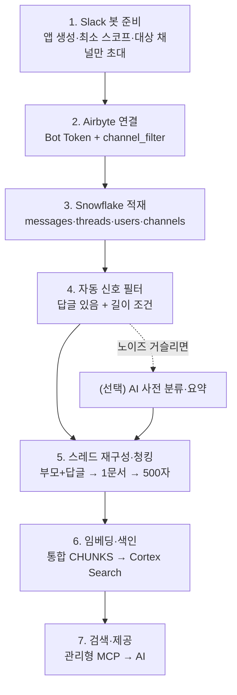

문서로 남는 지식은 일부다. *"그거 그때 어떻게 해결했더라"* 싶어 찾아보면, 정작 답은 몇 달 전 Slack 스레드 안에 묻혀 있는 경우가 많다. 누군가 물었고, 누군가 답했고, 문제는 풀렸는데, 그 대화는 아무 데도 정리되지 않은 채 타임라인 아래로 가라앉는다.

그래서 사내 문서를 검색해 답하던 AI에 Slack 대화도 소스로 붙이기로 했다. 문제는 Slack이 잡담 반, 지식 반이라는 거다. 점심 메뉴 정하는 스레드까지 검색에 섞이면 답이 오히려 나빠진다. 그러니 **대화에서 지식만 골라내는 게** 이번 일의 전부였다.

## 한 줄 그림

먼저 전체 흐름을 한 문장으로 줄여 봤다. **지식성 채널 몇 개만 봇이 읽어와, 쌓고, 답글이 있고 일정 길이 이상인 스레드만 걸러, 부모 질문과 답글을 한 덩어리로 묶어, 임베딩해 검색 색인에 올리면, AI가 검색해 답한다.**



일곱 단계지만 성격은 셋으로 갈린다. 무엇을 읽을지 정하는 앞단(1~3), 지식만 남기는 가운데(4~5), 검색으로 내보내는 뒷단(6~7)이다. 어려운 판단은 전부 가운데에 몰려 있었다.

## 봇이 들어간 채널만 수집 채널

Slack에서 데이터를 긁어오는 방법은 여럿이지만, 권한을 어디까지 열지가 제일 조심스러웠다. 공개 채널을 전부 자동으로 빨아들이는 옵션도 있는데, 그러면 잡담 채널까지 딸려 온다. 대신 원칙을 하나 세웠다. **봇이 초대된 채널이 곧 수집 채널이다.**

봇(앱) 하나를 만들어 지식성 채널 몇 개에만 손으로 초대한다. Slack 규칙상 봇은 자기가 들어간 채널만 읽을 수 있으니, 초대한 곳이 그대로 수집 범위가 된다. 이 원칙이 좋은 건 규칙이 눈에 보인다는 점이다. "어디를 수집하죠?"라는 질문에 "봇이 들어가 있는 채널요"로 답할 수 있다. 봇이 채널에 추가되면 "OO님이 채널에 추가되었습니다" 안내가 딱 한 번 뜨는데, 대상 채널에만 초대하니 그 안내도 딴 데는 뜨지 않는다. 사전에 "지식 수집용 봇을 추가합니다" 한 줄만 공지하면 아무도 놀라지 않는다.

읽어오는 도구로는 **Airbyte**(데이터를 실어 나르는 연결 도구)를 썼다. 소스 설정에서 몇 가지를 못박았다.

```yaml Airbyte Slack source
channel_filter: [지식-채널-A, 지식-채널-B]   # [!code highlight]
join_channels: false                         # 공개 채널 자동 가입 안 함
threads_ignore_no_replies: true              # 답글 없는 글은 아예 안 가져옴
```

강조한 `channel_filter`가 봇 초대 목록과 정확히 같은 채널을 가리키게 맞췄다. 봇이 들어간 채널과 실제로 동기화하는 채널이 어긋나면, 눈에 보이던 규칙이 다시 안 보이게 되기 때문이다. `join_channels`를 꺼서 공개 채널 자동 가입도 막고, `threads_ignore_no_replies`로 답글 한 개 없는 혼잣말은 애초에 안 가져온다. 이 옵션 하나로 가져오는 양이 크게 줄었다.

읽기 전용으로만 쓸 거라 권한도 최소로 뒀다. **스코프**(scope; 앱에 허용하는 권한 범위)는 채널 히스토리 읽기와 사용자 정보 읽기 정도만 켜고, 채널에 글 쓰기나 이모지 반응 같은 건 넣지 않았다. DM과 비공개 채널도 이번엔 통째로 뺐다. 그쪽까지 넣으려면 누가 무엇을 볼 수 있는지 가르는 권한 분리가 먼저라, 그건 다음 숙제로 미뤘다.

여기서 작은 함정 하나. **스코프는 나중에 더 켜면 앱을 다시 설치해야 적용되고, 그때 토큰이 새로 발급된다.** 토큰이 바뀌면 Airbyte에 넣어 둔 것도 같이 갈아 줘야 동기화가 안 끊긴다. 이걸 모르고 스코프만 추가했다가 한참 동기화가 멎어 있던 적이 있다(?). 그래서 필요한 스코프는 되도록 처음에 다 정해 두는 편이 낫다.

봇 이름도 신경 썼다. "AI"나 "어시스턴트"가 들어가면 직원들이 봇에게 답을 기대하고 말을 걸게 된다. 읽기만 하는 녀석이라 그런 오해가 없도록 "지식 수집기"처럼 역할이 그대로 드러나는 이름을 붙였다.

## 이모지 승인 대신 데이터 신호로 거른다

이제 진짜 문제다. 쌓인 대화에서 지식만 어떻게 골라낼까. 처음 떠오른 건 "쓸 만한 답글에 직원들이 승인 이모지를 달면 그것만 수집하자"였다. 깔끔해 보이지만, 이건 *사람의 행동 변화*를 전제로 한다. 다들 바쁜데 매번 도장을 찍어 줄 리 없고, 안 찍히면 파이프라인이 굶는다. 이런 류의 "직원이 협조해 줘야 도는" 장치는 대개 정착에 실패한다.

그래서 방향을 틀었다. **사람에게 새 행동을 요구하지 말고, 이미 데이터에 남아 있는 신호로 거르자.** 대화에는 이미 두 가지 신호가 들어 있었다.

- **답글이 달렸는가.** 누가 물었고 누가 답했다는 건, 그 스레드가 무언가를 해소했을 가능성이 있다는 뜻이다.

- **본문이 충분히 긴가.** "ㅇㅋ", "확인했습니다" 같은 한 줄 잡담은 지식이 아니다. 길이로 거른다.

이 둘을 그대로 SQL로 옮겼다.

```sql
-- 답글이 있고, 본문이 충분히 긴 스레드만 통과
SELECT thread_ts
FROM threads
WHERE reply_count >= 1
GROUP BY thread_ts
HAVING SUM(LENGTH(text)) >= 200;   -- [!code highlight]
```

강조한 `HAVING` 한 줄이 잡담과 지식을 가르는 문턱이다. 답글이 하나라도 있고, 스레드 전체 글자 수가 임계값을 넘는 스레드만 다음 단계로 보낸다. 200이라는 숫자는 처음부터 옳은 값이 아니라, 통과된 걸 들여다보며 올리고 내릴 출발점일 뿐이다. 이 방식의 장점은 **아무도 새로 뭘 하지 않아도 된다**는 것이다. 이미 오간 대화를 데이터로 판단할 뿐이라, 직원 입장에선 평소처럼 Slack을 쓰면 그만이다.

그래도 노이즈가 거슬리면 한 겹을 더 얹을 수 있게 열어 뒀다. 통과한 스레드를 AI에 한 번씩 통과시켜 "재사용할 만한 Q&A인가"를 판정하게 하는 방법이다. 이때도 사람은 통과분을 가끔 표본으로 훑어보기만 한다. 능동적으로 승인 도장을 찍는 게 아니라 자동 판정에 예외 검수만 붙이는 구조라, 이쪽도 정착 실패 위험이 없다. 처음부터 넣진 않고, 데이터 신호만으로 부족할 때 켤 선택지로 남겨 뒀다.

## 흩어진 메시지를 Q&A 한 덩어리로

거르고 나면 다음은 모양을 잡는 일이다. Slack의 한 스레드는 질문 하나와 답글 여러 개로 흩어져 있다. 이걸 메시지 낱개로 잘라 색인하면 맥락이 깨진다. 질문 없이 답만 검색되거나, 그 반대가 되기 때문이다. 그래서 **부모 질문과 답글을 시간순으로 이어 하나의 문서로** 다시 붙였다.

```sql
SELECT thread_ts,
       LISTAGG(user_name || ': ' || text, '\n')
         WITHIN GROUP (ORDER BY ts) AS thread_body   -- [!code highlight]
FROM threads JOIN users USING (user_id)
WHERE thread_ts IN (/* 앞 단계를 통과한 스레드 */)
GROUP BY thread_ts;
```

`LISTAGG`가 같은 스레드에 속한 메시지를 `ts`(보낸 시각) 순으로 한 줄씩 이어 붙인다. `users` 테이블과 조인한 이유는, Slack 원본에는 작성자가 `U01ABCD` 같은 ID로만 찍혀 있어서다. 조인으로 ID를 사람 이름으로 바꿔 둬야 나중에 "누가 한 말인지"가 검색 결과에 그대로 살아난다.

한 덩어리로 묶은 문서는 앞서 만든 Notion 파이프라인과 똑같은 방식으로 잘랐다. **청킹**(chunking; 긴 글을 검색용 작은 조각으로 나누기)은 500자 길이에 50자씩 겹쳐 자르는 규칙을 그대로 썼다. 앞뒤 소스가 같은 규칙을 공유하면, 나중에 한곳에서 검색할 때 조각 크기가 들쭉날쭉하지 않다.

자를 때 문서 맨 위에는 출처를 붙였다. Notion 문서에 붙이던 것과 같은 형식이다.

```text
[소속: slack/{채널}] [작성자: {질문자}] [제목: {질문 첫 줄}] [날짜: {날짜}]
---
{질문과 답글을 이은 본문}
```

이 머리말 덕에 검색 결과가 "어느 채널의, 누구의, 언제 대화인지"를 달고 나온다. Notion에서 온 조각과 형식이 같아서, 나중에 둘을 한 테이블에 섞어도 결과가 같은 얼굴로 보인다.

## 한 벡터 공간에 합류시키기

마지막 결정이 제일 중요했다. Slack 조각을 어디에 넣느냐다. 따로 색인을 두면 검색할 때 Notion 색인과 Slack 색인을 각각 뒤져 결과를 합쳐야 한다. 대신 **하나의 통합 테이블**에 넣기로 했다.

```sql
-- 소스가 무엇이든 한 테이블에 쌓고, 출처는 컬럼으로 구분
CREATE TABLE KB_CHUNKS (
  chunk_text     STRING,
  source_type    STRING,   -- 'notion' | 'slack'  [!code highlight]
  source_channel STRING,
  created_by     STRING
);
```

핵심은 `source_type` 컬럼이다. 조각이 Notion에서 왔는지 Slack에서 왔는지를 값으로만 구분하고, 저장소는 하나로 둔다. 이 단일 테이블을 하나의 **Cortex Search**(Snowflake가 임베딩과 색인을 대신 맡아 주는 관리형 검색) 서비스로 색인하면, 한 번의 검색으로 Notion 문서와 Slack 대화가 함께 나온다.

이게 가능한 건 **임베딩**(embedding; 문장을 뜻이 담긴 숫자로 바꾸기) 모델을 Notion 때와 같은 것으로 맞췄기 때문이다. 같은 모델이 만든 벡터라야 같은 좌표계 위에 놓여 서로 비교되는데, Snowflake가 관리해 주는 임베딩 모델을 양쪽이 공유하니 자연히 **한 벡터 공간**에 모인다. 소스가 달라도 뜻이 비슷하면 나란히 검색된다는 뜻이다.

한 가지 걸린 건 이름이었다. 기존 검색 서비스 이름이 `NOTION_`으로 시작해 Notion 전용처럼 보였다. 이제 Slack까지 들어오니 그 이름이 안 맞았다. 그래서 소스를 안 가리는 일반적인 이름(`KB_SEARCH` 같은)으로 정리하는 걸 숙제로 적어 뒀다. 사소해 보여도, 이름이 실제 범위와 어긋나면 나중에 들어올 소스를 자꾸 예외처럼 느끼게 된다.

## 남은 것

Slack을 붙이고 나서 가장 달라진 건, 문서에 없던 답이 검색되기 시작했다는 점이다. 정식 문서로 정리할 만큼은 아니어도 누군가 이미 겪고 풀어 둔 문제, 그 "그때 그 대화"가 이제 소스가 된다.

길이 임계값을 얼마로 둘지, 노이즈가 늘면 AI 분류를 한 겹 켤지는 굴려 보며 만질 대목으로 남았다. 그래도 잡담과 지식을 사람 손이 아니라 데이터 신호로 가른다는 큰 줄기는 마음에 든다. 오래 돌려 봐야 진짜 임계값이 잡힐 것 같다 😎
