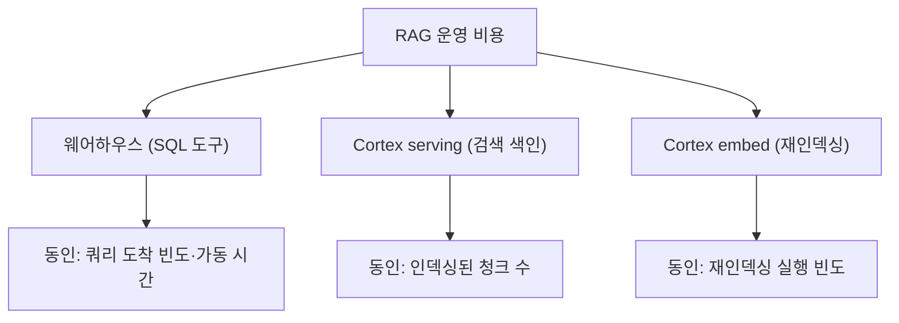

파이프라인이 한 바퀴 돌기 시작하면 다음으로 궁금해지는 건 늘 두 가지다. **잘 찾고 있나. 그리고 얼마가 드나.** [[rag-5-notion-pipeline|Notion을 적재]]하고 [[rag-6-slack-pipeline|Slack까지 붙여]] 검색이 실제로 응답을 돌려주기 시작하자, 나도 이 두 질문 앞에 서게 되었다. "그럭저럭 잘 되는 것 같다"는 느낌으로는 아무것도 정할 수 없었다. 느낌 말고 숫자로 답하고 싶었다.

그래서 계획서를 두 장 썼다. 하나는 *검색이 정답 문서를 실제로 찾아내는지*를 재는 품질 평가, 다른 하나는 *이 시스템을 굴리는 데 크레딧이 얼마나 빠지는지*를 재는 비용 산정이다. 시점은 서로 달랐다. 품질 기준선은 [[rag-4-managed-pivot|관리형으로 옮긴]] 직후, 아직 소스가 Notion 하나뿐일 때 잡아 뒀다. Slack이 붙기 전이 순수 Notion 검색 품질을 재기에 가장 깨끗한 시점이었기 때문이다. 비용은 반대로 Slack까지 쌓인 뒤의 실측이다.

## 정답을 아는 질문을 먼저 만든다

검색 품질을 재려면 채점표가 있어야 한다. 그 채점표가 **골든셋**(golden set; 정답을 아는 질문/문서 쌍 모음)이다. "이 질문에는 이 문서가 정답"이라고 미리 못 박아 둔 문항 묶음이 있어야, 검색이 그 문서를 위로 올렸는지 아닌지를 기계적으로 채점할 수 있다.

문제는 이 골든셋을 *누가 만드느냐*였다. 직원에게 질문을 새로 지어 달라고 하면 시간이 오래 걸리고, 사람마다 난이도가 들쭉날쭉해진다. 그래서 순서를 뒤집었다. 정답 문서를 먼저 정하고, 그 문서에서 질문을 역으로 만들었다. 정답을 이미 아는 상태에서 질문이 나오니 **Recall**(recall; 정답 문서를 상위 결과에 담아낸 비율)을 잴 수 있게 된다.

```sql
-- 카테고리별로 청크를 무작위로 뽑되, 한쪽에 쏠리지 않게 상한을 둔다
SELECT SOURCE_CATEGORY, PAGE_ID, CHUNK_TEXT
FROM DOC_CHUNKS
QUALIFY ROW_NUMBER() OVER (
  PARTITION BY SOURCE_CATEGORY ORDER BY RANDOM()
) <= category_quota   -- [!code highlight]
```

강조한 한 줄이 표본의 성격을 정한다. 코퍼스에서 회의록이 약 43%로 가장 두껍지만, 여기서는 8문항으로 눌렀다. 비중대로 뽑으면 회의록만 잔뜩 나오고 다른 영역의 약점이 가려지기 때문이다. 대신 배분은 *비례 + 소수 카테고리 최소 1건*으로 잡아, 얇은 영역도 최소 한 문항은 걸리게 했다. 이렇게 뽑은 청크를 하나씩 AI에 넣어 (질문 / 정답 / 근거가 되는 문서 ID)를 자동으로 만들었고, 약 35문항짜리 CSV가 나왔다.

## 직원은 keep만 거른다

자동 생성이라 품질이 고를 리 없다. 그래서 검수를 붙였는데, 여기서도 직원이 질문을 새로 쓰지 않게 했다. 자동 생성된 CSV에서 `keep` 컬럼만 0이나 1로 채워 거르는 방식이다. 기준은 "좋은 질문을 고르기"가 아니라 \*\*"쓰면 안 되는 것만 빼기"\*\*다. 판단이 가벼워야 빠르게 통과하기 때문이다.

```yaml golden_set 검수 규칙
# keep=1 이 기본값. 아래에 걸리는 문항만 keep=0 으로 뺀다.
- 질문과 정답이 사실상 같은 문장이라 자명한 경우   # [!code highlight]
- 청크 없이 상식만으로 답할 수 있어 검색 변별력이 없는 경우
- 정답이 청크 내용과 어긋나는 경우
```

첫 줄이 가장 자주 걸린다. 정답 문장을 거의 그대로 되묻는 질문은 검색이 아니라 복사/붙여넣기를 재는 셈이라 변별력이 없다. 상식으로 답할 수 있는 질문도 검색이 없어도 맞히니 걸러 낸다. 재현을 위해 골든셋을 만든 모델과 시드도 함께 기록해 뒀다. 나중에 다시 돌렸을 때 같은 문항이 나와야 비교가 성립한다.

## 페이지 단위 Recall과 지연

지표는 단순하게 잡았다. 정답 문서를 미리 아니까, 검색 상위 K개 안에 그 문서가 들어왔는지만 보면 된다.

```python
# 정답 문서가 검색 상위 K개 안에 있으면 '찾았다'로 센다 (페이지 단위)
hits = [q.gold_page_id in top_pages(q, k=K) for q in golden]  # [!code highlight]
recall_at_k = sum(hits) / len(hits)
```

`top_pages`가 돌려준 상위 결과의 문서 ID 집합에 정답 ID가 있으면 성공이다. 여기서 판정은 청크가 아니라 **페이지 단위**다. 같은 문서의 다른 청크가 올라와도 "그 문서는 찾았다"로 쳐 준다. 사람이 원하는 건 정답 문단이 아니라 정답 문서이기 때문이다. K는 5와 10 두 값으로 재고, 카테고리별 Recall 편차도 따로 본다. 어떤 주제에서 유독 못 찾는지가 다음 튜닝의 출발점이 된다.

속도는 Latency p50/p95로 잡았다. 같은 질의를 여러 번 던져 중앙값과 상위 5% 지점을 보고한다. 단발값 하나로 "빠르다"고 말하면 운이 좋았던 한 번에 속기 쉽다.


한 가지는 솔직하게 적어 둬야 한다. 답변 생성 품질(Faithfulness/Correctness)은 지금 구조에서 직접 재기 어렵다. 실제 답변은 MCP로 붙은 AI가 만드는데, 그 경로를 그대로 계측할 손잡이가 없다. 그래서 같은 검색엔진에 같은 모델을 물려 "검색 → 문맥 주입 → 답변 생성"을 다시 돌리는 *오프라인 근사 경로*로 잰다. 근사는 근사일 뿐, 실경로와의 차이는 따로 점검해야 한다. 목표선도 마찬가지다. 업계에서 흔히 쓰는 시작값을 참고로 뒀지만, 사내 데이터로 보정하기 전까지는 **잠정 관례값**이다. 그래서 이번 1차는 합격/불합격을 가르지 않고, 현 상태를 재는 데까지만 선을 그었다.

## serving 비용은 검색 횟수를 안 따른다

여기서부터는 비용이다. 처음엔 당연히 "검색을 많이 하면 비용이 는다"고 생각했다. 실측은 달랐다.

사내 지식 검색은 Cortex Search라는 serverless 서비스로 도는데, 이 **serving**(serving; 색인을 상주시켜 검색 질의를 받아 주는 부분) 비용은 검색 호출 횟수로 매겨지지 않는다. 인덱스 크기와 상주 시간으로 과금된다. 그래서 사용자가 검색을 더 많이 해도 이 비용은 거의 그대로다. 비용을 키우는 진짜 변수는 **인덱싱된 문서량**이다.

숫자가 이걸 깔끔하게 보여 줬다. 청크 1만 개당 하루 serving 비용이 Notion이든 Slack이든 0.009에서 0.010크레딧으로 거의 같았다. serving 비용이 청크 수에 선형으로 비례한다는 뜻이다.

```yaml serving 단위원가 (측정값)
청크 1만 개당 일 serving ≈ 0.0095 크레딧   # 두 소스 모두 거의 동일
Slack serving ÷ Notion serving ≈ 3.3배
Slack 청크 수 ÷ Notion 청크 수 ≈ 3.8배     # [!code highlight]
```

강조한 줄이 오해 하나를 정면으로 지운다. Slack의 serving이 Notion보다 3.3배 큰 건 *Slack을 더 많이 검색해서*가 아니다. 단지 Slack에 쌓인 청크가 3.8배 많기 때문이다. 검색 빈도가 아니라 색인에 쌓인 양이 비용을 정한다. 일별 추세도 이걸 뒷받침했다. 인덱싱이 쌓이는 동안 serving 비용이 함께 올라가다가, 코퍼스가 자리를 잡자 더 오르지 않고 평탄해졌다.

## 정작 큰 건 웨어하우스, 그리고 cold start

그럼 비용 대부분은 어디서 나올까. serving이 아니라 웨어하우스(warehouse; SQL형 도구가 쿼리를 처리할 때 켜지는 연산 자원)였다. 최근 7일 RAG 관련 비용 8.9크레딧 가운데 웨어하우스가 84%를 차지했고, serving은 채 0.3크레딧도 되지 않았다.



웨어하우스는 쿼리가 들어올 때만 켜지고, 없으면 곧 정지한다. 그래서 켜져 있던 시간이 곧 비용이다. 재미있는 건 이미 켜진 상태에서 검색 한 건을 더하는 한계비용이 거의 0에 가깝다는 점이었다. 정작 돈이 새는 자리는 *가동 시간* 쪽이고, 그중에서도 정지된 웨어하우스를 깨우는 순간이다. 재개할 때마다 최소 60초가 과금되기 때문이다. 그래서 호출당 비용은 일정하지 않고, **쿼리가 언제 도착하느냐에 좌우된다.** 한산한 시간대에 첫 쿼리가 들어오면 잠자던 웨어하우스를 깨우느라 단가가 확 뛰고, 이미 바쁜 시간대에 얹히는 쿼리는 거의 공짜다.

그러면 검색을 쓰는 사람은 이 재개 지연을 체감할까. **cold start**(cold start; 정지된 서비스가 첫 요청에 깨어나며 생기는 초기 지연)를 직접 재 봤다. 현재 코퍼스(약 4.8만 청크)에서 정지 후 재개 직후 첫 검색은 약 1.3초였다. 재개에 0.39초, 첫 검색에 0.90초가 들었다. 늘 켜져 있는 warm 상태(약 1초)와 큰 차이가 없었고, 30초짜리 MCP 타임아웃과는 거리가 한참 멀었다. 비용에 영향을 주는 재개가 사용자 체감으로는 거의 티가 안 난다는 뜻이다.

## auto-suspend는 안 켰다

검색 색인 쪽 serving은 웨어하우스와 성격이 반대였다. DESCRIBE로 확인하니 auto\_suspend가 미설정이고 상태가 계속 ACTIVE였다. 즉 24시간 상시 가동이라, 검색이 한 건도 없는 시간대에도 비용이 발생한다. 일별 serving 비용이 평탄했던 것도 이 때문이다.

줄이려면 방법은 있다. AUTO\_SUSPEND를 걸어(최소 30분) 놀 때 자동으로 정지시키면 된다. 그런데 켜지 않기로 했다. 절감액 자체가 작은 데다, 운영 중에 서비스가 정지되면 그 사이 들어온 검색이 끊길 위험이 있다. 지금은 상시 가동을 유지하는 쪽이 이득이 크다고 판단했다.

대신 그동안 사각지대였던 걸 하나 메웠다. serverless인 검색 도구는 웨어하우스 이력에 호출이 안 남아서, 검색이 하루 몇 번 일어났는지조차 셀 수 없었다. 그래서 두 검색 서비스에 요청 로깅을 켜, 이후 검색부터 이벤트 테이블에 검색어/응답시간/상태코드/시각이 건당 기록되게 했다. 이 로깅은 연산 비용 없이 로그 저장 요금만 들고(요청당 수백 바이트라 연간으로도 무시할 수준), 검색 지연에도 영향이 없다.

*(켠 첫날 로그에 검색이 딱 7건 찍혔는데, 전부 나 혼자 눌러 본 관리자 테스트였다. 실사용 트래픽은 아직 0이라는 뜻이다(?) 성공한 검색의 서버 응답은 0.28에서 0.38초 사이였다.)*

## 코퍼스가 커지면

숫자를 잡아 두니 확장을 추정할 근거가 생겼다. serving이 청크 수에 선형 비례하므로, 코퍼스가 지금의 N배가 되면 검색 비용도 대략 N배가 된다(추정이고, 인덱스 구조나 갱신 빈도에 따라 달라질 수 있다). 예를 들어 청크가 약 4.8만에서 10만으로 늘면 일 serving은 약 0.044에서 0.095크레딧으로 오른다.

그래서 얼마나 버틸까. 계산해 보니 RAG 소진을 좌우하는 건 질문의 절대 수가 아니라 웨어하우스 가동 시간이었다. 검색 도구만으로 남은 크레딧을 몇 달 안에 태우려면 하루 약 5만 4천 질문을 던져야 하는데, 이건 현실성이 없다. 정작 계정 전체 비용의 대부분은 RAG와 무관한 다른 경로에서 나오고 있었다. 적어도 이 시스템이 크레딧을 위험하게 빨아들이지는 않는다는 게, 어림이 아니라 측정으로 확인된 셈이다.

## 남은 것

두 계획서를 쓰기 전엔 품질도 비용도 그냥 막연했다. "잘 되는 것 같고, 그렇게 안 비쌀 것 같다." 숫자로 재고 나니 막연함이 걷히고, 오히려 다음에 뭘 만져야 할지가 또렷해졌다. 카테고리별로 유독 못 찾는 곳이 어디인지, serving을 정말 줄여야 할 만큼 코퍼스가 커지는 시점이 언제인지. 재 보기 전엔 보이지 않던 질문들이다.

무엇보다, 내가 만든 시스템의 속을 숫자로 들여다보는 일이 생각보다 재미있었다 😎
