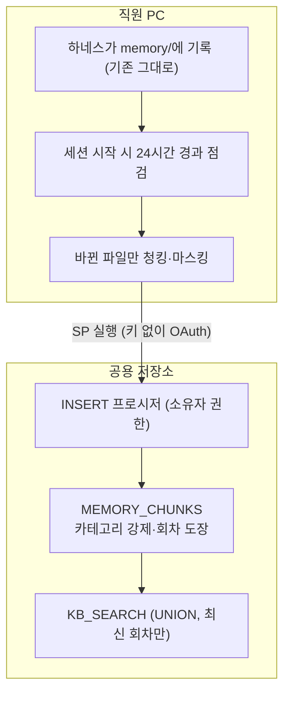
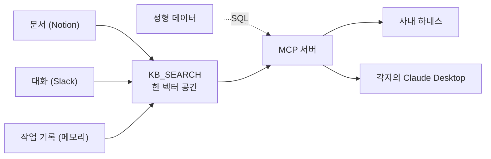

검색을 아무리 잘 되도록 설계해놨다고 해도, 그 과정을 거치지 못한다면 아무도 쓰지 않는다. [[rag-5-notion-pipeline|Notion 문서]]도 조각으로 적재하게 되었고, [[rag-6-slack-pipeline|Slack의 대화]]에서도 필요한 부분만 걸러내어 합류시켰고, [[rag-7-eval-cost|얼마나 맞히고 얼마가 드는지]]까지 검증해 보았다. 그런데 정작 사내 구성원들의 자리에서 이 검색 과정을 사용하려면 마지막 한 단계가 남아 있었다. 누구나, 어디서나 부를 수 있는 구조이다. 그 구조를 **MCP**(Model Context Protocol; AI가 외부 도구를 부를 수 있는 규칙) 서버 하나로 만들어낼 수 있었다.

MCP 서버는 AI에게 "이런 도구들을 사용할 수 있다"고 알려 주는 역할을 한다. 각자 PC의 Claude Desktop App 같은 AI 서비스가 이 서버에 연결되면, 서버가 제공하는 도구를 골라 직접 호출하고 그 결과로 답을 생성한다. 내가 몇 주에 걸쳐 지은 파이프라인은 전부 이 서버 뒤에 존재하고, 사용하는 사람은 그냥 자연어로 묻기만 하면 되는 구조이다.

## AI가 부를 수 있는 도구들, 검색과 쿼리

이 서버에 여러 도구를 달게 되었다. 도구들의 성격은 크게 세 가지로 분류된다.

- **문서 검색.** Notion에서의 청크를 의미 기반으로 검색한다. "**이 내용이 담긴 회의록 있어?**"처럼 주제나 키워드로 묻는 질문이 이 도구를 통한다고 보면 된다.

- **대화 검색.** Slack의 스레드를 같은 방식으로 검색한다. "**결제 시스템 관련 논의는 어디까지 진행되었어?**" 같은, 문서에는 없고 대화에만 남을 만한 답을 찾는다.

- **SQL 분석.** 고객 유입, 거래, 웹 트래픽처럼 숫자로 딱 떨어지는 사내 정형 데이터를 SQL로 집계한다. "**이번 달 신규 유입 몇 건 존재해?**", "**진행 중인 거래 건수 합계는 얼마야?**" 같은 질문을 예시로 들 수 있다.

여기서 중요한 건 도구를 나눈 기준이다. **텍스트로 찾을 수 있는 일과 숫자로 할 수 있는 일들을 가르게 되었다.** 주제나 키워드로 훑는 건 검색으로, 집계/카운팅/날짜 범위의 필터처럼 검색으로는 어려운 **정량 분석**은 SQL 쿼리로 짜도록 보내게 된다. 날짜와만 관련된 질문("**오늘 올라온 문서는 뭐야?**")은 최근 페이지를 훑는 전용 도구를 따로 두어, 의미적인 검색을 헛으로 돌리지 않도록 했다.

이 구분을 굳이 한 데는 사연이 있다. [[rag-6-slack-pipeline|앞서]] 겪은 대로, AI는 텍스트를 찾으라고 해도 종종 SQL 도구로 `ILIKE` 문자열 매칭을 돌리려고 한다. 그게 더 직관적으로 보이는 모양(?)이다. 도구를 잘 만드는 것과, AI가 그 도구를 제대로 고르게 만드는 건 별개의 일이었다.

## 도구의 설명이 곧 AI가 사용할 설명서

AI가 도구를 고르는 근거는 딱 하나, 도구에 붙은 **설명**이다. 사람이 API 공식 문서를 읽듯, AI는 이 설명만 보고 "**이 질문엔 이 도구**"라고 판단한다. 그래서 설명을 라벨이 아니라 사용 설명서처럼 쓰게 되었다.

```json
{
  "title": "Notion Knowledge Search",
  "name": "notion-search",
  "identifier": "KB_SEARCH",
  "type": "CORTEX_SEARCH_SERVICE_QUERY",
  "description": "사내 문서와 작업 기록을 의미 기반으로 검색한다. 카테고리·작성자·제목으로 필터할 수 있고, 결과마다 원본 링크(SOURCE_URL)가 붙는다. 페이지 절반쯤은 같은 PAGE_ID를 공유하는 여러 청크로 쪼개져 있어, 답이 첫 결과가 아닌 다른 청크에 있을 수 있다. 표처럼 구조가 있는 내용은 청크에 안 담기니, 그런 사실은 그 PAGE_ID의 청크 전체를 CHUNK_INDEX 순으로 sql-query로 읽어라."
}
```

이 설명에 [[rag-5-notion-pipeline|파이프라인]]을 구축하며 배운 것들이 다 들어 있다. 결과마다 **원본 링크**가 붙으니 인용하라는 것, 필터로 범위를 좁힐 수 있다는 것, 한 페이지가 여러 청크로 쪼개져 있어 **첫 결과만 믿으면 안 된다는 것** 등이다. 무엇보다 **표 같은 구조적 내용은 청크에 안 담긴다**는 한계를 적고, 그럴 땐 SQL로 그 페이지의 청크 전체를 읽으라는 우회 방법까지 일러 주게 되었다. 검색 과정이 못 잡는 것을 SQL 쿼리가 메울 수 있도록, 두 도구가 서로를 가리키도록 한 것이다.

Slack의 검색 설명도 같은 결이다. 스레드가 여러 청크로 나뉘어 한 조각만으로는 대화 전체가 안 보인다는 것, 참여자의 목록은 스레드 단위 정보라 그 청크에 없는 사람도 섞여 있을 수 있다는 것을 적어 두게 되었다. AI가 헷갈릴 지점을 미리 짚어 주는 주석에 가깝다.

## 각자 PC의 기록을 검색에 합류시키기

네 갈래 중 마지막, 작업 기록이 이번의 핵심이었다. 하네스는 직원이 작업할 때마다 학습 내용, 진행 맥락, 반복 에러 해결법 같은 걸 각자 PC에 자동으로 쌓는다. 문제는 이 기록이 *내 PC에만* 있다는 점이었다. 내가 어제 푼 에러를 옆자리 동료가 똑같이 겪어도, 그 해결 과정이 검색에 안 걸리니 처음부터 다시 헤맨다.

이 기록을 사내 공용 저장소로 올린 이야기는 [[harness-7-snowflake|하네스를 다루며 한 번]] 적었다. 그쪽이 청킹과 마스킹, 바뀐 것만 올리는 증분 적재를 다뤘다면, 여기선 같은 사건을 검색 쪽에서 본다. *올라온 기록이 어떻게 검색에 합류하느냐*가 남은 절반이었다.



첫 결정은 **기록을 별도 테이블에 담는 것**이었다. Notion과 Slack 청크가 쌓이는 테이블에 섞지 않고, 작업 기록만 담는 테이블(`MEMORY_CHUNKS`)을 따로 팠다. 회사 문서와 개인 작업 로그는 권한도 성격도 달라서, 물리적으로 갈라 두는 편이 나중을 위해 깔끔했다.

두 번째는 검색 서비스를 하나로 유지하는 것이다. 테이블이 둘로 늘었다고 검색 서비스까지 둘로 두면, 부를 때마다 양쪽을 각각 뒤져 결과를 합쳐야 한다. 대신 기존 **Cortex Search**(Snowflake가 임베딩/색인/검색을 대신 맡는 관리형 검색 기능) 서비스의 소스를 두 테이블의 합집합으로 한 번만 바꿨다.

```sql
-- 검색 서비스 하나가 두 창고를 함께 본다: 사내 콘텐츠 + 작업 기록(최신 회차만)
CREATE OR REPLACE CORTEX SEARCH SERVICE KB_SEARCH
  ON CHUNK_TEXT
  WAREHOUSE = RAG_WH
  TARGET_LAG = '1 day'
AS
  SELECT CHUNK_TEXT, SOURCE_CATEGORY, PAGE_TITLE, SOURCE_URL
  FROM KB_CHUNKS
  UNION ALL                                            -- [!code highlight]
  SELECT CHUNK_TEXT, SOURCE_CATEGORY, PAGE_TITLE, SOURCE_URL
  FROM MEMORY_LATEST;
```

강조한 `UNION ALL` 한 줄이 두 창고를 한 검색에 묶는다. 검색 서비스는 그대로 하나라, 작업 기록이 붙었다고 serving 비용이 더 들지 않는다. 소스를 한 번 바꾸면서 기존 청크를 다시 색인하는 1회성 비용만 감수하면 됐다.

## 고쳐 올려도 최신 것만 보이게

여기서 까다로운 게 하나 있었다. 같은 기록을 나중에 고쳐 올리면 옛 내용과 새 내용이 둘 다 검색에 걸린다는 점이다. 보통은 옛 행을 지우고 새 행을 넣지만(DELETE 후 INSERT), 직원에게는 삭제 권한을 주지 않기로 했다(이유는 곧 나온다). 지울 수 없다면, 지우지 않고도 최신 것만 보이게 해야 했다.

그래서 각 적재에 `SYNCED_AT`, 곧 올린 시각을 회차 도장처럼 찍었다. 검색에는 같은 문서(`PAGE_ID`)의 여러 회차 중 *가장 최근 회차만* 노출한다.

```sql
-- 같은 기록을 고쳐 올려도 최신 회차만 검색에 노출한다 (DELETE 없이)
CREATE VIEW MEMORY_LATEST AS
SELECT *
FROM MEMORY_CHUNKS
QUALIFY SYNCED_AT = MAX(SYNCED_AT) OVER (PARTITION BY PAGE_ID);  -- [!code highlight]
```

강조한 `QUALIFY` 한 줄이 문서별로 가장 늦게 찍힌 회차만 통과시킨다. 옛 회차 행은 테이블에 그대로 남지만 이 뷰를 거치며 걸러져, 검색에는 안 보인다. 이게 **멱등성**(idempotent; 같은 일을 여러 번 해도 결과가 한결같은 성질)을 지킨다. 청크 수가 줄어드는 수정, 이를테면 세 조각짜리 기록을 두 조각으로 고쳐 올려도 옛 세 조각이 섞이지 않고 새 두 조각만 검색된다.

덤으로 마커가 성공했을 때만 앞으로 당겨지게 해 둬서, PC를 며칠 꺼 뒀다 켜도 그동안 쌓인 기록이 다음 실행에서 한꺼번에 따라잡힌다. 실제 업로드 대상은 *마지막으로 성공한 동기화 이후 바뀐 모든 파일*이라, 중간에 며칠이 비어도 유실이 없다.

물론 옛 회차 행이 계속 쌓이면 저장 공간이 조금씩 는다. 이건 삭제 권한을 가진 관리자의 예약 작업이 주기적으로 비우게 맡겼다. 검색 정확성은 위 뷰가 이미 보장하니, 청소가 조금 늦어도 결과는 멀쩡하다.

## 한 테이블 밖으로는 못 쓰게

앞에서 미뤄 둔 이야기, 직원에게 삭제는커녕 왜 직접 쓰기 권한도 안 줬는지다. 답은 권한을 아주 좁게 묶어야 했기 때문이다.

작업 기록에는 민감정보가 섞이기 쉽고, 무엇보다 회사 문서가 쌓인 테이블은 절대 건드리면 안 됐다. 그래서 직원 계정에는 테이블 권한을 아예 0으로 두고, **저장 프로시저 하나를 실행할 권한만** 내줬다. 실제 INSERT는 이 프로시저가 소유자 권한으로 대신 한다.

```sql
-- 직원은 이 프로시저를 '실행'만 할 수 있다. 실제 INSERT는 소유자 권한으로 프로시저가 대신 한다
CREATE PROCEDURE SP_INSERT_MEMORY(ROWS VARIANT)
  RETURNS STRING
  EXECUTE AS OWNER                         -- [!code highlight]
AS
$$
  INSERT INTO MEMORY_CHUNKS (PAGE_ID, CHUNK_TEXT, SOURCE_CATEGORY, SYNCED_AT)
  SELECT r.value:page_id, r.value:chunk_text,
         'HARNESS_MEMORY',                 -- 카테고리를 코드가 강제로 박는다
         CURRENT_TIMESTAMP()               -- 올린 시각을 회차 도장으로 찍는다
  FROM TABLE(FLATTEN(input => :ROWS)) r;
$$;

-- 쓰기 권한이 없는 역할에 '프로시저 실행'만 내준다
GRANT USAGE ON PROCEDURE SP_INSERT_MEMORY(VARIANT) TO ROLE MEMORY_WRITER;  -- [!code highlight]
```

강조한 두 줄이 권한 경계의 전부다. `EXECUTE AS OWNER`라, 호출하는 직원이 아니라 프로시저를 만든 관리자의 권한으로 INSERT가 돈다. 직원 계정 자체에는 그 테이블에 쓸 권한이 없어도, 이 프로시저로만 딱 한 테이블에 행을 보탤 수 있다. 그마저도 프로시저 안은 정적 INSERT라 값을 바꿔 넣을 뿐, 임의의 SQL을 끼워 넣을 여지가 없다. 카테고리는 코드가 `HARNESS_MEMORY`로 강제로 박아, 직원이 다른 카테고리인 척 위장할 수도 없다.

결국 호출자가 할 수 있는 일은 *한 테이블에 기록을 보태는 것* 하나로 좁혀진다. 삭제도, 수정도, 다른 테이블 접근도 구조적으로 막혔다. 텍스트로 "건드리지 마세요"라고 부탁하는 게 아니라, 권한 목록에서 빼 버려 못 하게 만든 것이다. 검색 도구(MCP) 쪽도 읽기 전용으로 잠가 뒀으니, 임의의 쓰기는 양쪽 어디로도 새지 않는다.

## 네 창고가 한 검색으로

이제 그림이 닫힌다. 문서, 대화, 정형 데이터, 작업 기록이 MCP 서버 하나 뒤에 모였다.



문서와 대화, 작업 기록은 한 검색 서비스에 모여 같은 벡터 공간에서 함께 걸린다. 숫자로 세는 정형 데이터만 검색을 거치지 않고 SQL 도구로 곧장 간다. 어느 쪽이든 입구는 MCP 서버 하나뿐이고, 사내 하네스든 각자의 Claude Desktop이든 이 입구로 붙어 자연어로 묻는다.

처음 이 일을 시작할 때 세운 목표가 "과거 작업과 해결 사례를 사내에서 재활용하자"였다. 내가 겪은 걸 동료가 다시 겪지 않게, 흩어진 회사의 기억을 검색 한 줄로 불러오자는 것. 그 목표가 여기서 닫힌다. 이제 "그거 그때 어떻게 했더라" 싶을 때, 답은 누군가의 PC나 몇 달 전 대화에 묻혀 있는 대신 검색 결과로 올라온다.

## 남은 것

닫혔다고는 해도 숙제는 남았다. 작업 기록 본문에 섞인 비구조적 민감정보, 이를테면 고객사 이름이나 계약 금액 같은 건 정규식으로 못 잡는다. 어디까지 코드로 가리고 어디부터 운영 정책으로 거를지는 계속 만질 대목이다. 쌓이는 옛 회차를 비우는 관리자 청소 작업도 아직 예약만 걸어 둔 상태다. 쓰기를 세션 중에 AI가 호출하는 구조라, PC 세션을 안 켠 날은 그날 치가 보류됐다 다음에 회수되는 것도 결정적이진 않다.

돌아보면 처음엔 뭘 쓸지 고르는 것부터 막막했다. 서버를 직접 세우겠다고 덤볐다가 관리형으로 방향을 틀었고, 소스를 하나씩 올리고, 얼마나 맞히는지 재 보고, 마지막에 이렇게 입구를 냈다. 길게 돌아온 길이지만, 검색창에 한 줄 치면 회사의 기억이 딸려 나오는 걸 직접 보니 그 돌아온 값을 한 셈이다 🍀
