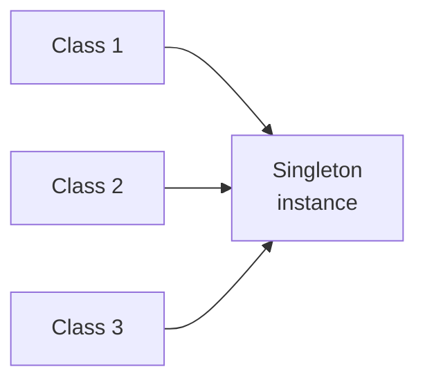
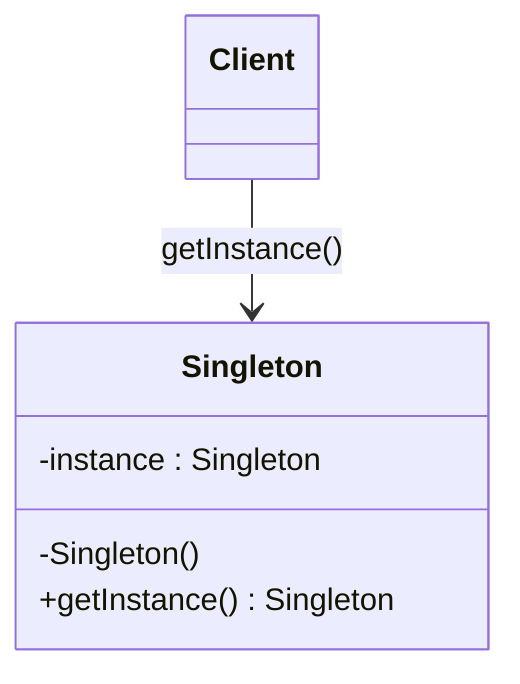
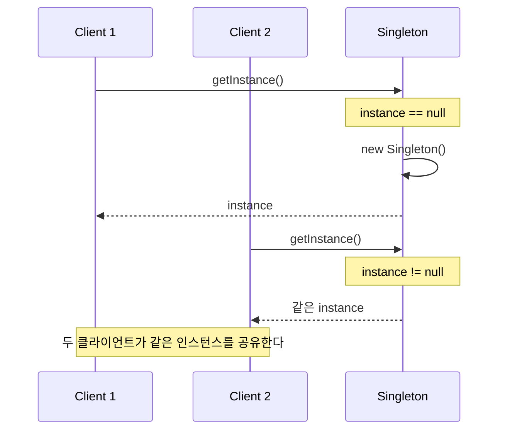
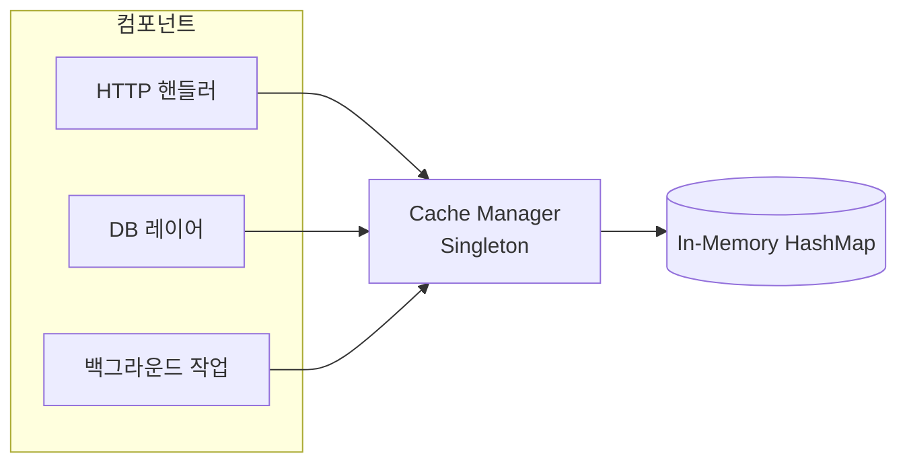

개발 공부를 하며 정리한 것들을 블로그에도 남겨 두기로 했다. 첫 주제는 **싱글톤 패턴**(Singleton pattern; 클래스의 인스턴스를 딱 하나만 만들도록 강제하는 방법)이다. 디자인 패턴 중에서 가장 간단해 보이지만, 막상 제대로 구현하려고 하면 걸리는 부분이 은근히 많은 패턴이다.

코드를 짜다 보면 **인스턴스가 하나뿐이어야 하는 클래스**를 만난다. 스레드 풀, 캐시, 로거(logger) 같은 클래스이다. 이런 객체들을 여러 개 만들어 버리면 프로그램이 엉뚱하게 동작하거나, 자원을 낭비하거나, 결과가 뒤죽박죽 섞이는 문제가 생긴다. 싱글톤 패턴은 바로 이런 부분에서 등장한다.



이 글에서는 싱글톤이 무엇이고 어떻게 동작하는지, 구현하는 여러 방법과 실제로 쓰이는 곳, 장단점까지 하나씩 짚어 볼 예정이다.

## 1. 싱글톤 패턴이란

> 싱글톤 패턴은 클래스의 인스턴스가 오직 하나만 존재하도록 보장하고, 어디서든 그 하나에 접근할 수 있는 방법을 열어 두는 **생성 패턴**(creational pattern; 객체를 만드는 방식을 다루는 패턴)이다.

패턴을 정의하는 조건은 두 가지다.

- **단일 인스턴스**. 코드의 어느 곳에서, 클래스를 몇 번 요청하든 늘 같은 객체가 돌아온다.

- **전역 접근**. 생성자나 매개변수로 넘겨받지 않아도 **어떤 컴포넌트든** **그 인스턴스에 접근**할 수 있다.

### 비유를 들자면

운영 체제에서의 **프린트 관리자**(print spooler; 인쇄 작업을 순서대로 관리하는 프로그램)를 떠올려보자. 관리자 프로그램 하나가 모든 인쇄 작업을 맡는다. 각 애플리케이션은 자신만의 관리자를 따로 만들지 않고, 이미 있는 하나의 관리자에 작업을 넘긴다. 애플리케이션마다 자신의 관리자를 돌린다면 인쇄 작업이 서로 충돌하고, 페이지가 뒤섞이고, 프린터는 엉망인 산출물을 뱉을 것이다. 관리자 하나가 전부를 조율한다.

싱글톤이 잘 어울리는 상황은 이렇다.

- **공유 자원 관리**(DB 커넥션, 스레드 풀, 캐시, 설정)

- **시스템 전역 동작 조정**(로깅, 프린트 관리자, 파일 관리자)

- **상태 관리**(사용자 세션, 애플리케이션 상태)

조금 더 구체적으로 들어보자면,

- **로거** - 많은 로깅 프레임워크가 싱글톤으로 **전역적인 로깅 객체**를 둔다. 덕분에 로그 메시지가 **한 출력으로 일관되게 모인다.**

- **DB 커넥션 풀** - 커넥션을 재사용해 효율을 높이는데, 풀이 하나만 만들어져 애플리케이션 전체가 이를 공유한다.

- **캐시** - 인메모리 캐시는 캐시된 데이터에 접근하는 단일 저장소가 되도록 싱글톤으로 자주 구현된다.

- **스레드 풀** - 작업 스레드 묶음을 하나의 풀로만 관리해 자원 과다 사용을 막는다.

- **파일 시스템** - 파일 연산 과정을 하나의 객체로 통일해서 다룬다.

## 2. 클래스 다이어그램

싱글톤을 구현하려면 **외부에서 함부로 인스턴스를 만들지 못하게 막아야 한다.** 오직 싱글톤 클래스 자신만 자기 객체를 만들 수 있어야 한다. 그리고 외부에서 **그 객체에 접근할 방법도 열어 줘야 한다.**



- **instance 필드**가 단 하나뿐인 싱글톤 객체를 담는다.

- **생성자는 private**(또는 그만큼 준하게 제한)이라, 바깥의 코드가 직접 새 인스턴스를 만들 수 없다.

- **getInstance() 같은 클래스 메서드**가 공유 인스턴스를 돌려주기 때문에 어디서든 부를 수 있다.

> [!NOTE]
> **그냥 전역 변수를 쓰면 안 되나?**
> \
> 전역 변수를 지원하는 언어라면 접근은 비슷하지만 초기화는 통제할 수 없다. 싱글톤은 인스턴스를 언제 어떻게 만들지 정하고, 필요할 때 늦게 만들거나(lazy), 만드는 동안 스레드를 안전하게 지키고, 인스턴스가 정말 하나뿐인지 검증할 수 있다.

## 3. 어떻게 동작하나

동작은 단순하다.



1. **첫 요청**. 클라이언트(사용자)가 `getInstance()`를 부르면, 메서드는 인스턴스가 이미 있는지 확인한다.
2. **인스턴스 생성**. 없으면 private 생성자로 하나 만들어 static 필드에 넣는다.
3. **인스턴스 반환**. 방금 만든 인스턴스를 돌려준다.
4. **이후 요청**. 그 다음부터는 이미 있는 인스턴스를 찾아 곧바로 돌려주고, 생성 과정은 통째로 건너뛴다.

위 시퀀스 다이어그램은 두 클라이언트가 인스턴스를 요청하는 모습이다. 첫 번째 요청이 생성을 일으키고, 두 번째는 이미 있는 것을 받는다. 둘 다 결국 같은 객체를 가리키게 된다.

## 4. 구현

싱글톤의 구현은 언어마다 조금씩 다르다. 주로 문제가 되는 상황은 **스레드 안전성**(thread safety; 여러 스레드가 동시에 접근해도 문제가 없는 성질)이다. **인스턴스가 아직 없을 때** 두 스레드가 동시에 `getInstance()`를 부르면, 둘 다 각자 인스턴스를 만들어 버릴 수 있다.

가장 단순하지만 문제가 생기는 지점부터 시작해 하나씩 개선해 보자. 예시는 파이썬으로 작성했다.

### 1) 지연 초기화 (스레드가 안전하지 않음)

필요해질 때 비로소 인스턴스를 만든다. 끝까지 안 쓰이면 아예 안 만들어지니 자원을 아낄 수 있다.

```python
class Singleton:
    _instance = None

    @classmethod
    def get_instance(cls):
        if cls._instance is None:  # [!code step:1]
            cls._instance = Singleton()  # [!code step:2]
        return cls._instance  # [!code step:3]
```

결국 "요청이 오면 그제야 만들고, 이미 있으면 그대로 돌려준다"는 코드다.

- `get_instance()`가 인스턴스가 있는지 확인한다.

- **없으면 새로 만든다.**

- 있으면 만드는 단계를 건너뛴다.

> [!WARNING]
> 이 구현은 스레드가 안전하지 않다. `_instance`가 아직 `None`일 때 여러 스레드가 동시에 `get_instance()`를 부르면 인스턴스가 여러 개 만들어질 수 있다.

### 2) 스레드가 안전한 싱글톤

그래서 위 방법에 **잠금(lock) 과정**을 더해 멀티스레드 환경에서도 안전하게 만들 수 있다. 여러 스레드가 동시에 접근하면, 잠금이 한 번에 한 스레드만 객체를 만들게 하고 나머지는 기다리게 한다.

```python
import threading

class Singleton:
    _instance = None
    _lock = threading.Lock()

    @classmethod
    def get_instance(cls):
        with cls._lock:  # [!code step:1]
            if cls._instance is None:  # [!code step:2]
                cls._instance = Singleton()  # [!code step:3]
        return cls._instance  # [!code step:4]
```

- 인스턴스는 **처음 요청될 때** 만들어진다. (지연 초기화)

- 인스턴스를 돌려주는 메서드가 잠금을 건다.

- 한 스레드가 보호 구역에 들어가면 잠금을 쥐게 되고, 다른 스레드는 잠금이 풀릴 때까지 기다린다.

- 그래서 동시에 접근해도 인스턴스는 하나만 만들어진다.

이 방법은 정확하지만 비용이 존재한다. 인스턴스가 이미 만들어진 뒤에도 `get_instance()`를 부를 때마다 매번 잠금을 걸게 된다. 이미 있는데 굳이 동기화할 필요는 없다.

### 3) 이중 검사 잠금 방법

**이중 검사 잠금**(double-checked locking; 잠금 전후로 두 번 확인하는 기법) 방법은 **처음 만들 때만 동기화**해서 비용을 줄인다. 인스턴스가 생긴 뒤에는 잠금을 아예 건너뛴다.

```python
import threading

class Singleton:
    _instance = None
    _lock = threading.Lock()

    @classmethod
    def get_instance(cls):
        if cls._instance is None:  # [!code step:1]
            with cls._lock:  # [!code step:2]
                if cls._instance is None:  # [!code step:3]
                    cls._instance = Singleton()  # [!code step:4]
        return cls._instance  # [!code step:5]
```

첫 번째 검사를 통과하면 잠금을 걸고, 같은 조건을 한 번 더 확인한다. **여러 스레드가 첫 검사를 함께 통과했을 수 있기 때문**이다. 두 검사를 모두 통과할 때만 인스턴스를 만든다.

> [!TIP]
> 구현은 조금 복잡해도, 싱글톤을 자주 부르는 상황에서는 성능 부담을 크게 덜어 준다.

### 4) 즉시 초기화

**즉시 초기화**(eager initialization; 미리 만들어 두는 방식)는 클래스나 모듈이 로드되는 순간, 어떤 스레드가 접근하기도 전에 인스턴스를 만들어 둔다. 초기화가 로드 시점에 한 번만 일어나므로 별도의 잠금 없이도 스레드가 안전하다.

애플리케이션이 그 인스턴스를 **항상 쓰거나**, **만드는 비용이 크지 않을 때** 잘 맞는다.

```python
class Singleton:
    @classmethod
    def get_instance(cls):
        return cls._instance

Singleton._instance = Singleton()  # [!code highlight]
```

- 클래스/static 변수가 **유일한 공유 인스턴스**를 가지게 된다.

- 인스턴스는 처음 쓸 때가 아니라 **클래스/모듈 초기화 시** 만들어진다.

- 런타임이 **static 상태를 한 번만 초기화**하므로 잠금이 필요 없다.

> [!CAUTION]
> 태생부터 스레드가 안전하지만, 인스턴스를 끝내 안 쓰게 되면 미리 만들어 둔 자원이 그대로 낭비된다.

### 5) 파이썬다운 구현

여기까지가 언어를 가리지 않는 뼈대라면, 파이썬에는 좀 더 파이썬다운 방법들이 있다.

**모듈 수준 싱글톤**

파이썬에서 모듈은 **한 번만 import**된다. 인터프리터가 처음 import한 뒤 `sys.modules`에 캐싱해 두고, 다음부터는 같은 모듈의 객체를 돌려준다. 그래서 모듈 레벨에 만들어 둔 인스턴스는 자연스럽게 싱글톤이 된다.

```python
# config.py
class _ConfigManager:
    def __init__(self):
        self.settings = {}

    def get(self, key):
        return self.settings.get(key)

    def set(self, key, value):
        self.settings[key] = value

config = _ConfigManager()  # [!code highlight]
```

밑줄로 시작하는 `_ConfigManager`는 "**이건 내부 구현이다**"라는 부분이다. 사용자는 클래스가 아니라 **`config`를 import**한다.

가장 파이썬다운 방법이다. 단순하고 명확한 데다, 모듈 로딩 수준에서 자연스럽게 스레드가 안전할 수 있다. 파이썬 커뮤니티에서는 대체로 클래스 기반의 싱글톤보다 이 방법을 선호한다고 한다.

**`__new__`** **오버라이드**

`Singleton()`을 부를 때마다 **늘 같은 인스턴스**를 돌려주고 싶다면(클래스 기반 인터페이스), `__new__`를 손 봐주면 된다.

```python
class Singleton:
    _instance = None

    def __new__(cls):
        if cls._instance is None:  # [!code step:1]
            cls._instance = super().__new__(cls)  # [!code step:2]
        return cls._instance  # [!code step:3]
```

그런데 한 가지 문제가 있다. `__new__`가 같은 객체를 돌려줘도 `__init__`은 `Singleton()`을 부를 때마다 실행된다. `__init__`이 상태를 초기화한다면 기존 데이터를 잃는다. 그래서 **플래그**로 이런 문제를 막거나, 초기화 과정을 `__new__`로 옮겨 대비한다.

**메타클래스 싱글톤**

**메타클래스**(metaclass; 클래스를 만드는 클래스)를 쓰면 싱글톤 로직을 클래스 자체에서 떼어낼 수 있다. `SingletonMeta`를 메타클래스로 삼는 클래스는 자동으로 싱글톤이 된다.

```python
import threading

class SingletonMeta(type):
    _instances = {}
    _lock = threading.Lock()

    def __call__(cls, *args, **kwargs):
        if cls not in cls._instances:  # [!code step:1]
            with cls._lock:  # [!code step:2]
                if cls not in cls._instances:  # [!code step:3]
                    cls._instances[cls] = super().__call__(*args, **kwargs)  # [!code step:4]
        return cls._instances[cls]  # [!code step:5]

class Database(metaclass=SingletonMeta):
    ...
```

메타클래스가 클래스 호출(`Database()`)을 가로채서, 인스턴스가 이미 있으면 그것을, 없으면 새로 만들어서 돌려준다. 앞서 얘기했던 **이중 검사 잠금 방법**을 써서 스레드가 안전하고, 여러 클래스에 재사용할 수 있다. 다만 메타클래스는 파이썬 객체 모델에 익숙하지 않으면 헷갈릴 수 있다.

**데코레이터 싱글톤**

첫 인스턴스를 캐싱해 두고 다음부터 그대로 돌려주는 함수 데코레이터다.

```python
def singleton(cls):
    instances = {}  # [!code step:2]

    def get_instance(*args, **kwargs):
        if cls not in instances:  # [!code step:4]
            instances[cls] = cls(*args, **kwargs)  # [!code step:5]
        return instances[cls]  # [!code step:6]

    return get_instance  # [!code step:3]

@singleton  # [!code step:1]
class AppConfig:
    ...
```

데코레이터가 **클래스를 래퍼 함수로 바꾼다.** **`AppConfig()`를 부르면** 사실 `get_instance()`가 불려 캐싱된 인스턴스를 돌려준다. 깔끔하고 읽기 좋지만, 데코레이션 이후 `AppConfig`는 더 이상 클래스 참조가 아니라서 `isinstance(c1, AppConfig)`가 기대대로 동작하지 않는다.

## 5. 인메모리 캐시 관리자 (실전 예제)

여러 컴포넌트(HTTP 핸들러, DB 레이어, 백그라운드 작업)가 사용자 프로필이나 설정, 쿼리 결과처럼 만드는 데 비싼 데이터를 캐싱해야 하는 애플리케이션을 만든다고 하자.

원하는 건 하나의 공유 캐시다. 어떤 컴포넌트가 쓴 값이든 다른 모든 컴포넌트에 곧바로 보여야 하고, 해시 맵이 중복되거나 오래된 값을 읽거나 메모리를 낭비하는 일이 없어야 한다.



모든 컴포넌트가 하나의 `CacheManager` 인스턴스에 접근한다. 이 인스턴스가 공유 해시 맵 하나를 관리하고, 읽을 때 **TTL**(time to live; 데이터를 살려 둘 시간) 만료를 처리하며, 내부에서 접근을 동기화한다.

```python
import threading
import time

class CacheManager:
    _instance = None
    _lock = threading.Lock()

    def __new__(cls):
        if cls._instance is None:
            with cls._lock:
                if cls._instance is None:
                    cls._instance = super().__new__(cls)
                    cls._instance._store = {}
                    cls._instance._data_lock = threading.Lock()
        return cls._instance

    def put(self, key, value, ttl=None):
        expires = time.time() + ttl if ttl else None  # [!code highlight]
        with self._data_lock:
            self._store[key] = (value, expires)

    def get(self, key):
        with self._data_lock:
            item = self._store.get(key)
            if item is None:
                return None
            value, expires = item
            if expires and time.time() > expires:  # [!code highlight]
                del self._store[key]
                return None
            return value
```

위 코드는 결국 "누가 언제 만들든 캐시 인스턴스는 하나, 그 안의 해시 맵도 하나"를 보장한다.

```python
cache = CacheManager()
cache.put("user:1", {"name": "조이"}, ttl=60)

# 다른 컴포넌트에서 얻어도 같은 인스턴스다
same = CacheManager()
print(same.get("user:1"))  # {'name': '조이'}
print(cache is same)       # True
```

이렇게 풀어낸 것을 정리하면,

- 공유되는 캐시는 하나이다. 중복 데이터도, 낭비되는 메모리도 없다.

- 한 컴포넌트의 `put()`이 모두에게 즉시 보인다.

- 내부 동기화로 **스레드가 안전**하다.

- **TTL 만료**를 한 곳에서, 읽는 김에 지연되게 정리한다.

- 캐시 참조를 생성자로 일일이 넘길 필요가 없다.

## 6. 장단점

### **장점**

- 클래스의 인스턴스를 하나로 보장하고, 어디서든 공유되는 전역적인 통로를 제공해준다.

- 객체가 하나만 만들어지니, 자원을 많이 쓰는 클래스에 특히 유리하다.

- 애플리케이션 전역 상태를 유지하는 방법이 된다.

- 지연 로딩(Lazy Loading)을 지원해, 처음 필요할 때 비로소 인스턴스를 만든다.

- 애플리케이션의 모든 객체가 **같은 전역 자원을 쓰도록 보장**한다.

### **단점**

- **단일 책임 원칙**(Single Responsibility Principle)을 어긴다. 한 번에 두 가지 문제를 풀기 때문이다.

- 멀티스레드 환경에서는 **경쟁 상태**(race condition; 실행 순서에 따라 결과가 달라지는 문제)를 피하려고 각별히 신경 써야 한다.

- 전역 상태를 끌어들여, 관리하기 어려워질 수 있다.

- 싱글톤을 쓰는 클래스가 **싱글톤 클래스에 강하게 결합**된다.

- 전역 상태 때문에 **단위 테스트**가 까다로워진다.

> [!CAUTION]
> 싱글톤은 전역 상태를 가져오고 테스트와 유지보수를 어렵게 만드는 만큼, **꼭 필요할 때만 골라 써야 한다.** 가능하면 **의존성 주입**(dependency injection; 필요한 객체를 바깥에서 넣어 주는 방식) 같은 대안을 먼저 떠올려, 느슨한 결합과 테스트하기 좋은 구조를 노리는 편이 낫다.

가장 단순하다고 소문난 패턴인데도, 스레드의 안전성 하나를 붙잡고 늘어지니 파고들 부분이 꽤 많았다. 개발 공부 시리즈의 첫 글로 나쁘지 않은 선택이었던 것 같다. 다음 글에서도 또 다른 패턴이나 지식을 하나씩 정리해 볼 생각이다. <span class="tossface">🌱</span>
