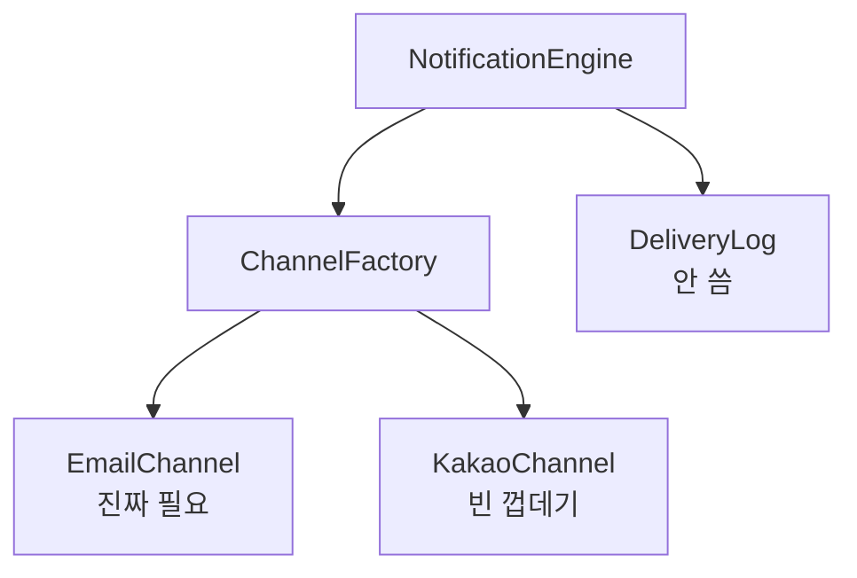

나중에 필요할 것 같아서 기능을 미리 만든 적이 있는가. 아직 쓰지도 않을 상황을 위해 추상화를 하거나, 아무도 건드리지 않을 유연한 구조를 넣어 둔 적은 없는가. 있다면 소프트웨어 설계에서 가장 실용적인 원칙 하나를 어긴 셈이다. 바로 **YAGNI**(You Aren't Gonna Need It; 지금 필요하지 않으면 만들지 마라)다.

말로는 당연해 보인다. 필요 없는 걸 왜 만드나 싶다. 그런데 막상 코드를 짜다 보면 이 원칙을 어기는 순간이 자주 온다. 플러그인이 하나뿐인데 **플러그인에 대한 시스템**을 만들고, 하나만 구현했는데도 팩토리 클래스를 두고, 아무도 바꾸지 않을 설정의 옵션을 더한다. 전부 "나중에 필요할지도 모르니까"라는 말로 스스로를 설득하면서 만드는 구조이다.

지난 [[singleton-pattern]] 글 끝에서 싱글톤은 꼭 필요할 때만 골라 써야 한다고 적었는데, 사실 그 말이 YAGNI의 한 부분이다. 이번 글에서는 YAGNI가 무엇이고 왜 자꾸 무시되는지, 이 원칙을 지키면 코드가 어떻게 담백해지는지 정리해본다.

## 1. YAGNI란

> *"필요할 것 같다고 예상될 때가 아니라, 실제로 필요해질 때 만들어라."*
>
> \- Ron Jeffries, 익스트림 프로그래밍 공동 창시자

YAGNI는 기능이나 구조를 **정말 필요하다고 확신하기 전까지는 만들지 말라**고 권하는 원칙이다.

이 원칙은 초기 애자일 방법론 중 하나인 **익스트림 프로그래밍**(Extreme Programming; 짧은 주기로 자주 배포하며 요구사항 변화에 맞춰 가는 개발 방식)에서 나왔다. 소프트웨어 요구사항은 끊임없이 변하니, 예상한 미래를 위해 미리 만드는 일은 낭비라는 생각에서부터 나온 것이다. **지금 당장 동작하는 가장 단순한 것**을 내놓고, 거기서부터 조금씩 고쳐 나가는 게 좋다는 것이다.

여기서 오해하면 안 되는 부분이 있다. YAGNI는 **<u>대충 짜라거나 설계를 무시하라는 말이 아니다.</u>** 오늘 필요한 코드는 여전히 깔끔하고 탄탄하게 짠다. 다만 아직 오지 않은 내일을 위해 추상화 계층이나 인터페이스, 필요 없는 기능을 미리 추가하지 않을 뿐이다. 오늘의 요구를 위해 잘 짠 코드와, 상상 속 내일을 위해 과하게 설계한 코드는 전혀 다르다.

## 2. 실제로 겪는 문제

블로그에 새 댓글이 달리면 글쓴이에게 이메일로 알려 주는 기능을 만든다고 하자. 지금 요구사항은 단순하다.

- 댓글 정보를 받는다.

- 메일 제목과 내용을 만든다.

- 글쓴이의 이메일 주소로 발송한다.

세 단계면 끝난다. 그런데 여기서부터 앞서 나가기 시작한다.

> 나중에 카카오 알림톡도 보내야 하지 않을까? 알림 채널 인터페이스도 둬야겠다.
> 문자(SMS)도 필요할 수 있으니 채널을 갈아 끼울 수 있게 팩토리 클래스를 만들자.
> 발송 이력도 나중에 DB에 남겨야 할 텐데, 저장소 인터페이스도 미리 빼 두는 게 좋겠다.

그래서 단순한 이메일 발송 기능 대신 이런 코드가 나온다.

### 과하게 설계한 버전

```python
from abc import ABC, abstractmethod

# 알림 채널 인터페이스
class NotificationChannel(ABC):
    @abstractmethod
    def can_handle(self, channel_type: str) -> bool: ...

    @abstractmethod
    def send(self, message) -> None: ...

# 발송 이력 저장소 인터페이스 (아직 필요 없음)
class DeliveryLog(ABC):
    @abstractmethod
    def save(self, message) -> None: ...

    @abstractmethod
    def load(self, message_id: str) -> object: ...

    @abstractmethod
    def delete(self, message_id: str) -> None: ...

# 채널을 만들어 주는 팩토리 클래스
class ChannelFactory:
    def __init__(self):
        self._channels = {}

    def register(self, channel_type: str, channel: NotificationChannel):
        self._channels[channel_type] = channel

    def get(self, channel_type: str) -> NotificationChannel:
        channel = self._channels.get(channel_type)
        if channel is None:
            raise ValueError(f"채널 없음: {channel_type}")
        return channel

# 카카오 알림톡 채널 (아직 필요 없음, 빈 껍데기)
class KakaoChannel(NotificationChannel):
    def can_handle(self, channel_type: str) -> bool:
        return channel_type == "kakao"

    def send(self, message) -> None:
        # 알림톡 발송 로직 - 구현 안 됨, 필요 없음
        pass

# 이메일 채널 (실제로 유일하게 필요한 것)
class EmailChannel(NotificationChannel):
    def can_handle(self, channel_type: str) -> bool:
        return channel_type == "email"

    def send(self, message) -> None:
        self._smtp_send(message)

    def _smtp_send(self, message):
        # 실제 메일 발송
        ...

# 이 모든 걸 구조화하는 엔진
class NotificationEngine:
    def __init__(self, factory: ChannelFactory, log: DeliveryLog):
        self._factory = factory
        self._log = log

    def notify(self, message, channel_type: str) -> None:
        channel = self._factory.get(channel_type)  # [!code step:1]
        channel.send(message)  # [!code step:2]
        self._log.save(message)  # [!code step:3]
```

요구사항은 진짜 일로 치면 세 줄이었다. 받고, 만들고, 보내면 된다. 그런데 그걸 하려고 클래스와 인터페이스를 6개나 만들었다. `KakaoChannel`은 `send()`가 비어 있다. `ChannelFactory`는 채널을 딱 하나 관리한다. `DeliveryLog`의 `load`와 `delete`는 아무도 부르지 않는다. 사용자도 없고 푸는 문제도 없는 인프라의 코드를 잔뜩 짠 셈이다.



### 간단하게 다시

이번엔 YAGNI를 적용한 코드다.

```python
class EmailNotifier:
    def __init__(self, mail_client):
        self.mail_client = mail_client

    def notify(self, comment):
        subject = f"새 댓글이 달렸어요: {comment.post_title}"  # [!code step:1]
        body = f"{comment.author}: {comment.text}"  # [!code step:2]
        self.mail_client.send(comment.post_author_email, subject, body)  # [!code step:3]
```

이 코드는 결국 "댓글이 오면 제목과 내용을 만들어 글쓴이에게 메일 한 통을 보낸다"가 전부다. 재생을 눌러 보면 제목을 만들고, 내용을 채우고, 발송하는 순서가 한 줄씩 보인다.

- 오늘의 요구사항을 온전히 만족한다.

- 읽기 쉽고, 테스트와 디버깅도 편하다.

- 진짜 필요가 생기면 그때 고치고 넓히면 된다.

- 죽은 코드도, 빈 메서드도, 지어낸 추상화도 없다.

카카오 알림톡이나 SMS가 내일 정말 필요해지면, 그때가 손볼 시기이다.

## 3. 미리 만든 코드가 왜 짐이 되는가

"미리 대비해서 나쁠 게 있나" 싶을 수 있다. 그런데 꽤 있다. 지어낸 코드 한 줄 한 줄이 시간이 지날수록 불어나는 숨은 비용을 지게 된다.

- **시간 낭비** - 필요 없는 걸 만드는 데 쓴 시간은 진짜 중요한 걸 만들 시간을 뺏는다. 위 예시에서 개발자는 사용자가 댓글 하나 달기도 전에 `KakaoChannel`과 `ChannelFactory`, `DeliveryLog`를 짰다. 개발 시간에 코드 리뷰 시간, 테스트 시간까지 사용자가 0명인 기능에 부었다.

- **불어나는 복잡도** - 유연함이 늘게 되면, 움직여야하는 부품도 늘게 된다. 이해하기 어렵고, 테스트와 수정도 그만큼 힘들어진다. 새로 합류한 동료가 `NotificationEngine`과 팩토리 클래스, 인터페이스를 보면 "다 이유가 있어서 이렇게 짰겠지" 하고 지레짐작한다. 함부로 단순하게 못 바꾼다. 지어낸 코드가 얼떨결에 영구히 남는다.

- **늦어지는 가치** - "언젠가 쓸" 기능을 붙들고 있으면, 사용자가 오늘 필요로 하는 기능을 그만큼 늦게 내놓게 된다. 오후 반나절이면 끝날 이메일 발송 기능이 일주일이 걸렸다면, 아무도 요청하지 않은 기능 때문에 가치 전달이 나흘이나 밀린 것이다.

- **유지보수 비용** - 안 쓰는 기능도 공짜가 아니다. 버그를 부르기도 하고, 의존성이 바뀌면 같이 손봐야 하고, 리팩토링을 가로막는다. 메일 라이브러리를 새 버전으로 올리려는데, 아무도 안 쓰는 카카오 채널까지 함께 고쳐야 한다. 죽은 코드는 **공짜가 아니라 부채**다.

## 4. 규칙을 굽혀도 될 때

모든 원칙이 그렇듯 YAGNI에도 예외가 있다. **지어낸 기능**("혹시나 나중에")과 **이미 정해진 제약**(실제 요구사항, 규제, 계약)을 가르는 것이다.

- **보안과 규제** - 금융 데이터나 의료 기록, 개인정보를 다루는 시스템이라면 **감사 로그**(audit trail; 누가 언제 무엇을 했는지 남기는 기록)와 **암호화**, **접근 제어**가 처음부터 필요할 수 있다. 지어내는 기능이 아니라 개인정보보호법이 요구하는 것이다.

- **미리 정해진 아키텍처 제약** - 가용성에 대한 SLA가 계약에 걸려 있거나, 시작부터 지역 간의 복제를 해야 한다고 이미 아는 경우엔 일부 구조를 일찍 정해야 한다. 처음부터 고가용성을 염두에 두지 않은 시스템에 나중에 끼워 넣는 비용이, 처음부터 넣는 비용보다 훨씬 크기 때문이다.

- **공용 라이브러리나 프레임워크** - 다른 팀이 가져다 쓰는 라이브러리라면 어느 정도의 유연함을 기대해야 한다. API를 한 번 깨게 되면 그걸 쓰는 모두가 영향을 받으니, 설계에 더 많은 고민이 든다. 다만 여기서도 최소한의 API로 시작해 실제 사용 패턴을 보며 넓히는 편이 낫다.

이 예외들의 공통점은 하나다. 필요가 **상상이 아니라 구체적으로 확정돼 있다**는 것이다. 감사 로그가 필요할지도 모른다고 짐작하는 게 아니라, 법이 요구하니 필요하다는 걸 안다.

> [!TIP]
> **판단이 서지 않을 땐**
>
> - "지금 이걸 만들지 않으면 당장 무엇이 막히나"를 자문해 보면 된다. 답이 "*막히는 건 없고, 나중에 편할 것 같아서*"라면 YAGNI 위반일 가능성이 높다. 진짜 필요할 때가 오면 그때는 훨씬 좋은 정보를 손에 쥐고 만들게 된다.

과하게 설계하고 싶은 마음은 대개 **불안**에서 온다. 나중에 요구사항이 바뀌면 어쩌지 하는 불안이다. 그런데 정작 코드를 유연하게 지켜 주는 건 미리 만드는 추상화가 아니라, **지우고 고치기 쉬운 단순함**이었다. 나도 블로그나 사내 하네스를 만들며 "이건 나중에 확장하려면 필요하겠지" 하고 얹었다가 끝내 안 쓰고 걷어낸 코드가 여럿이다. 담백하게 짜 두면 필요할 때 고치는 게 오히려 쉽다는 걸, 걷어내면서 배우게 되었다. <span class="tossface">🌱</span>
